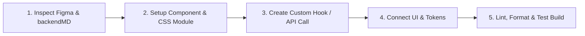

# 🚀 SyncStays HMS — Employee Developer Guide & Onboarding Handbook

Welcome to the **SyncStays Hotel Management System (HMS)** frontend repository!

This handbook is designed to help you quickly understand the project architecture, set up your development environment, and start building your assigned pages and components efficiently while adhering to enterprise-grade code quality standards.

---

## 📋 Table of Contents
1. [Overview & Tech Stack](#-1-overview--tech-stack)
2. [Quick Start & Local Setup](#-2-quick-start--local-setup)
3. [Repository Directory Blueprint](#-3-repository-directory-blueprint)
4. [Step-by-Step Developer Workflow](#-4-step-by-step-developer-workflow)
5. [Styling & Design System Discipline](#-5-styling--design-system-discipline)
6. [API Client & State Management Guide](#-6-api-client--state-management-guide)
7. [Module Assignment Checklist](#-7-module-assignment-checklist)
8. [Pre-Commit & Pull Request Checklist](#-8-pre-commit--pull-request-checklist)

---

## ⚙️ 1. Overview & Tech Stack

SyncStays is a multi-tenant, cloud-based Hotel & Hospitality Management Platform supporting 9 core business domain modules (Hotel Rooms/Guests, Restaurant POS & KDS, Inventory & Purchasing, Customers & Loyalty, Billing & Invoices, Audit Logs, Notifications, Administration, Auth).

### Core Stack
- **Framework**: [React 19](https://react.dev/) + [Vite 8](https://vitejs.dev/)
- **Routing**: [React Router v6](https://reactrouter.com/) (Data API with `createBrowserRouter`)
- **Styling**: Vanilla CSS Modules (`*.module.css`) + CSS Custom Properties Design Tokens (`tokens.css`)
- **Code Quality**: ESLint 9 + Prettier 3 + Oxlint
- **Icons & Assets**: Custom SVG & Iconography system

---

## 🛠️ 2. Quick Start & Local Setup

### Prerequisites
- **Node.js**: v18.0.0 or higher
- **npm**: v9.0.0 or higher

### Environment Setup

1. **Clone the repository**:
   ```bash
   git clone <repository-url>
   cd HMS_frontend/frontend
   ```

2. **Install dependencies**:
   ```bash
   npm install
   ```

3. **Configure Environment Variables**:
   Copy the `.env.example` template to create your local `.env` file:
   ```bash
   cp .env.example .env
   ```
   *Default API endpoint*: `http://localhost:5000/api/v1`

4. **Start the local development server**:
   ```bash
   npm run dev
   ```
   Open your browser at `http://localhost:5173`.

5. **Available NPM Scripts**:
   - `npm run dev`: Launch Vite dev server.
   - `npm run build`: Build production bundle into `dist/`.
   - `npm run lint`: Run ESLint checks across `src/`.
   - `npm run format`: Format code using Prettier.
   - `npm run preview`: Locally preview the production build.

---

## 📁 3. Repository Directory Blueprint

```text
frontend/
├── backendMD/             # 📖 Backend REST API specs for all 22 domain services
├── public/                # Static public assets
├── src/
│   ├── app/               # Application root & Router configuration
│   │   ├── App.jsx        # App component entry
│   │   └── router.jsx     # Master React Router v6 mapping
│   ├── components/        # Reusable UI component library (18+ pre-built stubs)
│   │   ├── SideNavBar/    # Collapsible primary brand navigation
│   │   ├── TopNavBar/     # Header bar with search, branch selector, avatar
│   │   ├── DataTable/     # General data table component
│   │   ├── KpiCard/       # Key Metric / Summary card
│   │   ├── Modal/         # Accessible modal backdrop
│   │   ├── Toast/         # Notification banners
│   │   └── ...            # Button, Badge, Avatar, Fab, Timeline, etc.
│   ├── pages/             # Domain route screens (by module)
│   │   ├── Auth/          # Login, Register, Forgot Password
│   │   ├── Dashboard/     # Primary landing overview
│   │   ├── Hotel/         # Rooms, Guests, Reservations, Check-In
│   │   ├── Restaurant/    # POS, Menu, KDS (Kitchen), Tables
│   │   ├── Inventory/     # Products, Stock, Suppliers, Purchase Orders
│   │   ├── Customers/     # Guest directory & Loyalty programs
│   │   ├── Billing/       # Invoices, Payments, Financial Reports
│   │   ├── Notifications/ # Real-time alerts center
│   │   ├── AuditLogs/     # Security & activity logs
│   │   └── Admin/         # Users, RBAC, Branches, Subscription, Settings
│   ├── layouts/           # Shell layouts (MainLayout.jsx)
│   ├── styles/            # Design Tokens (tokens.css) & Global Reset (global.css)
│   ├── hooks/             # Custom React Hooks (e.g. useAuth.js)
│   └── utils/             # Utilities & Central API Client (apiClient.js)
├── .env.example           # Environment template
├── RULES.md               # 🛡️ Strict Architecture & Coding Rules
├── README.md              # Project Overview
└── package.json           # Scripts & Dependencies
```

---

## 🔄 4. Step-by-Step Developer Workflow

When assigned to build a new page or feature module, follow this 5-step process:



### Step 1: Inspect Figma Design & `backendMD` Specs
- Open your assigned Figma frame.
- Read the corresponding domain API specification file in `backendMD/` (e.g., `backendMD/09-rooms-setup.md` or `backendMD/11-bookings-folio.md`). Note down API endpoints, payload bodies, and path parameters.

### Step 2: Create Page Component & CSS Module
Every page lives under `src/pages/<Domain>/<PageName>/`:
- `Index.jsx`: Page component logic and structure.
- `Index.module.css`: Page specific styles.

**Required Top JSDoc Header**:
Every `.jsx` file **MUST** start with a JSDoc header detailing its purpose and props:
```javascript
/**
 * @file Index.jsx
 * @description Hotel Rooms Inventory Management Screen.
 * @reference Figma Frame: Hotel / Rooms Management
 */
import React from 'react';
import styles from './Index.module.css';
```

### Step 3: Implement Data Fetching via `apiClient.js`
Use the central API client helper located in `src/utils/apiClient.js` or create a custom hook in `src/hooks/`.

```javascript
import { useState, useEffect } from 'react';
import api from '@utils/apiClient';

export function useRooms() {
  const [rooms, setRooms] = useState([]);
  const [loading, setLoading] = useState(true);

  useEffect(() => {
    async function fetchRooms() {
      try {
        const response = await api.get('/rooms');
        setRooms(response.data);
      } catch (err) {
        console.error('Failed to load rooms:', err.message);
      } finally {
        setLoading(false);
      }
    }
    fetchRooms();
  }, []);

  return { rooms, loading };
}
```

---

## 🎨 5. Styling & Design System Discipline

To maintain visual consistency and dark mode readiness, follow these mandatory styling rules:

### Rule 1: Zero Hardcoded Colors or Pixel Offsets
Never write raw hex codes (`#147a7e`) or arbitrary pixel values in component styling. Always use CSS Design Tokens from `src/styles/tokens.css`.

| Property | CSS Custom Token | Example |
| :--- | :--- | :--- |
| **Primary Theme** | `var(--color-primary)` | `color: var(--color-primary);` |
| **Primary Tint/Hover** | `var(--color-primary-tint)` | `background: var(--color-primary-tint);` |
| **Background Surface** | `var(--color-surface)` | `background-color: var(--color-surface);` |
| **Borders** | `var(--color-border)` | `border: 1px solid var(--color-border);` |
| **Text Primary** | `var(--color-text-primary)` | `color: var(--color-text-primary);` |
| **Text Muted** | `var(--color-text-muted)` | `color: var(--color-text-muted);` |
| **Spacing** | `var(--space-sm)`, `var(--space-md)`, `var(--space-lg)` | `padding: var(--space-md);` |
| **Border Radii** | `var(--radius-sm)`, `var(--radius-md)`, `var(--radius-lg)` | `border-radius: var(--radius-md);` |

### Rule 2: Zero Inline Styles
Do NOT use inline `style={{ ... }}` props in React components. All styles belong in `.module.css`. *(Exception: Dynamic runtime percentages like progress bar widths `style={{ width: `${percent}%` }}`).*

---

## 🔌 6. API Client & State Management Guide

The central API wrapper in `src/utils/apiClient.js` automatically manages:
1. **Base URL Prefix**: Uses `import.meta.env.VITE_API_BASE_URL` (default: `/api/v1`).
2. **JWT Authorization**: Automatically attaches `Authorization: Bearer <token>` from `localStorage`.
3. **Multi-Tenant Branch Switcher**: Automatically includes `x-branch-id` header.
4. **Standard Envelope Parsing**: Returns normalized `{ data, meta, message }` or throws a structured `ApiError`.

### Example API Usage in Components

```javascript
import api from '@utils/apiClient';

// GET Request
const { data } = await api.get('/hotel/reservations');

// POST Request with JSON Body
const newBooking = await api.post('/hotel/reservations', {
  guestId: 'g_123',
  roomId: 'r_402',
  checkInDate: '2026-08-10',
  checkOutDate: '2026-08-15',
});

// PATCH Request
await api.patch('/hotel/reservations/res_987', { status: 'CHECKED_IN' });

// DELETE Request
await api.delete('/hotel/reservations/res_987');
```

---

## 📋 7. Module Assignment Checklist

Developers should pick up tasks from the following domain breakdown:

| Domain Module | Route Path | API Spec File | Status / Owner |
| :--- | :--- | :--- | :--- |
| **Dashboard Overview** | `/` | `00-index-frontend-modules.md` | 🟡 Ready for Integration |
| **Hotel Rooms** | `/hotel/rooms` | `09-rooms-setup.md` | ⚪ Unassigned |
| **Hotel Guests** | `/hotel/guests` | `10-hotel-guests.md` | ⚪ Unassigned |
| **Hotel Reservations** | `/hotel/reservations` | `11-bookings-folio.md` | ⚪ Unassigned |
| **Hotel Check-In** | `/hotel/check-in` | `11-bookings-folio.md` | ⚪ Unassigned |
| **Restaurant POS** | `/restaurant/pos` | `14-orders-kitchen.md` | ⚪ Unassigned |
| **Restaurant Menu** | `/restaurant/menu` | `13-menu.md` | ⚪ Unassigned |
| **Kitchen Display (KDS)**| `/restaurant/kds` | `14-orders-kitchen.md` | ⚪ Unassigned |
| **Inventory Stock** | `/inventory/stock` | `16-inventory.md` | ⚪ Unassigned |
| **Purchase Orders** | `/inventory/purchase-orders` | `18-purchase.md` | ⚪ Unassigned |
| **Billing & Invoices** | `/billing/invoices` | `19-billing.md` | ⚪ Unassigned |
| **Admin & RBAC** | `/admin/rbac` | `05-rbac.md` | ⚪ Unassigned |

---

## ✅ 8. Pre-Commit & Pull Request Checklist

Before submitting a Pull Request (PR) or committing your changes:

- [ ] **Linter Pass**: Executed `npm run lint` and resolved 100% of warnings and errors.
- [ ] **Formatter Pass**: Executed `npm run format` to enforce formatting rules.
- [ ] **Production Build Check**: Executed `npm run build` locally and confirmed 0 build errors.
- [ ] **No Inline Styles**: Verified all component styles use `.module.css`.
- [ ] **Design Tokens**: Verified zero hardcoded hex colors exist in CSS files.
- [ ] **JSDoc Header**: Verified every `.jsx` file contains a descriptive JSDoc block header.
- [ ] **Semantic HTML**: Used appropriate `<header>`, `<main>`, `<section>`, `<button>` tags instead of unclickable `<div>` elements.

---

*For further details on system rules, refer to [RULES.md](file:///c:/Users/kondk/OneDrive/Desktop/Projects/Nexoresha/HMS_frontend/frontend/RULES.md) or reach out to the lead frontend architect.*
