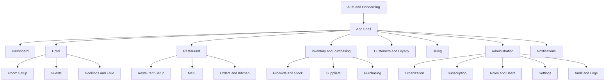
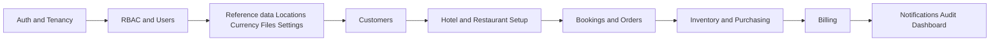

# API Conventions

Global standards that apply to **every** endpoint in this system. Individual module files only document what differs from these defaults.

- **Stack:** Node.js + Express (JavaScript), PostgreSQL, JWT auth.
- **Base URL:** `/api/v1`
- **Content-Type:** `application/json` (except file uploads → `multipart/form-data`).

---

## 1. Authentication

- All endpoints require a JWT **Bearer** token unless explicitly marked `Public`.
- Header: `Authorization: Bearer <accessToken>`
- The token payload carries `userId`, `organizationId`, `organizationBranchId`, `roleId`, and `tokenVersion`.
- **Tenancy is resolved server-side from the token.** Clients **never** send `organizationId` / `organizationBranchId` in request bodies — the middleware injects them.
- `tokenVersion` mismatch (e.g. after change-password / logout-all) → `401 TOKEN_INVALIDATED`.

### Standard Auth Headers

| Header | Required | Description |
|--------|----------|-------------|
| `Authorization` | Yes (protected) | `Bearer <accessToken>` |
| `x-branch-id` | Optional | Override active branch for multi-branch users (must be a branch the user belongs to). Falls back to token branch. |

---

## 2. Response Envelope

Every response (success or error) uses this envelope:

```json
{
  "success": true,
  "message": "Human-readable message",
  "data": {},
  "meta": null
}
```

- `success` — boolean.
- `message` — short human-readable status.
- `data` — object / array / null (the payload).
- `meta` — pagination or extra metadata, `null` when not applicable.

### List (paginated) `meta`

```json
{
  "meta": {
    "page": 1,
    "limit": 20,
    "total": 137,
    "totalPages": 7,
    "hasNext": true,
    "hasPrev": false
  }
}
```

---

## 3. List / Query Parameters

All list (`GET` collection) endpoints support:

| Param | Type | Default | Description |
|-------|------|---------|-------------|
| `page` | int | 1 | Page number (1-based). |
| `limit` | int | 20 | Items per page (max 100). |
| `search` | string | — | Free-text search across the module's searchable fields. |
| `sortBy` | string | `createdAt` | Field to sort by. |
| `sortOrder` | enum | `desc` | `asc` \| `desc`. |
| `status` | enum | — | Filter by the entity's status enum. |
| `includeDeleted` | bool | false | Include soft-deleted rows (admin only). |

Module-specific filters (e.g. `roomTypeId`, `fromDate`, `toDate`) are documented per module.

---

## 4. Standard CRUD Pattern

Unless a module states otherwise, each primary entity exposes:

| Action | Method | Path | Body | Returns |
|--------|--------|------|------|---------|
| List | `GET` | `/resource` | — | Array + pagination `meta` |
| Get one | `GET` | `/resource/:id` | — | Single object |
| Create | `POST` | `/resource` | Create DTO | Created object |
| Update | `PATCH` | `/resource/:id` | Partial DTO | Updated object |
| Delete | `DELETE` | `/resource/:id` | — | `{ id, deletedAt }` (soft delete) |

- **Create** returns `201`.
- **Update** is `PATCH` (partial). Full replace (`PUT`) is not used.
- **Delete** is a **soft delete** — sets `deletedAt`, row is excluded from default lists.

---

## 5. Common Field Conventions

- All IDs are **UUID v4**.
- Timestamps are **ISO 8601 UTC** strings (e.g. `2026-01-15T10:30:00.000Z`).
- Money fields are strings/numbers with 2 decimals (`"1500.00"`), matching `decimal(12,2)`.
- Every entity returns `id`, `createdAt`, `updatedAt`, and (soft-deletable ones) `deletedAt`.
- Audit fields (`createdBy`) are set server-side from the token, never from the client.

---

## 6. Error Format

```json
{
  "success": false,
  "message": "Validation failed",
  "data": null,
  "meta": {
    "code": "VALIDATION_ERROR",
    "errors": [
      { "field": "email", "message": "email must be a valid email" }
    ]
  }
}
```

### Standard HTTP Status Codes

| Code | When |
|------|------|
| `200` | Success (read / update / action) |
| `201` | Resource created |
| `400` | Validation / bad request (`VALIDATION_ERROR`) |
| `401` | Missing/invalid/expired token (`UNAUTHORIZED`, `TOKEN_INVALIDATED`) |
| `403` | Authenticated but lacks permission (`FORBIDDEN`) |
| `404` | Resource not found (`NOT_FOUND`) |
| `409` | Conflict — unique constraint / invalid state transition (`CONFLICT`) |
| `422` | Business rule violation (e.g. room not available, insufficient stock) |
| `429` | Rate limited (`RATE_LIMITED`) |
| `500` | Server error (logged to `errorLogger`) |

---

## 7. Permissions (RBAC)

- Each protected endpoint maps to a `permission.code` (e.g. `booking.create`, `room.update`).
- Middleware checks the user's `role → roleSubModule → subModule → modulePermission → permission`.
- Failing the check → `403 FORBIDDEN`.
- Permission codes are listed in each module file's endpoint table under the **Permission** column.

---

## 8. Soft Delete & Timestamps

- Tables with `deletedAt` support soft delete; default queries filter `deletedAt IS NULL`.
- Tables **without** `deletedAt` (logs, join tables like `roleSubModule`) are hard-deleted.
- Restore (where supported): `POST /resource/:id/restore`.

---

## 9. Audit Logging

- All `CREATE` / `UPDATE` / `DELETE` on business entities auto-write to `auditLog` (old/new value diff) via middleware.
- `LOGIN` / `LOGOUT` events are written on auth actions.
- No separate client call needed — it is transparent.

---

## 10. Idempotency & Concurrency

- Money/stock-mutating workflow endpoints (payments, stock adjustments, check-in/out) accept an optional `Idempotency-Key` header to prevent duplicate submission.
- Optimistic concurrency: send `If-Unmodified-Since` or the entity's `updatedAt`; a mismatch → `409 CONFLICT`.

---

## 11. Multi-Tenant Scoping Rules

| Scope level | Tables | Rule |
|-------------|--------|------|
| Global (platform) | `currency`, `country`, `state`, `city`, `module`, `subModule`, `permission`, `subscriptionPlan`, `organizationType` | Managed by super-admin; readable by all tenants. |
| Organization | `organization`, `role`, `organizationSubscription`, `user` (partly) | Scoped to `organizationId` from token. |
| Branch | `room`, `booking`, `order`, `product`, `stock`, `purchase`, etc. | Scoped to `organizationId` **and** `organizationBranchId`. |

Attempting to access a resource outside your org/branch → `404 NOT_FOUND` (never leaks existence).

# Frontend Modules → API Map

This is the master index for the platform's API documentation. It maps every **frontend UI module** to the backend **API groups** that power it, so frontend teams can find the exact endpoints per screen and backend teams can see how each API is consumed.

- **Stack:** Node.js + Express (REST), PostgreSQL, JWT Bearer auth
- **Base path:** `/api/v1`
- **Multi-tenant:** `organizationId` + `organizationBranchId` are derived from the JWT; never sent in payloads

Start with [Conventions](00-conventions.md:1) for the response envelope, auth, tenancy, pagination, error format, idempotency, and soft-delete rules shared by every module.

---

## API document index

| # | Document | Domain |
|---|----------|--------|
| 00 | [Conventions](00-conventions.md:1) | Global standards |
| 01 | [Auth](01-auth.md:1) | Authentication |
| 02 | [Organization & Tenancy](02-organization-tenancy.md:1) | Org / branch / subscription |
| 03 | [Locations](03-locations.md:1) | Country/state/city reference |
| 04 | [Subscription & Plans](04-subscription-plans.md:1) | Plans, subscriptions |
| 05 | [RBAC](05-rbac.md:1) | Roles & permissions |
| 06 | [Users](06-users.md:1) | User management |
| 07 | [Files](07-files.md:1) | Uploads & media |
| 08 | [Currency](08-currency.md:1) | Currencies & rates |
| 09 | [Rooms Setup](09-rooms-setup.md:1) | Room types, rooms, floors |
| 10 | [Hotel Guests](10-hotel-guests.md:1) | Guest profiles |
| 11 | [Bookings & Folio](11-bookings-folio.md:1) | Reservations, folios |
| 12 | [Restaurant Setup](12-restaurant-setup.md:1) | Tables, areas, kitchens |
| 13 | [Menu](13-menu.md:1) | Menu categories & items |
| 14 | [Orders & Kitchen](14-orders-kitchen.md:1) | Orders, KOT, KDS |
| 15 | [Customers](15-customers.md:1) | Customers & loyalty |
| 16 | [Inventory](16-inventory.md:1) | Products, stock, recipes |
| 17 | [Suppliers & Batch](17-suppliers-batch.md:1) | Suppliers, batches |
| 18 | [Purchase](18-purchase.md:1) | Purchase orders, receipts |
| 19 | [Billing](19-billing.md:1) | Invoices & payments |
| 20 | [Notifications](20-notifications.md:1) | In-app + email logs |
| 21 | [Audit Logs](21-audit-logs.md:1) | Audit & error logs |
| 22 | [App Settings](22-app-settings.md:1) | Tenant settings |

---

## Frontend module architecture



---

## Module-by-module API map

### 1. Auth & Onboarding
Login, registration, password reset, tenant onboarding, session/profile.

| Screen | API groups |
|--------|-----------|
| Login / Logout / Refresh | [Auth](01-auth.md:1) |
| Register organization | [Auth](01-auth.md:1), [Organization & Tenancy](02-organization-tenancy.md:1) |
| Forgot / Reset / Change password | [Auth](01-auth.md:1) |
| My profile | [Auth](01-auth.md:1), [Users](06-users.md:1) |

### 2. App Shell & Dashboard
Global chrome, tenant/branch switcher, bootstrapped settings, KPI dashboard.

| Screen | API groups |
|--------|-----------|
| Branch switcher | [Organization & Tenancy](02-organization-tenancy.md:1) |
| Bootstrap settings / theme | [App Settings](22-app-settings.md:1) (effective) |
| Dashboard KPIs | [Billing](19-billing.md:1) (reports), [Orders & Kitchen](14-orders-kitchen.md:1), [Bookings & Folio](11-bookings-folio.md:1), [Inventory](16-inventory.md:1) |
| Notification bell | [Notifications](20-notifications.md:1) |

### 3. Hotel
Room configuration, guest management, reservations and folios.

| Screen | API groups |
|--------|-----------|
| Room types / Rooms / Floors | [Rooms Setup](09-rooms-setup.md:1) |
| Guest directory | [Hotel Guests](10-hotel-guests.md:1) |
| Reservation calendar / Booking create | [Bookings & Folio](11-bookings-folio.md:1), [Rooms Setup](09-rooms-setup.md:1) |
| Check-in / Check-out | [Bookings & Folio](11-bookings-folio.md:1) |
| Folio & charges | [Bookings & Folio](11-bookings-folio.md:1), [Billing](19-billing.md:1) |

### 4. Restaurant
Floor/table setup, menu management, order taking, kitchen display.

| Screen | API groups |
|--------|-----------|
| Areas / Tables / Kitchens | [Restaurant Setup](12-restaurant-setup.md:1) |
| Menu categories & items | [Menu](13-menu.md:1), [Files](07-files.md:1) |
| POS / Order entry | [Orders & Kitchen](14-orders-kitchen.md:1), [Menu](13-menu.md:1), [Customers](15-customers.md:1) |
| Kitchen Display (KDS) | [Orders & Kitchen](14-orders-kitchen.md:1) |
| Settle order | [Orders & Kitchen](14-orders-kitchen.md:1), [Billing](19-billing.md:1) |

### 5. Inventory & Purchasing
Products, stock levels, recipes, suppliers, purchase orders and receipts.

| Screen | API groups |
|--------|-----------|
| Products / Categories / Brands / Units | [Inventory](16-inventory.md:1) |
| Stock levels & adjustments | [Inventory](16-inventory.md:1) |
| Recipes | [Inventory](16-inventory.md:1), [Menu](13-menu.md:1) |
| Suppliers | [Suppliers & Batch](17-suppliers-batch.md:1) |
| Purchase orders / Goods receipt | [Purchase](18-purchase.md:1), [Suppliers & Batch](17-suppliers-batch.md:1), [Inventory](16-inventory.md:1) |
| Supplier invoices & payments | [Purchase](18-purchase.md:1), [Billing](19-billing.md:1) |

### 6. Customers & Loyalty
Unified customer directory shared by hotel and restaurant, loyalty points.

| Screen | API groups |
|--------|-----------|
| Customer directory | [Customers](15-customers.md:1) |
| Customer profile & history | [Customers](15-customers.md:1), [Bookings & Folio](11-bookings-folio.md:1), [Orders & Kitchen](14-orders-kitchen.md:1), [Billing](19-billing.md:1) |
| Loyalty | [Customers](15-customers.md:1) |

### 7. Billing
Unified invoices and payments across hotel, restaurant, purchase, and subscription.

| Screen | API groups |
|--------|-----------|
| Invoices list / detail | [Billing](19-billing.md:1) |
| Record payment / Refund | [Billing](19-billing.md:1) |
| Revenue & payment reports | [Billing](19-billing.md:1), [Currency](08-currency.md:1) |

### 8. Notifications
In-app inbox and outbound email log auditing.

| Screen | API groups |
|--------|-----------|
| Notification inbox | [Notifications](20-notifications.md:1) |
| Email delivery logs | [Notifications](20-notifications.md:1) |

### 9. Administration
Organization, subscription, RBAC, users, settings, audit.

| Screen | API groups |
|--------|-----------|
| Organization & branches | [Organization & Tenancy](02-organization-tenancy.md:1), [Locations](03-locations.md:1) |
| Subscription & plans | [Subscription & Plans](04-subscription-plans.md:1), [Billing](19-billing.md:1) |
| Roles & permissions | [RBAC](05-rbac.md:1) |
| User management | [Users](06-users.md:1), [RBAC](05-rbac.md:1) |
| Currencies | [Currency](08-currency.md:1) |
| Media library | [Files](07-files.md:1) |
| General settings / Preferences | [App Settings](22-app-settings.md:1) |
| Audit trail & error logs | [Audit Logs](21-audit-logs.md:1) |

---

## Cross-cutting API groups

Some API groups are consumed by nearly every screen rather than one module:

| API group | Consumed by |
|-----------|-------------|
| [Conventions](00-conventions.md:1) | Every request (envelope, auth, tenancy) |
| [Auth](01-auth.md:1) | Every authenticated request |
| [RBAC](05-rbac.md:1) | Permission gating across all screens |
| [Files](07-files.md:1) | Any screen with uploads/images |
| [Currency](08-currency.md:1) | Any screen displaying money |
| [App Settings](22-app-settings.md:1) | Bootstrapped defaults everywhere |
| [Notifications](20-notifications.md:1) | Global bell + event feedback |
| [Audit Logs](21-audit-logs.md:1) | Records mutations from all modules |

---

## Suggested build order

For teams implementing frontend and backend in tandem, this order minimizes blocking dependencies:



1. **Foundation** — [Auth](01-auth.md:1), [Organization & Tenancy](02-organization-tenancy.md:1), [Subscription & Plans](04-subscription-plans.md:1)
2. **Access control** — [RBAC](05-rbac.md:1), [Users](06-users.md:1)
3. **Reference data** — [Locations](03-locations.md:1), [Currency](08-currency.md:1), [Files](07-files.md:1), [App Settings](22-app-settings.md:1)
4. **Shared entities** — [Customers](15-customers.md:1)
5. **Operational setup** — [Rooms Setup](09-rooms-setup.md:1), [Hotel Guests](10-hotel-guests.md:1), [Restaurant Setup](12-restaurant-setup.md:1), [Menu](13-menu.md:1)
6. **Transactions** — [Bookings & Folio](11-bookings-folio.md:1), [Orders & Kitchen](14-orders-kitchen.md:1)
7. **Supply chain** — [Inventory](16-inventory.md:1), [Suppliers & Batch](17-suppliers-batch.md:1), [Purchase](18-purchase.md:1)
8. **Money** — [Billing](19-billing.md:1)
9. **Observability** — [Notifications](20-notifications.md:1), [Audit Logs](21-audit-logs.md:1), Dashboard