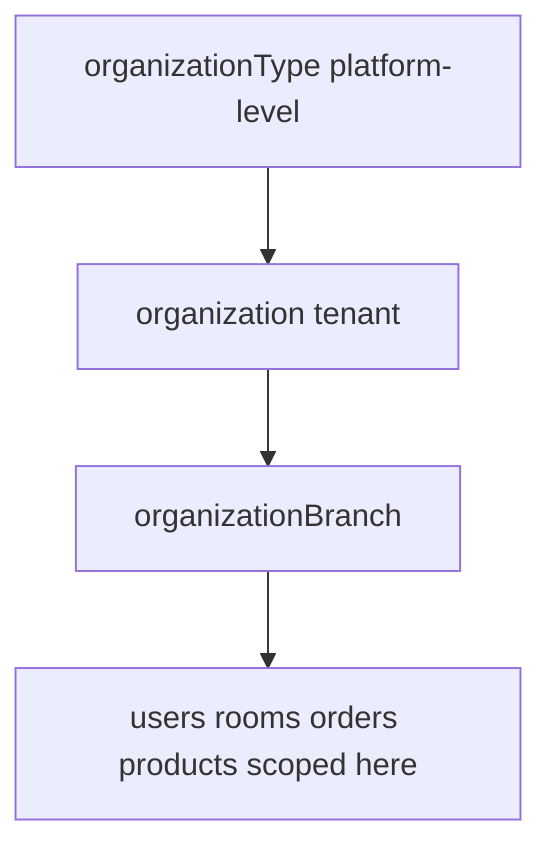

# 02 — Organization & Tenancy

Manages the tenant hierarchy: organization types (platform-level), organizations (tenants), and their branches.

**Entities:** `organizationType`, `organization`, `organizationBranch`
**Base path:** `/api/v1`
**Frontend module:** Onboarding / Org setup, Branch management, Organization profile settings.

---

## Tenancy Model



- `organizationType` is **global** (super-admin managed): e.g. Hotel, Restaurant, Hotel+Restaurant.
- `organization` is a tenant, scoped by `organizationId`.
- `organizationBranch` is a physical location under an org; most operational data is scoped to a branch.

---

## Endpoint Summary

| # | Action | Method | Path | Auth | Permission |
|---|--------|--------|------|------|------------|
| 1 | List organization types | GET | `/organization-types` | Bearer | `organizationType.read` |
| 2 | Create organization type | POST | `/organization-types` | Super-admin | `organizationType.create` |
| 3 | Update organization type | PATCH | `/organization-types/:id` | Super-admin | `organizationType.update` |
| 4 | Delete organization type | DELETE | `/organization-types/:id` | Super-admin | `organizationType.delete` |
| 5 | Get current organization | GET | `/organizations/me` | Bearer | `organization.read` |
| 6 | Register organization | POST | `/organizations` | Public/Onboarding | — |
| 7 | Update organization | PATCH | `/organizations/:id` | Bearer | `organization.update` |
| 8 | Delete organization | DELETE | `/organizations/:id` | Super-admin | `organization.delete` |
| 9 | List branches | GET | `/branches` | Bearer | `branch.read` |
| 10 | Get branch | GET | `/branches/:id` | Bearer | `branch.read` |
| 11 | Create branch | POST | `/branches` | Bearer | `branch.create` |
| 12 | Update branch | PATCH | `/branches/:id` | Bearer | `branch.update` |
| 13 | Delete branch | DELETE | `/branches/:id` | Bearer | `branch.delete` |
| 14 | Set branch status | PATCH | `/branches/:id/status` | Bearer | `branch.update` |

---

## Organization Type

### List — `GET /organization-types`

Standard list. Searchable: `name`.

#### Response `200`

```json
{
  "success": true,
  "message": "OK",
  "data": [
    { "id": "ot-1a2b", "name": "Hotel", "description": "Hotel/lodging businesses", "createdAt": "2025-01-01T00:00:00.000Z" },
    { "id": "ot-3c4d", "name": "Restaurant", "description": "Standalone F&B", "createdAt": "2025-01-01T00:00:00.000Z" },
    { "id": "ot-5e6f", "name": "Hotel + Restaurant", "description": "Combined property", "createdAt": "2025-01-01T00:00:00.000Z" }
  ],
  "meta": { "page": 1, "limit": 20, "total": 3, "totalPages": 1, "hasNext": false, "hasPrev": false }
}
```

### Create — `POST /organization-types`

```json
{ "name": "Cafe Chain", "description": "Multi-outlet cafe" }
```

Response `201` → created object.

---

## Organization

### Register — `POST /organizations`

Creates a tenant, its first branch, an owner user, and (optionally) starts a trial subscription.

#### Request

```json
{
  "organization": {
    "name": "Grand Hotel Group",
    "organizationTypeId": "ot-5e6f",
    "email": "info@grandhotel.com",
    "phone": "+914412345678",
    "gstNumber": "29ABCDE1234F1Z5",
    "logoFileId": null,
    "defaultCurrencyId": "cur-inr"
  },
  "branch": {
    "name": "Grand Hotel - MG Road",
    "cityId": "city-blr",
    "addressLine1": "12, MG Road",
    "postalCode": "560001",
    "phone": "+918012345678"
  },
  "owner": {
    "fullName": "Anita Sharma",
    "email": "anita@grandhotel.com",
    "phone": "+919800011122",
    "password": "OwnerStrong@123"
  },
  "planId": "plan-trial"
}
```

#### Response `201`

```json
{
  "success": true,
  "message": "Organization registered successfully",
  "data": {
    "organization": { "id": "org-a1b2", "name": "Grand Hotel Group", "status": "ACTIVE" },
    "branch": { "id": "br-c3d4", "name": "Grand Hotel - MG Road" },
    "owner": { "id": "usr-e5f6", "email": "anita@grandhotel.com", "roleName": "Owner" },
    "subscription": { "id": "sub-g7h8", "planId": "plan-trial", "status": "TRIAL", "trialEndsAt": "2026-08-19T00:00:00.000Z" }
  },
  "meta": null
}
```

#### Errors

| Status | Code | Reason |
|--------|------|--------|
| 409 | ORG_EMAIL_EXISTS | Email/GST already registered. |
| 400 | VALIDATION_ERROR | Missing required fields. |

### Get Current Org — `GET /organizations/me`

```json
{
  "success": true,
  "message": "OK",
  "data": {
    "id": "org-a1b2",
    "name": "Grand Hotel Group",
    "organizationType": { "id": "ot-5e6f", "name": "Hotel + Restaurant" },
    "email": "info@grandhotel.com",
    "phone": "+914412345678",
    "gstNumber": "29ABCDE1234F1Z5",
    "logoUrl": "https://cdn.example.com/org/a1b2.png",
    "defaultCurrency": { "id": "cur-inr", "code": "INR", "symbol": "₹" },
    "status": "ACTIVE",
    "branchCount": 3,
    "createdAt": "2025-11-01T09:00:00.000Z"
  },
  "meta": null
}
```

### Update — `PATCH /organizations/:id`

```json
{ "name": "Grand Hotels & Resorts", "phone": "+914499998888", "logoFileId": "file-xyz" }
```

Response `200` → updated object.

---

## Organization Branch

### Create — `POST /branches`

`organizationId` injected from token.

#### Request

```json
{
  "name": "Grand Hotel - Whitefield",
  "cityId": "city-blr",
  "addressLine1": "88, ITPL Main Road",
  "addressLine2": "Whitefield",
  "postalCode": "560066",
  "phone": "+918098765432",
  "email": "whitefield@grandhotel.com",
  "timezone": "Asia/Kolkata",
  "isActive": true
}
```

#### Response `201`

```json
{
  "success": true,
  "message": "Branch created",
  "data": {
    "id": "br-9x8y",
    "name": "Grand Hotel - Whitefield",
    "organizationId": "org-a1b2",
    "cityId": "city-blr",
    "addressLine1": "88, ITPL Main Road",
    "addressLine2": "Whitefield",
    "postalCode": "560066",
    "phone": "+918098765432",
    "email": "whitefield@grandhotel.com",
    "timezone": "Asia/Kolkata",
    "status": "ACTIVE",
    "createdAt": "2026-08-05T06:20:00.000Z"
  },
  "meta": null
}
```

#### Errors

| Status | Code | Reason |
|--------|------|--------|
| 422 | BRANCH_LIMIT_REACHED | Subscription plan branch limit exceeded. |

### List — `GET /branches`

Filters: `status`, `cityId`. Searchable: `name`, `addressLine1`.

```json
{
  "success": true,
  "message": "OK",
  "data": [
    { "id": "br-c3d4", "name": "Grand Hotel - MG Road", "city": "Bengaluru", "status": "ACTIVE" },
    { "id": "br-9x8y", "name": "Grand Hotel - Whitefield", "city": "Bengaluru", "status": "ACTIVE" }
  ],
  "meta": { "page": 1, "limit": 20, "total": 2, "totalPages": 1, "hasNext": false, "hasPrev": false }
}
```

### Set Branch Status — `PATCH /branches/:id/status`

```json
{ "status": "INACTIVE" }
```

| Field | Type | Values |
|-------|------|--------|
| `status` | enum | `ACTIVE` \| `INACTIVE` \| `SUSPENDED` |

#### Response `200`

```json
{ "success": true, "message": "Branch status updated", "data": { "id": "br-9x8y", "status": "INACTIVE" }, "meta": null }