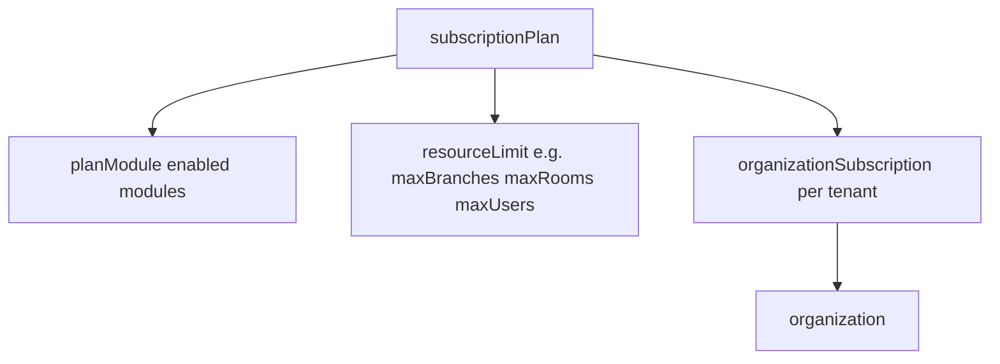

# 04 — Subscription Plans & Tenant Subscriptions

Platform-level subscription catalog (plans, their enabled modules, resource limits) and per-tenant subscription lifecycle.

**Entities:** `subscriptionPlan`, `planModule`, `resourceLimit`, `organizationSubscription`
**Base path:** `/api/v1`
**Frontend module:** Pricing/Plans page, Admin → Subscription & Billing, Super-admin plan catalog.

---

## Model



- `subscriptionPlan` — global catalog (Trial, Basic, Pro, Enterprise).
- `planModule` — which platform `module`s a plan unlocks.
- `resourceLimit` — numeric caps per plan (branches, rooms, users, orders/month, etc.).
- `organizationSubscription` — a tenant's active/trial/expired subscription with billing cycle.

---

## Endpoint Summary

| # | Action | Method | Path | Auth | Permission |
|---|--------|--------|------|------|------------|
| 1 | List plans (public catalog) | GET | `/subscription-plans` | Public | — |
| 2 | Get plan detail | GET | `/subscription-plans/:id` | Public | — |
| 3 | Create plan | POST | `/subscription-plans` | Super-admin | `plan.manage` |
| 4 | Update plan | PATCH | `/subscription-plans/:id` | Super-admin | `plan.manage` |
| 5 | Delete plan | DELETE | `/subscription-plans/:id` | Super-admin | `plan.manage` |
| 6 | Set plan modules | PUT | `/subscription-plans/:id/modules` | Super-admin | `plan.manage` |
| 7 | Set plan resource limits | PUT | `/subscription-plans/:id/limits` | Super-admin | `plan.manage` |
| 8 | Get current subscription | GET | `/subscriptions/current` | Bearer | `subscription.read` |
| 9 | Assign/subscribe to plan | POST | `/subscriptions/subscribe` | Bearer | `subscription.manage` |
| 10 | Upgrade/downgrade plan | POST | `/subscriptions/change-plan` | Bearer | `subscription.manage` |
| 11 | Cancel subscription | POST | `/subscriptions/cancel` | Bearer | `subscription.manage` |
| 12 | Renew subscription | POST | `/subscriptions/renew` | Bearer | `subscription.manage` |
| 13 | Get usage vs limits | GET | `/subscriptions/usage` | Bearer | `subscription.read` |
| 14 | List all tenant subscriptions | GET | `/subscriptions` | Super-admin | `subscription.admin` |

---

## Subscription Plan

### List (catalog) — `GET /subscription-plans`

Filter: `billingCycle`, `isActive`. Searchable: `name`.

```json
{
  "success": true,
  "message": "OK",
  "data": [
    {
      "id": "plan-basic",
      "name": "Basic",
      "description": "For single-branch properties",
      "price": "1999.00",
      "currencyCode": "INR",
      "billingCycle": "MONTHLY",
      "trialDays": 14,
      "isActive": true,
      "modules": ["HOTEL", "BILLING"],
      "limits": { "maxBranches": 1, "maxRooms": 30, "maxUsers": 10 }
    },
    {
      "id": "plan-pro",
      "name": "Pro",
      "price": "4999.00",
      "currencyCode": "INR",
      "billingCycle": "MONTHLY",
      "trialDays": 14,
      "isActive": true,
      "modules": ["HOTEL", "RESTAURANT", "INVENTORY", "PURCHASE", "BILLING"],
      "limits": { "maxBranches": 3, "maxRooms": 150, "maxUsers": 50 }
    }
  ],
  "meta": { "page": 1, "limit": 20, "total": 2, "totalPages": 1, "hasNext": false, "hasPrev": false }
}
```

### Create — `POST /subscription-plans`

```json
{
  "name": "Enterprise",
  "description": "Multi-branch chains",
  "price": "14999.00",
  "currencyId": "cur-inr",
  "billingCycle": "MONTHLY",
  "trialDays": 30,
  "isActive": true
}
```

| Field | Type | Required | Notes |
|-------|------|----------|-------|
| `billingCycle` | enum | Yes | `MONTHLY` \| `QUARTERLY` \| `YEARLY`. |
| `trialDays` | int | No | 0 = no trial. |

Response `201` → created plan.

### Set Plan Modules — `PUT /subscription-plans/:id/modules`

Replaces the plan's `planModule` set.

```json
{ "moduleIds": ["mod-hotel", "mod-restaurant", "mod-inventory", "mod-billing"] }
```

Response `200`:

```json
{ "success": true, "message": "Plan modules updated", "data": { "planId": "plan-pro", "moduleCount": 4 }, "meta": null }
```

### Set Resource Limits — `PUT /subscription-plans/:id/limits`

Replaces the plan's `resourceLimit` rows.

```json
{
  "limits": [
    { "resourceKey": "maxBranches", "limitValue": 3 },
    { "resourceKey": "maxRooms", "limitValue": 150 },
    { "resourceKey": "maxUsers", "limitValue": 50 },
    { "resourceKey": "maxTables", "limitValue": 60 },
    { "resourceKey": "maxProducts", "limitValue": 2000 }
  ]
}
```

Response `200` → updated limits array.

---

## Tenant Subscription

### Get Current — `GET /subscriptions/current`

```json
{
  "success": true,
  "message": "OK",
  "data": {
    "id": "sub-g7h8",
    "plan": { "id": "plan-pro", "name": "Pro", "billingCycle": "MONTHLY", "price": "4999.00" },
    "status": "ACTIVE",
    "startedAt": "2026-08-01T00:00:00.000Z",
    "currentPeriodEnd": "2026-09-01T00:00:00.000Z",
    "trialEndsAt": null,
    "autoRenew": true,
    "modules": ["HOTEL", "RESTAURANT", "INVENTORY", "PURCHASE", "BILLING"],
    "limits": { "maxBranches": 3, "maxRooms": 150, "maxUsers": 50 }
  },
  "meta": null
}
```

### Subscribe — `POST /subscriptions/subscribe`

Starts a subscription for the current org. Generates a `SUBSCRIPTION` invoice (see Billing module) unless within trial.

```json
{ "planId": "plan-pro", "billingCycle": "MONTHLY", "autoRenew": true, "startTrial": true }
```

Response `201`:

```json
{
  "success": true,
  "message": "Subscription activated",
  "data": {
    "id": "sub-new1",
    "planId": "plan-pro",
    "status": "TRIAL",
    "trialEndsAt": "2026-08-19T00:00:00.000Z",
    "currentPeriodEnd": "2026-08-19T00:00:00.000Z",
    "invoiceId": null
  },
  "meta": null
}
```

#### Errors

| Status | Code | Reason |
|--------|------|--------|
| 409 | ALREADY_SUBSCRIBED | Active subscription exists (use change-plan). |
| 404 | PLAN_NOT_FOUND | Invalid plan. |

### Change Plan (upgrade/downgrade) — `POST /subscriptions/change-plan`

```json
{ "planId": "plan-enterprise", "effective": "IMMEDIATE" }
```

| Field | Type | Values |
|-------|------|--------|
| `effective` | enum | `IMMEDIATE` (prorate now) \| `NEXT_CYCLE`. |

Response `200`:

```json
{
  "success": true,
  "message": "Plan changed to Enterprise",
  "data": {
    "id": "sub-g7h8",
    "planId": "plan-enterprise",
    "status": "ACTIVE",
    "proratedInvoiceId": "inv-prorate-1",
    "currentPeriodEnd": "2026-09-01T00:00:00.000Z"
  },
  "meta": null
}
```

#### Errors

| Status | Code | Reason |
|--------|------|--------|
| 422 | DOWNGRADE_LIMIT_VIOLATION | Current usage exceeds target plan limits (e.g. 5 branches → plan allows 3). |

### Cancel — `POST /subscriptions/cancel`

```json
{ "reason": "Switching provider", "immediate": false }
```

Response `200`:

```json
{
  "success": true,
  "message": "Subscription will cancel at period end",
  "data": { "id": "sub-g7h8", "status": "ACTIVE", "cancelAtPeriodEnd": true, "currentPeriodEnd": "2026-09-01T00:00:00.000Z" },
  "meta": null
}
```

### Renew — `POST /subscriptions/renew`

Manually renews (or clears `cancelAtPeriodEnd`). Generates next-cycle invoice.

```json
{ "billingCycle": "YEARLY" }
```

Response `200` → updated subscription with new `currentPeriodEnd` and `invoiceId`.

### Usage vs Limits — `GET /subscriptions/usage`

Powers plan-limit warnings in the UI.

```json
{
  "success": true,
  "message": "OK",
  "data": {
    "planId": "plan-pro",
    "usage": [
      { "resourceKey": "maxBranches", "used": 2, "limit": 3, "percent": 66.7 },
      { "resourceKey": "maxRooms", "used": 88, "limit": 150, "percent": 58.7 },
      { "resourceKey": "maxUsers", "used": 41, "limit": 50, "percent": 82.0 }
    ]
  },
  "meta": null
}
```

---

## Subscription Status Lifecycle

```mermaid
stateDiagram-v2
  [*] --> TRIAL: subscribe with trial
  [*] --> ACTIVE: subscribe paid
  TRIAL --> ACTIVE: payment success
  TRIAL --> EXPIRED: trial ends unpaid
  ACTIVE --> PAST_DUE: renewal payment fails
  PAST_DUE --> ACTIVE: payment recovered
  PAST_DUE --> EXPIRED: grace period ends
  ACTIVE --> CANCELLED: cancel at period end
  CANCELLED --> [*]
  EXPIRED --> [*]