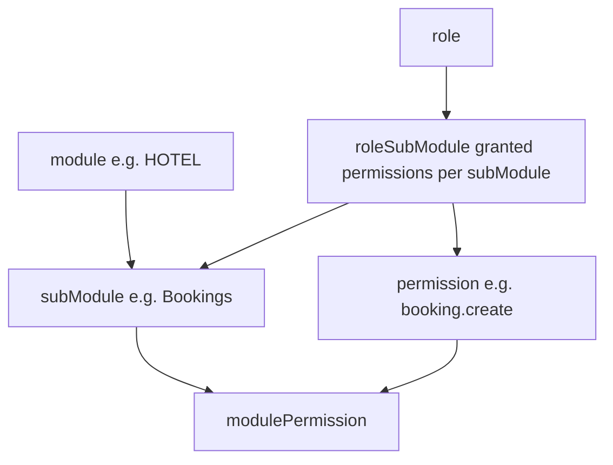

# 05 — RBAC (Modules, Sub-modules, Roles & Permissions)

Role-based access control catalog and role assignment. Permission codes referenced throughout other docs (e.g. `booking.create`) are defined here.

**Entities:** `module`, `subModule`, `permission`, `modulePermission`, `role`, `roleSubModule`
**Base path:** `/api/v1`
**Frontend module:** Admin → Roles & Permissions, Access Control matrix.

---

## Model



- `module` — top-level platform area (HOTEL, RESTAURANT, INVENTORY, PURCHASE, BILLING, ADMIN).
- `subModule` — feature group inside a module (Bookings, Rooms, Menu, Orders…).
- `permission` — atomic action code (`resource.action`).
- `modulePermission` — links which permissions apply to a sub-module.
- `role` — named role, org-scoped (plus system roles: SUPER_ADMIN, OWNER).
- `roleSubModule` — grants a role a set of permissions on a sub-module.

---

## Endpoint Summary

| # | Action | Method | Path | Auth | Permission |
|---|--------|--------|------|------|------------|
| 1 | List modules (+sub-modules tree) | GET | `/rbac/modules` | Bearer | `rbac.read` |
| 2 | List permissions | GET | `/rbac/permissions` | Bearer | `rbac.read` |
| 3 | List roles | GET | `/roles` | Bearer | `role.read` |
| 4 | Get role (+grants) | GET | `/roles/:id` | Bearer | `role.read` |
| 5 | Create role | POST | `/roles` | Bearer | `role.manage` |
| 6 | Update role | PATCH | `/roles/:id` | Bearer | `role.manage` |
| 7 | Delete role | DELETE | `/roles/:id` | Bearer | `role.manage` |
| 8 | Set role permissions (grant matrix) | PUT | `/roles/:id/permissions` | Bearer | `role.manage` |
| 9 | Clone role | POST | `/roles/:id/clone` | Bearer | `role.manage` |
| 10 | Get permission matrix (role×subModule) | GET | `/roles/:id/matrix` | Bearer | `role.read` |

> Modules, sub-modules & permissions are **platform-defined** (seeded, super-admin managed). Tenants read them and compose them into org-scoped **roles**.

---

## Modules Tree — `GET /rbac/modules`

Optional `?moduleCode=HOTEL` to scope. Only modules enabled by the org's subscription are returned by default (`?all=true` for super-admin).

```json
{
  "success": true,
  "message": "OK",
  "data": [
    {
      "id": "mod-hotel",
      "code": "HOTEL",
      "name": "Hotel Management",
      "subModules": [
        {
          "id": "sm-bookings",
          "code": "BOOKINGS",
          "name": "Bookings",
          "permissions": [
            { "id": "perm-b1", "code": "booking.read", "name": "View bookings" },
            { "id": "perm-b2", "code": "booking.create", "name": "Create booking" },
            { "id": "perm-b3", "code": "booking.checkin", "name": "Check-in guest" },
            { "id": "perm-b4", "code": "booking.checkout", "name": "Check-out guest" }
          ]
        },
        { "id": "sm-rooms", "code": "ROOMS", "name": "Rooms", "permissions": [] }
      ]
    }
  ],
  "meta": null
}
```

---

## Permissions — `GET /rbac/permissions`

Flat searchable list. Filter: `moduleCode`, `subModuleCode`.

```json
{
  "success": true,
  "message": "OK",
  "data": [
    { "id": "perm-b2", "code": "booking.create", "name": "Create booking", "module": "HOTEL", "subModule": "BOOKINGS" },
    { "id": "perm-o5", "code": "order.place", "name": "Place order", "module": "RESTAURANT", "subModule": "ORDERS" }
  ],
  "meta": { "page": 1, "limit": 50, "total": 2, "totalPages": 1, "hasNext": false, "hasPrev": false }
}
```

---

## Roles

### List — `GET /roles`

Branch-optionally-scoped; returns org roles + system roles. Filter: `isSystem`, `status`.

```json
{
  "success": true,
  "message": "OK",
  "data": [
    { "id": "role-owner", "name": "Owner", "isSystem": true, "userCount": 1, "status": "ACTIVE" },
    { "id": "role-fd", "name": "Front Desk", "isSystem": false, "userCount": 6, "status": "ACTIVE" },
    { "id": "role-mgr", "name": "Manager", "isSystem": false, "userCount": 3, "status": "ACTIVE" }
  ],
  "meta": { "page": 1, "limit": 20, "total": 3, "totalPages": 1, "hasNext": false, "hasPrev": false }
}
```

### Get (with grants) — `GET /roles/:id`

```json
{
  "success": true,
  "message": "OK",
  "data": {
    "id": "role-fd",
    "name": "Front Desk",
    "description": "Reception staff",
    "isSystem": false,
    "status": "ACTIVE",
    "grants": [
      { "subModuleId": "sm-bookings", "subModuleCode": "BOOKINGS", "permissions": ["booking.read", "booking.create", "booking.checkin", "booking.checkout"] },
      { "subModuleId": "sm-guests", "subModuleCode": "GUESTS", "permissions": ["guest.read", "guest.create"] }
    ]
  },
  "meta": null
}
```

### Create — `POST /roles`

```json
{ "name": "Housekeeping", "description": "Room status & cleaning" }
```

| Field | Type | Required | Notes |
|-------|------|----------|-------|
| `name` | string | Yes | Unique within org. |
| `description` | string | No | |

Response `201` → created role (no grants yet).

#### Errors

| Status | Code | Reason |
|--------|------|--------|
| 409 | ROLE_NAME_EXISTS | Duplicate name in org. |

### Update — `PATCH /roles/:id`

```json
{ "name": "Housekeeping Supervisor", "status": "ACTIVE" }
```

System roles (`isSystem: true`) return `403 SYSTEM_ROLE_IMMUTABLE`.

### Delete — `DELETE /roles/:id`

Soft-delete. `409 ROLE_IN_USE` if users are still assigned.

---

## Grant Matrix

### Set Role Permissions — `PUT /roles/:id/permissions`

Replaces the entire grant set for the role (`roleSubModule` rows). Permissions must belong to sub-modules of the org's enabled modules.

```json
{
  "grants": [
    { "subModuleId": "sm-bookings", "permissionCodes": ["booking.read", "booking.create", "booking.checkin"] },
    { "subModuleId": "sm-rooms", "permissionCodes": ["room.read", "room.setStatus"] }
  ]
}
```

Response `200`:

```json
{
  "success": true,
  "message": "Role permissions updated",
  "data": { "roleId": "role-fd", "subModuleCount": 2, "permissionCount": 5 },
  "meta": null
}
```

#### Errors

| Status | Code | Reason |
|--------|------|--------|
| 422 | INVALID_PERMISSION | Permission code not in sub-module. |
| 403 | MODULE_NOT_SUBSCRIBED | Sub-module belongs to a module not in the org's plan. |

### Clone Role — `POST /roles/:id/clone`

```json
{ "name": "Front Desk (Night)" }
```

Copies all grants into a new role. Response `201` → new role.

### Permission Matrix View — `GET /roles/:id/matrix`

UI-friendly grid: every sub-module × every permission with a `granted` boolean. Powers the checkbox matrix screen.

```json
{
  "success": true,
  "message": "OK",
  "data": {
    "roleId": "role-fd",
    "modules": [
      {
        "code": "HOTEL",
        "subModules": [
          {
            "code": "BOOKINGS",
            "permissions": [
              { "code": "booking.read", "granted": true },
              { "code": "booking.create", "granted": true },
              { "code": "booking.checkin", "granted": true },
              { "code": "booking.checkout", "granted": false }
            ]
          }
        ]
      }
    ]
  },
  "meta": null
}
```

---

## Notes

- A user's effective permissions = union of grants across all their assigned roles (see [`06-users.md`](06-users.md:1)). The `/auth/me` endpoint ([`01-auth.md`](01-auth.md:1)) returns the flattened permission code array used by the frontend for UI gating.
- Permission checks are enforced server-side per endpoint via the documented `Permission` column; the frontend uses `/auth/me` permissions only to show/hide UI, never as the security boundary.