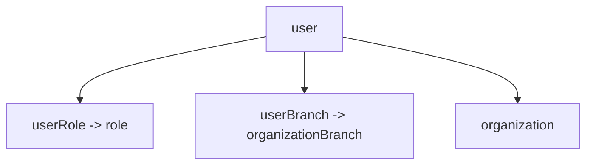

# 06 — Users

User management: CRUD, invitation flow, activation/status, and role assignment. Users belong to an organization and may be scoped to one or more branches.

**Entities:** `user` (plus `userRole` / `userBranch` join links)
**Base path:** `/api/v1`
**Frontend module:** Admin → Users & Team, Staff directory.

---

## Model



- A `user` always has an `organizationId`.
- Roles come from [`05-rbac.md`](05-rbac.md:1) via `userRole`.
- Branch access via `userBranch` (empty = all branches / org-wide for owner).

---

## Endpoint Summary

| # | Action | Method | Path | Auth | Permission |
|---|--------|--------|------|------|------------|
| 1 | List users | GET | `/users` | Bearer | `user.read` |
| 2 | Get user | GET | `/users/:id` | Bearer | `user.read` |
| 3 | Create user (direct) | POST | `/users` | Bearer | `user.manage` |
| 4 | Invite user (email) | POST | `/users/invite` | Bearer | `user.manage` |
| 5 | Accept invite (set password) | POST | `/users/accept-invite` | Public (token) | — |
| 6 | Update user | PATCH | `/users/:id` | Bearer | `user.manage` |
| 7 | Delete user | DELETE | `/users/:id` | Bearer | `user.manage` |
| 8 | Set user status | PATCH | `/users/:id/status` | Bearer | `user.manage` |
| 9 | Assign roles | PUT | `/users/:id/roles` | Bearer | `user.manage` |
| 10 | Assign branches | PUT | `/users/:id/branches` | Bearer | `user.manage` |
| 11 | Resend invite | POST | `/users/:id/resend-invite` | Bearer | `user.manage` |
| 12 | Reset user password (admin) | POST | `/users/:id/reset-password` | Bearer | `user.manage` |

---

## List — `GET /users`

Filter: `status`, `roleId`, `branchId`. Searchable: `firstName`, `lastName`, `email`, `phone`.

```json
{
  "success": true,
  "message": "OK",
  "data": [
    {
      "id": "usr-a1b2",
      "firstName": "Aarav",
      "lastName": "Shah",
      "email": "aarav@grandpalace.com",
      "phone": "+919812345670",
      "status": "ACTIVE",
      "roles": [{ "id": "role-fd", "name": "Front Desk" }],
      "branches": [{ "id": "br-main", "name": "Main Branch" }],
      "lastLoginAt": "2026-08-04T18:20:00.000Z",
      "createdAt": "2026-06-01T09:00:00.000Z"
    }
  ],
  "meta": { "page": 1, "limit": 20, "total": 1, "totalPages": 1, "hasNext": false, "hasPrev": false }
}
```

## Get — `GET /users/:id`

```json
{
  "success": true,
  "message": "OK",
  "data": {
    "id": "usr-a1b2",
    "firstName": "Aarav",
    "lastName": "Shah",
    "email": "aarav@grandpalace.com",
    "phone": "+919812345670",
    "avatarFileId": "file-778",
    "status": "ACTIVE",
    "isEmailVerified": true,
    "isPhoneVerified": false,
    "roles": [{ "id": "role-fd", "name": "Front Desk" }],
    "branches": [{ "id": "br-main", "name": "Main Branch" }],
    "lastLoginAt": "2026-08-04T18:20:00.000Z",
    "createdAt": "2026-06-01T09:00:00.000Z",
    "updatedAt": "2026-08-01T10:00:00.000Z"
  },
  "meta": null
}
```

---

## Create (direct) — `POST /users`

Creates an active user with a temporary password (returned once) or a provided one. Prefer **invite** for staff onboarding.

```json
{
  "firstName": "Isha",
  "lastName": "Verma",
  "email": "isha@grandpalace.com",
  "phone": "+919812345671",
  "password": "TempPass@123",
  "roleIds": ["role-fd"],
  "branchIds": ["br-main"]
}
```

| Field | Type | Required | Notes |
|-------|------|----------|-------|
| `email` | string | Yes | Unique within org. |
| `phone` | string | No | E.164. |
| `password` | string | No | If omitted, a temp password is generated & emailed. |
| `roleIds` | uuid[] | No | Defaults to none. |
| `branchIds` | uuid[] | No | Empty = org-wide. |

Response `201`:

```json
{
  "success": true,
  "message": "User created",
  "data": { "id": "usr-new1", "email": "isha@grandpalace.com", "status": "ACTIVE", "temporaryPassword": null },
  "meta": null
}
```

#### Errors

| Status | Code | Reason |
|--------|------|--------|
| 409 | EMAIL_EXISTS | Email already used in org. |
| 422 | USER_LIMIT_REACHED | `maxUsers` plan limit hit (see [`04-subscription-plans.md`](04-subscription-plans.md:1)). |

---

## Invite — `POST /users/invite`

Creates a `PENDING` user and emails an invite link with a signed token.

```json
{
  "firstName": "Rohan",
  "lastName": "Mehta",
  "email": "rohan@grandpalace.com",
  "roleIds": ["role-mgr"],
  "branchIds": ["br-main", "br-airport"]
}
```

Response `201`:

```json
{
  "success": true,
  "message": "Invitation sent",
  "data": { "id": "usr-inv1", "email": "rohan@grandpalace.com", "status": "PENDING", "inviteExpiresAt": "2026-08-12T06:22:00.000Z" },
  "meta": null
}
```

### Accept Invite — `POST /users/accept-invite`

Public; consumes the invite token, sets password, activates the user.

```json
{ "token": "inv_eyJhbGciOi...", "password": "MyStrongPass@1", "confirmPassword": "MyStrongPass@1" }
```

Response `200`:

```json
{
  "success": true,
  "message": "Account activated",
  "data": {
    "user": { "id": "usr-inv1", "email": "rohan@grandpalace.com", "status": "ACTIVE" },
    "accessToken": "eyJhbGciOi...",
    "refreshToken": "eyJhbGciOi..."
  },
  "meta": null
}
```

#### Errors

| Status | Code | Reason |
|--------|------|--------|
| 400 | INVALID_INVITE_TOKEN | Malformed/tampered token. |
| 410 | INVITE_EXPIRED | Past `inviteExpiresAt`. |
| 409 | INVITE_ALREADY_USED | Already accepted. |

### Resend Invite — `POST /users/:id/resend-invite`

Regenerates token, re-emails. `409 USER_NOT_PENDING` if user is already active.

---

## Update — `PATCH /users/:id`

```json
{ "firstName": "Rohan", "phone": "+919812345672", "avatarFileId": "file-901" }
```

Email changes may require re-verification (triggers OTP flow in [`01-auth.md`](01-auth.md:1)). Response `200` → updated user.

## Delete — `DELETE /users/:id`

Soft-delete; revokes sessions (bumps `tokenVersion`). Cannot delete the last OWNER → `422 LAST_OWNER`.

---

## Set Status — `PATCH /users/:id/status`

```json
{ "status": "SUSPENDED", "reason": "On leave" }
```

| Value | Effect |
|-------|--------|
| `ACTIVE` | Can log in. |
| `SUSPENDED` | Blocked from login; sessions revoked. |
| `INACTIVE` | Archived, hidden from active lists. |

Response `200`:

```json
{ "success": true, "message": "User suspended", "data": { "id": "usr-a1b2", "status": "SUSPENDED" }, "meta": null }
```

---

## Assign Roles — `PUT /users/:id/roles`

Replaces the user's role set. Effective permissions recomputed on next `/auth/me`.

```json
{ "roleIds": ["role-mgr", "role-fd"] }
```

Response `200`:

```json
{ "success": true, "message": "Roles updated", "data": { "userId": "usr-a1b2", "roleIds": ["role-mgr", "role-fd"] }, "meta": null }
```

#### Errors

| Status | Code | Reason |
|--------|------|--------|
| 404 | ROLE_NOT_FOUND | A role id is invalid/out-of-org. |
| 422 | LAST_OWNER | Removing OWNER from the final owner. |

## Assign Branches — `PUT /users/:id/branches`

```json
{ "branchIds": ["br-main", "br-airport"] }
```

Empty array = org-wide access (owner/admin). Response `200` → updated branch list.

---

## Reset Password (admin) — `POST /users/:id/reset-password`

Forces a password reset: either sets a provided temp password or emails a reset link. Revokes existing sessions.

```json
{ "mode": "EMAIL_LINK" }
```

| `mode` | Behavior |
|--------|----------|
| `EMAIL_LINK` | Sends reset link (see forgot/reset in [`01-auth.md`](01-auth.md:1)). |
| `TEMP_PASSWORD` | Generates temp password, returns it once, forces change on next login. |

Response `200`:

```json
{ "success": true, "message": "Reset link sent", "data": { "userId": "usr-a1b2", "temporaryPassword": null }, "meta": null }
```

---

## User Status Lifecycle

```mermaid
stateDiagram-v2
  [*] --> PENDING: invite
  PENDING --> ACTIVE: accept invite
  [*] --> ACTIVE: direct create
  ACTIVE --> SUSPENDED: suspend
  SUSPENDED --> ACTIVE: reactivate
  ACTIVE --> INACTIVE: archive
  INACTIVE --> ACTIVE: restore
  ACTIVE --> [*]: delete soft