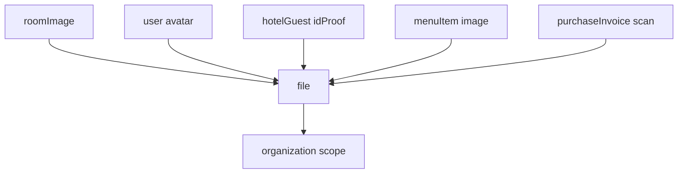

# 07 — Files & Uploads

Centralized file storage used by avatars, room images, ID proofs, menu images, purchase invoice scans, etc. Files are referenced by other entities via a `fileId`.

**Entities:** `file`
**Base path:** `/api/v1/files`
**Frontend module:** Shared upload widget / media picker (used across all modules).

---

## Model



- Files store metadata (`originalName`, `mimeType`, `size`, `storageKey`, `url`).
- Uploads return a `fileId`; consuming entities persist that id.
- Files are org-scoped; some (e.g. room images) are branch-scoped via `organizationBranchId`.

---

## Endpoint Summary

| # | Action | Method | Path | Auth | Permission |
|---|--------|--------|------|------|------------|
| 1 | Upload file | POST | `/files` | Bearer | `file.upload` |
| 2 | Upload multiple | POST | `/files/bulk` | Bearer | `file.upload` |
| 3 | List files | GET | `/files` | Bearer | `file.read` |
| 4 | Get file metadata | GET | `/files/:id` | Bearer | `file.read` |
| 5 | Download / stream file | GET | `/files/:id/download` | Bearer | `file.read` |
| 6 | Get temporary signed URL | GET | `/files/:id/signed-url` | Bearer | `file.read` |
| 7 | Delete file | DELETE | `/files/:id` | Bearer | `file.delete` |

---

## Upload — `POST /files`

`Content-Type: multipart/form-data`.

| Field | Type | Required | Notes |
|-------|------|----------|-------|
| `file` | binary | Yes | The uploaded file part. |
| `purpose` | string | No | `AVATAR` \| `ROOM_IMAGE` \| `ID_PROOF` \| `MENU_IMAGE` \| `PURCHASE_INVOICE` \| `GENERAL`. Drives validation. |
| `isPublic` | boolean | No | Public files served via CDN URL; private require signed URL. Default `false`. |

**Constraints (by purpose):**

| Purpose | Allowed types | Max size |
|---------|---------------|----------|
| AVATAR / ROOM_IMAGE / MENU_IMAGE | jpeg, png, webp | 5 MB |
| ID_PROOF / PURCHASE_INVOICE | jpeg, png, pdf | 10 MB |
| GENERAL | any allow-listed | 15 MB |

Response `201`:

```json
{
  "success": true,
  "message": "File uploaded",
  "data": {
    "id": "file-9f3a",
    "originalName": "room-101.jpg",
    "mimeType": "image/jpeg",
    "size": 284512,
    "purpose": "ROOM_IMAGE",
    "isPublic": true,
    "url": "https://cdn.example.com/org-3k2l/room-101-9f3a.jpg",
    "createdAt": "2026-08-05T06:23:00.000Z"
  },
  "meta": null
}
```

#### Errors

| Status | Code | Reason |
|--------|------|--------|
| 400 | NO_FILE | Missing file part. |
| 413 | FILE_TOO_LARGE | Exceeds max for purpose. |
| 415 | UNSUPPORTED_MEDIA_TYPE | MIME not allowed for purpose. |
| 422 | STORAGE_QUOTA_EXCEEDED | Org storage cap reached. |

---

## Bulk Upload — `POST /files/bulk`

`multipart/form-data` with repeated `files[]` parts (max 10). Shared `purpose`.

Response `201`:

```json
{
  "success": true,
  "message": "3 files uploaded",
  "data": [
    { "id": "file-a1", "originalName": "r1.jpg", "url": "https://cdn.example.com/.../r1.jpg" },
    { "id": "file-a2", "originalName": "r2.jpg", "url": "https://cdn.example.com/.../r2.jpg" },
    { "id": "file-a3", "originalName": "r3.jpg", "url": "https://cdn.example.com/.../r3.jpg" }
  ],
  "meta": { "uploaded": 3, "failed": 0 }
}
```

Partial failures return per-item status in `meta.errors[]` (still `201` with mixed results).

---

## List — `GET /files`

Filter: `purpose`, `mimeType`, `isPublic`, `createdFrom`, `createdTo`. Searchable: `originalName`.

```json
{
  "success": true,
  "message": "OK",
  "data": [
    { "id": "file-9f3a", "originalName": "room-101.jpg", "mimeType": "image/jpeg", "size": 284512, "purpose": "ROOM_IMAGE", "url": "https://cdn.example.com/.../room-101-9f3a.jpg", "createdAt": "2026-08-05T06:23:00.000Z" }
  ],
  "meta": { "page": 1, "limit": 20, "total": 1, "totalPages": 1, "hasNext": false, "hasPrev": false }
}
```

## Get Metadata — `GET /files/:id`

```json
{
  "success": true,
  "message": "OK",
  "data": {
    "id": "file-9f3a",
    "originalName": "room-101.jpg",
    "mimeType": "image/jpeg",
    "size": 284512,
    "purpose": "ROOM_IMAGE",
    "isPublic": true,
    "url": "https://cdn.example.com/.../room-101-9f3a.jpg",
    "uploadedBy": "usr-a1b2",
    "createdAt": "2026-08-05T06:23:00.000Z"
  },
  "meta": null
}
```

---

## Download — `GET /files/:id/download`

Streams the raw bytes with `Content-Disposition: attachment`. For private files, requires `file.read` and org scope match. Returns `404 FILE_NOT_FOUND` if missing/foreign-org.

## Signed URL — `GET /files/:id/signed-url`

Returns a short-lived URL (default 5 min) for private files (e.g. ID proofs). Optional `?expiresIn=600` (seconds, max 3600).

```json
{
  "success": true,
  "message": "OK",
  "data": {
    "id": "file-idp-1",
    "signedUrl": "https://storage.example.com/private/idp-1?sig=...&exp=1754375000",
    "expiresAt": "2026-08-05T06:33:00.000Z"
  },
  "meta": null
}
```

---

## Delete — `DELETE /files/:id`

Soft-delete metadata and schedule storage removal. If the file is still referenced (e.g. active room image), returns:

| Status | Code | Reason |
|--------|------|--------|
| 409 | FILE_IN_USE | Referenced by an active entity. Detach first. |

Response `200`:

```json
{ "success": true, "message": "File deleted", "data": { "id": "file-9f3a" }, "meta": null }
```

---

## Usage Notes

- Upload first → receive `fileId` → send `fileId` in the consuming entity's create/update payload (e.g. `avatarFileId`, `roomImages[].fileId`, `idProofFileId`).
- Public assets (room/menu images) expose a permanent `url`. Sensitive assets (ID proofs, purchase invoices) should be `isPublic: false` and accessed via signed URL.
- Ordering for galleries (room images) is handled by the consuming module (see [`09-rooms-setup.md`](09-rooms-setup.md:1)), not the file entity.