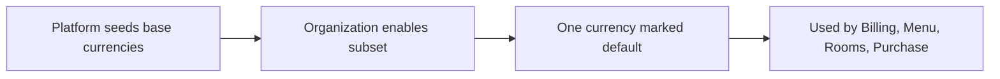

# 08 — Currency

Manage the catalog of currencies used across the platform for pricing, invoices, and payments. Currencies are seeded globally (platform-managed base list) and can be extended or toggled per organization to control which currencies are selectable in billing, menus, room rates, and purchases.

- **Entities:** `currency`
- **Base path:** `/api/v1/currencies`
- **Frontend module:** Settings → Currencies (and referenced by Billing, Menu, Rooms, Purchase pricing selectors)

See [Conventions](00-conventions.md:1) for the response envelope, auth, tenancy scoping, pagination, and error format used throughout.

---

## Overview



Notes:
- The platform seeds a global master list of ISO-4217 currencies (`code`, `name`, `symbol`, `numericCode`, `decimalDigits`). These are read-only for organizations.
- Each organization enables the subset of currencies it transacts in and marks **exactly one** as the **default** currency. The default is used wherever a currency is not explicitly specified.
- `code` is the unique ISO-4217 alpha-3 code (e.g. `USD`, `INR`, `AED`) and is immutable once created.
- Amounts elsewhere in the platform are stored as minor units where `decimalDigits` defines the scale (e.g. `INR` = 2 → paise). Use this field when formatting/parsing money.
- Soft-delete applies; a currency **in use** by any invoice, payment, price, or rate cannot be hard-removed and is protected on delete.

---

## Endpoint Summary

| # | Action | Method | Path | Auth | Permission |
|---|--------|--------|------|------|------------|
| 1 | List currencies | GET | `/api/v1/currencies` | Bearer | `currency.read` |
| 2 | Get currency | GET | `/api/v1/currencies/:id` | Bearer | `currency.read` |
| 3 | Create currency | POST | `/api/v1/currencies` | Bearer | `currency.create` |
| 4 | Update currency | PATCH | `/api/v1/currencies/:id` | Bearer | `currency.update` |
| 5 | Delete currency | DELETE | `/api/v1/currencies/:id` | Bearer | `currency.delete` |
| 6 | Set default currency | PUT | `/api/v1/currencies/:id/default` | Bearer | `currency.update` |
| 7 | Set currency status | PATCH | `/api/v1/currencies/:id/status` | Bearer | `currency.update` |

---

## 1. List currencies

`GET /api/v1/currencies`

Returns the currencies visible to the current organization. By default returns only enabled (active) currencies; pass filters to widen the result.

### Query parameters

| Param | Type | Default | Description |
|-------|------|---------|-------------|
| `page` | number | `1` | Page number |
| `limit` | number | `20` | Items per page (max 100) |
| `search` | string | — | Matches `code`, `name`, or `symbol` |
| `status` | string | — | `ACTIVE` \| `INACTIVE` |
| `isDefault` | boolean | — | Filter to the default currency |
| `sortBy` | string | `code` | `code` \| `name` \| `createdAt` |
| `sortOrder` | string | `asc` | `asc` \| `desc` |
| `includeDeleted` | boolean | `false` | Include soft-deleted rows |

### Response — `200 OK`

```json
{
  "success": true,
  "message": "Currencies retrieved successfully",
  "data": [
    {
      "id": "a1f0c2d4-1111-4a2b-9c3d-000000000001",
      "code": "INR",
      "name": "Indian Rupee",
      "symbol": "₹",
      "numericCode": "356",
      "decimalDigits": 2,
      "isDefault": true,
      "status": "ACTIVE",
      "createdAt": "2026-01-10T08:15:00.000Z",
      "updatedAt": "2026-01-10T08:15:00.000Z"
    },
    {
      "id": "a1f0c2d4-1111-4a2b-9c3d-000000000002",
      "code": "USD",
      "name": "US Dollar",
      "symbol": "$",
      "numericCode": "840",
      "decimalDigits": 2,
      "isDefault": false,
      "status": "ACTIVE",
      "createdAt": "2026-01-10T08:16:00.000Z",
      "updatedAt": "2026-01-10T08:16:00.000Z"
    }
  ],
  "meta": {
    "page": 1,
    "limit": 20,
    "total": 2,
    "totalPages": 1,
    "hasNext": false,
    "hasPrev": false
  }
}
```

### Errors

| Status | Code | When |
|--------|------|------|
| 401 | `UNAUTHENTICATED` | Missing/invalid token |
| 403 | `FORBIDDEN` | Missing `currency.read` |

---

## 2. Get currency

`GET /api/v1/currencies/:id`

### Response — `200 OK`

```json
{
  "success": true,
  "message": "Currency retrieved successfully",
  "data": {
    "id": "a1f0c2d4-1111-4a2b-9c3d-000000000001",
    "code": "INR",
    "name": "Indian Rupee",
    "symbol": "₹",
    "numericCode": "356",
    "decimalDigits": 2,
    "isDefault": true,
    "status": "ACTIVE",
    "createdAt": "2026-01-10T08:15:00.000Z",
    "updatedAt": "2026-01-10T08:15:00.000Z"
  },
  "meta": {}
}
```

### Errors

| Status | Code | When |
|--------|------|------|
| 401 | `UNAUTHENTICATED` | Missing/invalid token |
| 403 | `FORBIDDEN` | Missing `currency.read` |
| 404 | `CURRENCY_NOT_FOUND` | No currency with that id in scope |

---

## 3. Create currency

`POST /api/v1/currencies`

Enable a currency for the organization. Typically the `code` is chosen from the platform master list; supplying a valid ISO-4217 code auto-fills canonical `name`/`symbol`/`numericCode`/`decimalDigits` if omitted.

### Request

```json
{
  "code": "AED",
  "name": "UAE Dirham",
  "symbol": "د.إ",
  "numericCode": "784",
  "decimalDigits": 2,
  "status": "ACTIVE",
  "isDefault": false
}
```

### Fields

| Field | Type | Required | Notes |
|-------|------|----------|-------|
| `code` | string | Yes | ISO-4217 alpha-3, uppercase, unique per org. Immutable after creation |
| `name` | string | No | Display name; defaults from master list if known |
| `symbol` | string | No | Display symbol; defaults from master list if known |
| `numericCode` | string | No | ISO-4217 numeric code |
| `decimalDigits` | number | No | 0–4; defaults from master list (usually 2) |
| `status` | string | No | `ACTIVE` (default) \| `INACTIVE` |
| `isDefault` | boolean | No | If `true`, atomically demotes the previous default |

### Response — `201 Created`

```json
{
  "success": true,
  "message": "Currency created successfully",
  "data": {
    "id": "a1f0c2d4-1111-4a2b-9c3d-000000000003",
    "code": "AED",
    "name": "UAE Dirham",
    "symbol": "د.إ",
    "numericCode": "784",
    "decimalDigits": 2,
    "isDefault": false,
    "status": "ACTIVE",
    "createdAt": "2026-08-05T06:20:00.000Z",
    "updatedAt": "2026-08-05T06:20:00.000Z"
  },
  "meta": {}
}
```

### Errors

| Status | Code | When |
|--------|------|------|
| 401 | `UNAUTHENTICATED` | Missing/invalid token |
| 403 | `FORBIDDEN` | Missing `currency.create` |
| 409 | `CURRENCY_CODE_EXISTS` | `code` already enabled in this organization |
| 422 | `VALIDATION_ERROR` | Invalid ISO code / decimalDigits out of range |

---

## 4. Update currency

`PATCH /api/v1/currencies/:id`

Partial update of display attributes. `code` is immutable and rejected if included with a different value.

### Request

```json
{
  "name": "UAE Dirham (AED)",
  "symbol": "AED",
  "decimalDigits": 2
}
```

### Fields

| Field | Type | Required | Notes |
|-------|------|----------|-------|
| `name` | string | No | Display name |
| `symbol` | string | No | Display symbol |
| `numericCode` | string | No | ISO-4217 numeric code |
| `decimalDigits` | number | No | 0–4. Changing scale is blocked if currency is already in use (see errors) |

### Response — `200 OK`

```json
{
  "success": true,
  "message": "Currency updated successfully",
  "data": {
    "id": "a1f0c2d4-1111-4a2b-9c3d-000000000003",
    "code": "AED",
    "name": "UAE Dirham (AED)",
    "symbol": "AED",
    "numericCode": "784",
    "decimalDigits": 2,
    "isDefault": false,
    "status": "ACTIVE",
    "createdAt": "2026-08-05T06:20:00.000Z",
    "updatedAt": "2026-08-05T06:25:00.000Z"
  },
  "meta": {}
}
```

### Errors

| Status | Code | When |
|--------|------|------|
| 401 | `UNAUTHENTICATED` | Missing/invalid token |
| 403 | `FORBIDDEN` | Missing `currency.update` |
| 404 | `CURRENCY_NOT_FOUND` | No currency with that id in scope |
| 409 | `CURRENCY_CODE_IMMUTABLE` | Attempted to change `code` |
| 422 | `CURRENCY_SCALE_LOCKED` | `decimalDigits` change blocked; currency already used by money records |

---

## 5. Delete currency

`DELETE /api/v1/currencies/:id`

Soft-deletes the currency (sets `deletedAt`). Protected if referenced by any invoice, payment, price, or rate, and the default currency cannot be deleted.

### Response — `200 OK`

```json
{
  "success": true,
  "message": "Currency deleted successfully",
  "data": { "id": "a1f0c2d4-1111-4a2b-9c3d-000000000003", "deletedAt": "2026-08-05T06:30:00.000Z" },
  "meta": {}
}
```

### Errors

| Status | Code | When |
|--------|------|------|
| 401 | `UNAUTHENTICATED` | Missing/invalid token |
| 403 | `FORBIDDEN` | Missing `currency.delete` |
| 404 | `CURRENCY_NOT_FOUND` | No currency with that id in scope |
| 409 | `CURRENCY_IN_USE` | Referenced by invoices/payments/prices/rates |
| 422 | `DEFAULT_CURRENCY_PROTECTED` | Cannot delete the default currency; set another default first |

---

## 6. Set default currency

`PUT /api/v1/currencies/:id/default`

Marks the currency as the organization default. Atomically demotes the previous default so exactly one default always exists. The target currency must be `ACTIVE`.

### Request

_No body._

### Response — `200 OK`

```json
{
  "success": true,
  "message": "Default currency updated successfully",
  "data": {
    "id": "a1f0c2d4-1111-4a2b-9c3d-000000000002",
    "code": "USD",
    "isDefault": true,
    "previousDefaultId": "a1f0c2d4-1111-4a2b-9c3d-000000000001"
  },
  "meta": {}
}
```

### Errors

| Status | Code | When |
|--------|------|------|
| 401 | `UNAUTHENTICATED` | Missing/invalid token |
| 403 | `FORBIDDEN` | Missing `currency.update` |
| 404 | `CURRENCY_NOT_FOUND` | No currency with that id in scope |
| 422 | `CURRENCY_INACTIVE` | Cannot set an `INACTIVE` currency as default |

---

## 7. Set currency status

`PATCH /api/v1/currencies/:id/status`

Enable or disable a currency. Disabling hides it from selection in new pricing/billing UIs but does not affect historical records. The default currency cannot be set `INACTIVE`.

### Request

```json
{ "status": "INACTIVE" }
```

### Fields

| Field | Type | Required | Notes |
|-------|------|----------|-------|
| `status` | string | Yes | `ACTIVE` \| `INACTIVE` |

### Response — `200 OK`

```json
{
  "success": true,
  "message": "Currency status updated successfully",
  "data": {
    "id": "a1f0c2d4-1111-4a2b-9c3d-000000000003",
    "code": "AED",
    "status": "INACTIVE",
    "updatedAt": "2026-08-05T06:35:00.000Z"
  },
  "meta": {}
}
```

### Errors

| Status | Code | When |
|--------|------|------|
| 401 | `UNAUTHENTICATED` | Missing/invalid token |
| 403 | `FORBIDDEN` | Missing `currency.update` |
| 404 | `CURRENCY_NOT_FOUND` | No currency with that id in scope |
| 422 | `DEFAULT_CURRENCY_PROTECTED` | Cannot deactivate the default currency |

---

## Related

- [Billing](19-billing.md:1) — invoices and payments reference the currency `code`/`decimalDigits` for amount formatting.
- [Menu](13-menu.md:1), [Rooms Setup](09-rooms-setup.md:1), [Purchase](18-purchase.md:1) — pricing fields use the enabled currency list; the default currency is pre-selected.
- [Conventions](00-conventions.md:1) — money is stored in minor units scaled by `decimalDigits`.