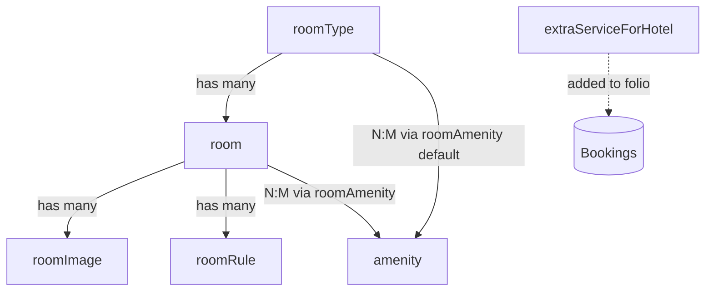
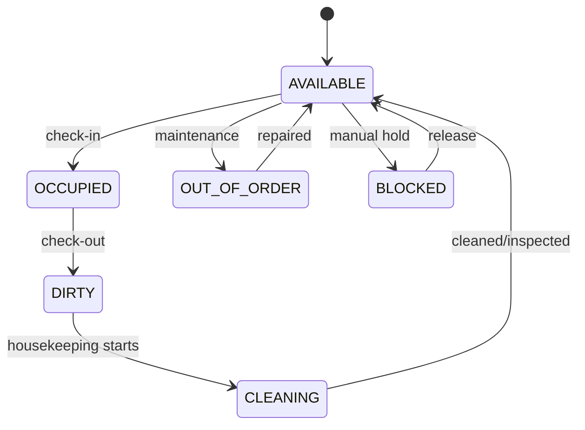

# 09 — Rooms Setup (Hotel)

Configure the hotel's physical inventory: room types (categories with base rates and occupancy), amenities, individual rooms, room images, house rules, room ↔ amenity links, and extra services offered to guests. This module is the foundation for availability search and bookings.

- **Entities:** `roomType`, `amenity`, `room`, `roomImage`, `roomRule`, `roomAmenity`, `extraServiceForHotel`
- **Base path:** `/api/v1/hotel`
- **Frontend module:** Hotel → Rooms Setup (Room Types, Amenities, Rooms, Extra Services)

See [Conventions](00-conventions.md:1) for the response envelope, auth, tenancy scoping, pagination, and error format. Room rates/prices use the enabled [Currency](08-currency.md:1) list (default currency pre-selected). Images are attached via [Files](07-files.md:1).

---

## Domain overview



Notes:
- A **roomType** defines a category (e.g. Deluxe King) with base rate, max occupancy, bed configuration, and default amenities. Individual **rooms** inherit type defaults but can override rate and amenities.
- A **room** belongs to exactly one `roomType` and one branch. Its `roomNumber` is unique per branch.
- **roomAmenity** links amenities to either a `roomType` (default set) or a specific `room` (override).
- **extraServiceForHotel** are chargeable add-ons (airport pickup, breakfast, spa) referenced when posting folio transactions.
- All money fields are stored in minor units scaled by the currency `decimalDigits` (see [Currency](08-currency.md:1)).
- Soft-delete applies to all entities; rooms/types referenced by active bookings are protected on delete.

---

## Room operational status



`status` values: `AVAILABLE`, `OCCUPIED`, `DIRTY`, `CLEANING`, `OUT_OF_ORDER`, `BLOCKED`. Booking-driven transitions (`OCCUPIED`, `DIRTY`) are set by [Bookings](11-bookings-folio.md:1) check-in/out; housekeeping and maintenance transitions are set here via the status endpoint.

---

## Endpoint Summary

### Room Types

| # | Action | Method | Path | Auth | Permission |
|---|--------|--------|------|------|------------|
| 1 | List room types | GET | `/api/v1/hotel/room-types` | Bearer | `roomType.read` |
| 2 | Get room type | GET | `/api/v1/hotel/room-types/:id` | Bearer | `roomType.read` |
| 3 | Create room type | POST | `/api/v1/hotel/room-types` | Bearer | `roomType.create` |
| 4 | Update room type | PATCH | `/api/v1/hotel/room-types/:id` | Bearer | `roomType.update` |
| 5 | Delete room type | DELETE | `/api/v1/hotel/room-types/:id` | Bearer | `roomType.delete` |
| 6 | Set room type default amenities | PUT | `/api/v1/hotel/room-types/:id/amenities` | Bearer | `roomType.update` |

### Amenities

| # | Action | Method | Path | Auth | Permission |
|---|--------|--------|------|------|------------|
| 7 | List amenities | GET | `/api/v1/hotel/amenities` | Bearer | `amenity.read` |
| 8 | Create amenity | POST | `/api/v1/hotel/amenities` | Bearer | `amenity.create` |
| 9 | Update amenity | PATCH | `/api/v1/hotel/amenities/:id` | Bearer | `amenity.update` |
| 10 | Delete amenity | DELETE | `/api/v1/hotel/amenities/:id` | Bearer | `amenity.delete` |

### Rooms

| # | Action | Method | Path | Auth | Permission |
|---|--------|--------|------|------|------------|
| 11 | List rooms | GET | `/api/v1/hotel/rooms` | Bearer | `room.read` |
| 12 | Get room | GET | `/api/v1/hotel/rooms/:id` | Bearer | `room.read` |
| 13 | Create room | POST | `/api/v1/hotel/rooms` | Bearer | `room.create` |
| 14 | Update room | PATCH | `/api/v1/hotel/rooms/:id` | Bearer | `room.update` |
| 15 | Delete room | DELETE | `/api/v1/hotel/rooms/:id` | Bearer | `room.delete` |
| 16 | Set room status | PATCH | `/api/v1/hotel/rooms/:id/status` | Bearer | `room.update` |
| 17 | Set room amenities (override) | PUT | `/api/v1/hotel/rooms/:id/amenities` | Bearer | `room.update` |

### Room Images & Rules

| # | Action | Method | Path | Auth | Permission |
|---|--------|--------|------|------|------------|
| 18 | Add room images | POST | `/api/v1/hotel/rooms/:id/images` | Bearer | `room.update` |
| 19 | Reorder room images | PUT | `/api/v1/hotel/rooms/:id/images/order` | Bearer | `room.update` |
| 20 | Delete room image | DELETE | `/api/v1/hotel/rooms/:id/images/:imageId` | Bearer | `room.update` |
| 21 | List room rules | GET | `/api/v1/hotel/rooms/:id/rules` | Bearer | `room.read` |
| 22 | Set room rules | PUT | `/api/v1/hotel/rooms/:id/rules` | Bearer | `room.update` |

### Extra Services

| # | Action | Method | Path | Auth | Permission |
|---|--------|--------|------|------|------------|
| 23 | List extra services | GET | `/api/v1/hotel/extra-services` | Bearer | `extraService.read` |
| 24 | Create extra service | POST | `/api/v1/hotel/extra-services` | Bearer | `extraService.create` |
| 25 | Update extra service | PATCH | `/api/v1/hotel/extra-services/:id` | Bearer | `extraService.update` |
| 26 | Delete extra service | DELETE | `/api/v1/hotel/extra-services/:id` | Bearer | `extraService.delete` |

### Availability

| # | Action | Method | Path | Auth | Permission |
|---|--------|--------|------|------|------------|
| 27 | Check room availability | GET | `/api/v1/hotel/rooms/availability` | Bearer | `room.read` |

---

## Room Types

### 1. List room types

`GET /api/v1/hotel/room-types`

#### Query parameters

| Param | Type | Default | Description |
|-------|------|---------|-------------|
| `page` | number | `1` | Page number |
| `limit` | number | `20` | Items per page (max 100) |
| `search` | string | — | Matches `name`/`code` |
| `status` | string | — | `ACTIVE` \| `INACTIVE` |
| `sortBy` | string | `name` | `name` \| `baseRate` \| `maxOccupancy` \| `createdAt` |
| `sortOrder` | string | `asc` | `asc` \| `desc` |
| `includeDeleted` | boolean | `false` | Include soft-deleted rows |

#### Response — `200 OK`

```json
{
  "success": true,
  "message": "Room types retrieved successfully",
  "data": [
    {
      "id": "rt-0001",
      "name": "Deluxe King",
      "code": "DLX-K",
      "description": "Spacious king room with city view",
      "baseRate": 450000,
      "currencyCode": "INR",
      "maxOccupancy": 3,
      "maxAdults": 2,
      "maxChildren": 1,
      "bedType": "KING",
      "sizeSqft": 320,
      "roomCount": 12,
      "status": "ACTIVE",
      "createdAt": "2026-02-01T10:00:00.000Z",
      "updatedAt": "2026-02-01T10:00:00.000Z"
    }
  ],
  "meta": { "page": 1, "limit": 20, "total": 1, "totalPages": 1, "hasNext": false, "hasPrev": false }
}
```

#### Errors

| Status | Code | When |
|--------|------|------|
| 401 | `UNAUTHENTICATED` | Missing/invalid token |
| 403 | `FORBIDDEN` | Missing `roomType.read` |

---

### 2. Get room type

`GET /api/v1/hotel/room-types/:id`

#### Response — `200 OK`

```json
{
  "success": true,
  "message": "Room type retrieved successfully",
  "data": {
    "id": "rt-0001",
    "name": "Deluxe King",
    "code": "DLX-K",
    "description": "Spacious king room with city view",
    "baseRate": 450000,
    "currencyCode": "INR",
    "maxOccupancy": 3,
    "maxAdults": 2,
    "maxChildren": 1,
    "bedType": "KING",
    "sizeSqft": 320,
    "defaultAmenities": [
      { "id": "am-01", "name": "Wi-Fi" },
      { "id": "am-02", "name": "Air Conditioning" }
    ],
    "status": "ACTIVE",
    "createdAt": "2026-02-01T10:00:00.000Z",
    "updatedAt": "2026-02-01T10:00:00.000Z"
  },
  "meta": {}
}
```

#### Errors

| Status | Code | When |
|--------|------|------|
| 404 | `ROOM_TYPE_NOT_FOUND` | No room type with that id in scope |

---

### 3. Create room type

`POST /api/v1/hotel/room-types`

#### Request

```json
{
  "name": "Deluxe King",
  "code": "DLX-K",
  "description": "Spacious king room with city view",
  "baseRate": 450000,
  "currencyCode": "INR",
  "maxOccupancy": 3,
  "maxAdults": 2,
  "maxChildren": 1,
  "bedType": "KING",
  "sizeSqft": 320,
  "defaultAmenityIds": ["am-01", "am-02"],
  "status": "ACTIVE"
}
```

#### Fields

| Field | Type | Required | Notes |
|-------|------|----------|-------|
| `name` | string | Yes | Display name |
| `code` | string | No | Short code, unique per branch |
| `description` | string | No | — |
| `baseRate` | number | Yes | Minor units in `currencyCode` |
| `currencyCode` | string | No | Defaults to org default currency |
| `maxOccupancy` | number | Yes | Total guests |
| `maxAdults` | number | No | — |
| `maxChildren` | number | No | — |
| `bedType` | string | No | `SINGLE` \| `TWIN` \| `QUEEN` \| `KING` \| `SUITE` |
| `sizeSqft` | number | No | — |
| `defaultAmenityIds` | string[] | No | Seeds `roomAmenity` defaults |
| `status` | string | No | `ACTIVE` (default) \| `INACTIVE` |

#### Response — `201 Created`

```json
{
  "success": true,
  "message": "Room type created successfully",
  "data": { "id": "rt-0002", "name": "Deluxe King", "code": "DLX-K", "status": "ACTIVE" },
  "meta": {}
}
```

#### Errors

| Status | Code | When |
|--------|------|------|
| 403 | `FORBIDDEN` | Missing `roomType.create` |
| 409 | `ROOM_TYPE_CODE_EXISTS` | `code` already used in branch |
| 422 | `VALIDATION_ERROR` | Invalid occupancy/rate |

---

### 4. Update room type

`PATCH /api/v1/hotel/room-types/:id`

Partial update. Changing `baseRate` affects only **future** rate lookups, not existing bookings.

#### Request

```json
{ "baseRate": 480000, "maxOccupancy": 4 }
```

#### Response — `200 OK`

```json
{
  "success": true,
  "message": "Room type updated successfully",
  "data": { "id": "rt-0001", "baseRate": 480000, "maxOccupancy": 4, "updatedAt": "2026-08-05T06:40:00.000Z" },
  "meta": {}
}
```

#### Errors

| Status | Code | When |
|--------|------|------|
| 404 | `ROOM_TYPE_NOT_FOUND` | No room type with that id |
| 422 | `VALIDATION_ERROR` | Invalid values |

---

### 5. Delete room type

`DELETE /api/v1/hotel/room-types/:id`

Soft-deletes. Protected if any room references it.

#### Response — `200 OK`

```json
{
  "success": true,
  "message": "Room type deleted successfully",
  "data": { "id": "rt-0002", "deletedAt": "2026-08-05T06:41:00.000Z" },
  "meta": {}
}
```

#### Errors

| Status | Code | When |
|--------|------|------|
| 404 | `ROOM_TYPE_NOT_FOUND` | No room type with that id |
| 409 | `ROOM_TYPE_IN_USE` | Rooms of this type exist |

---

### 6. Set room type default amenities

`PUT /api/v1/hotel/room-types/:id/amenities`

Replaces the default amenity set for the type (used as the baseline for new rooms).

#### Request

```json
{ "amenityIds": ["am-01", "am-02", "am-05"] }
```

#### Response — `200 OK`

```json
{
  "success": true,
  "message": "Room type amenities updated successfully",
  "data": { "id": "rt-0001", "amenityIds": ["am-01", "am-02", "am-05"] },
  "meta": {}
}
```

#### Errors

| Status | Code | When |
|--------|------|------|
| 404 | `ROOM_TYPE_NOT_FOUND` | No room type with that id |
| 422 | `AMENITY_NOT_FOUND` | One or more amenity ids invalid |

---

## Amenities

### 7. List amenities

`GET /api/v1/hotel/amenities`

#### Query parameters

| Param | Type | Default | Description |
|-------|------|---------|-------------|
| `page` | number | `1` | Page number |
| `limit` | number | `50` | Items per page (max 100) |
| `search` | string | — | Matches `name` |
| `category` | string | — | `ROOM` \| `BATHROOM` \| `ENTERTAINMENT` \| `GENERAL` |
| `status` | string | — | `ACTIVE` \| `INACTIVE` |

#### Response — `200 OK`

```json
{
  "success": true,
  "message": "Amenities retrieved successfully",
  "data": [
    { "id": "am-01", "name": "Wi-Fi", "icon": "wifi", "category": "GENERAL", "status": "ACTIVE" },
    { "id": "am-02", "name": "Air Conditioning", "icon": "ac", "category": "ROOM", "status": "ACTIVE" }
  ],
  "meta": { "page": 1, "limit": 50, "total": 2, "totalPages": 1, "hasNext": false, "hasPrev": false }
}
```

---

### 8. Create amenity

`POST /api/v1/hotel/amenities`

#### Request

```json
{ "name": "Mini Bar", "icon": "minibar", "category": "ROOM", "status": "ACTIVE" }
```

#### Fields

| Field | Type | Required | Notes |
|-------|------|----------|-------|
| `name` | string | Yes | Unique per branch |
| `icon` | string | No | Icon key for UI |
| `category` | string | No | `ROOM` \| `BATHROOM` \| `ENTERTAINMENT` \| `GENERAL` |
| `status` | string | No | `ACTIVE` (default) |

#### Response — `201 Created`

```json
{
  "success": true,
  "message": "Amenity created successfully",
  "data": { "id": "am-06", "name": "Mini Bar", "category": "ROOM", "status": "ACTIVE" },
  "meta": {}
}
```

#### Errors

| Status | Code | When |
|--------|------|------|
| 409 | `AMENITY_EXISTS` | Name already used |

---

### 9. Update amenity

`PATCH /api/v1/hotel/amenities/:id`

#### Request

```json
{ "name": "Premium Mini Bar", "status": "ACTIVE" }
```

#### Response — `200 OK`

```json
{
  "success": true,
  "message": "Amenity updated successfully",
  "data": { "id": "am-06", "name": "Premium Mini Bar", "status": "ACTIVE" },
  "meta": {}
}
```

#### Errors

| Status | Code | When |
|--------|------|------|
| 404 | `AMENITY_NOT_FOUND` | No amenity with that id |

---

### 10. Delete amenity

`DELETE /api/v1/hotel/amenities/:id`

Soft-deletes; automatically removed from `roomAmenity` links.

#### Response — `200 OK`

```json
{
  "success": true,
  "message": "Amenity deleted successfully",
  "data": { "id": "am-06", "deletedAt": "2026-08-05T06:45:00.000Z" },
  "meta": {}
}
```

#### Errors

| Status | Code | When |
|--------|------|------|
| 404 | `AMENITY_NOT_FOUND` | No amenity with that id |

---

## Rooms

### 11. List rooms

`GET /api/v1/hotel/rooms`

#### Query parameters

| Param | Type | Default | Description |
|-------|------|---------|-------------|
| `page` | number | `1` | Page number |
| `limit` | number | `20` | Items per page (max 100) |
| `search` | string | — | Matches `roomNumber` |
| `roomTypeId` | string | — | Filter by type |
| `status` | string | — | Operational status (see lifecycle) |
| `floor` | string | — | Filter by floor |
| `sortBy` | string | `roomNumber` | `roomNumber` \| `floor` \| `status` |
| `sortOrder` | string | `asc` | `asc` \| `desc` |

#### Response — `200 OK`

```json
{
  "success": true,
  "message": "Rooms retrieved successfully",
  "data": [
    {
      "id": "rm-101",
      "roomNumber": "101",
      "floor": "1",
      "roomTypeId": "rt-0001",
      "roomTypeName": "Deluxe King",
      "rateOverride": null,
      "effectiveRate": 480000,
      "currencyCode": "INR",
      "status": "AVAILABLE",
      "isSmoking": false,
      "createdAt": "2026-02-02T09:00:00.000Z",
      "updatedAt": "2026-08-04T22:00:00.000Z"
    }
  ],
  "meta": { "page": 1, "limit": 20, "total": 1, "totalPages": 1, "hasNext": false, "hasPrev": false }
}
```

---

### 12. Get room

`GET /api/v1/hotel/rooms/:id`

#### Response — `200 OK`

```json
{
  "success": true,
  "message": "Room retrieved successfully",
  "data": {
    "id": "rm-101",
    "roomNumber": "101",
    "floor": "1",
    "roomTypeId": "rt-0001",
    "roomTypeName": "Deluxe King",
    "rateOverride": null,
    "effectiveRate": 480000,
    "currencyCode": "INR",
    "status": "AVAILABLE",
    "isSmoking": false,
    "amenities": [
      { "id": "am-01", "name": "Wi-Fi", "source": "TYPE_DEFAULT" },
      { "id": "am-06", "name": "Mini Bar", "source": "ROOM_OVERRIDE" }
    ],
    "images": [
      { "id": "img-1", "fileId": "file-aaa", "url": "https://cdn.example.com/file-aaa.jpg", "sortOrder": 1, "isPrimary": true }
    ],
    "rules": [
      { "id": "rr-1", "title": "No pets", "description": "Pets are not allowed" }
    ],
    "createdAt": "2026-02-02T09:00:00.000Z",
    "updatedAt": "2026-08-04T22:00:00.000Z"
  },
  "meta": {}
}
```

#### Errors

| Status | Code | When |
|--------|------|------|
| 404 | `ROOM_NOT_FOUND` | No room with that id |

---

### 13. Create room

`POST /api/v1/hotel/rooms`

#### Request

```json
{
  "roomNumber": "102",
  "floor": "1",
  "roomTypeId": "rt-0001",
  "rateOverride": null,
  "isSmoking": false,
  "status": "AVAILABLE"
}
```

#### Fields

| Field | Type | Required | Notes |
|-------|------|----------|-------|
| `roomNumber` | string | Yes | Unique per branch |
| `floor` | string | No | — |
| `roomTypeId` | string | Yes | Must exist in branch |
| `rateOverride` | number\|null | No | Minor units; overrides type `baseRate` when set |
| `isSmoking` | boolean | No | Default `false` |
| `status` | string | No | Default `AVAILABLE` |

#### Response — `201 Created`

```json
{
  "success": true,
  "message": "Room created successfully",
  "data": { "id": "rm-102", "roomNumber": "102", "roomTypeId": "rt-0001", "status": "AVAILABLE" },
  "meta": {}
}
```

#### Errors

| Status | Code | When |
|--------|------|------|
 not found in branch |
| 409 | `ROOM_NUMBER_EXISTS` | `roomNumber` already used in branch |
| 422 | `VALIDATION_ERROR` | Invalid values |

---

### 14. Update room

`PATCH /api/v1/hotel/rooms/:id`

Partial update. Does not change operational `status` (use endpoint 16).

#### Request

```json
{ "floor": "2", "rateOverride": 500000, "isSmoking": true }
```

#### Response — `200 OK`

```json
{
  "success": true,
  "message": "Room updated successfully",
  "data": { "id": "rm-102", "floor": "2", "rateOverride": 500000, "isSmoking": true, "updatedAt": "2026-08-05T06:50:00.000Z" },
  "meta": {}
}
```

#### Errors

| Status | Code | When |
|--------|------|------|
| 404 | `ROOM_NOT_FOUND` | No room with that id |
| 409 | `ROOM_NUMBER_EXISTS` | New `roomNumber` conflicts |
| 422 | `VALIDATION_ERROR` | Invalid values |

---

### 15. Delete room

`DELETE /api/v1/hotel/rooms/:id`

Soft-deletes. Protected if the room has active/future bookings.

#### Response — `200 OK`

```json
{
  "success": true,
  "message": "Room deleted successfully",
  "data": { "id": "rm-102", "deletedAt": "2026-08-05T06:51:00.000Z" },
  "meta": {}
}
```

#### Errors

| Status | Code | When |
|--------|------|------|
| 404 | `ROOM_NOT_FOUND` | No room with that id |
| 409 | `ROOM_HAS_ACTIVE_BOOKINGS` | Active or future bookings reference this room |

---

### 16. Set room status

`PATCH /api/v1/hotel/rooms/:id/status`

Sets the operational status for housekeeping/maintenance transitions. Booking-driven statuses (`OCCUPIED`, `DIRTY`) are managed by [Bookings](11-bookings-folio.md:1) and rejected here.

#### Request

```json
{ "status": "OUT_OF_ORDER", "reason": "AC repair", "expectedUntil": "2026-08-07T00:00:00.000Z" }
```

#### Fields

| Field | Type | Required | Notes |
|-------|------|----------|-------|
| `status` | string | Yes | `AVAILABLE` \| `CLEANING` \| `OUT_OF_ORDER` \| `BLOCKED` |
| `reason` | string | No | Recommended for `OUT_OF_ORDER`/`BLOCKED` |
| `expectedUntil` | string(date-time) | No | When the room returns to service |

#### Response — `200 OK`

```json
{
  "success": true,
  "message": "Room status updated successfully",
  "data": { "id": "rm-101", "status": "OUT_OF_ORDER", "reason": "AC repair", "expectedUntil": "2026-08-07T00:00:00.000Z" },
  "meta": {}
}
```

#### Errors

| Status | Code | When |
|--------|------|------|
| 404 | `ROOM_NOT_FOUND` | No room with that id |
| 409 | `INVALID_STATUS_TRANSITION` | Attempt to set booking-driven status or invalid transition |
| 422 | `VALIDATION_ERROR` | Unknown status value |

---

### 17. Set room amenities (override)

`PUT /api/v1/hotel/rooms/:id/amenities`

Replaces the room's amenity override set. Passing an empty array reverts the room to inherit its type's default amenities.

#### Request

```json
{ "amenityIds": ["am-01", "am-06"] }
```

#### Response — `200 OK`

```json
{
  "success": true,
  "message": "Room amenities updated successfully",
  "data": {
    "id": "rm-101",
    "amenities": [
      { "id": "am-01", "name": "Wi-Fi", "source": "ROOM_OVERRIDE" },
      { "id": "am-06", "name": "Mini Bar", "source": "ROOM_OVERRIDE" }
    ]
  },
  "meta": {}
}
```

#### Errors

| Status | Code | When |
|--------|------|------|
| 404 | `ROOM_NOT_FOUND` | No room with that id |
| 422 | `AMENITY_NOT_FOUND` | One or more amenity ids invalid |

---

## Room Images & Rules

### 18. Add room images

`POST /api/v1/hotel/rooms/:id/images`

Attaches already-uploaded [Files](07-files.md:1) to the room as images. The first image added becomes primary unless `isPrimary` is specified.

#### Request

```json
{
  "images": [
    { "fileId": "file-aaa", "isPrimary": true },
    { "fileId": "file-bbb" }
  ]
}
```

#### Fields

| Field | Type | Required | Notes |
|-------|------|----------|-------|
| `images` | array | Yes | 1–20 items |
| `images[].fileId` | string | Yes | Must reference an uploaded image file |
| `images[].isPrimary` | boolean | No | At most one primary; last-wins if multiple |

#### Response — `201 Created`

```json
{
  "success": true,
  "message": "Room images added successfully",
  "data": [
    { "id": "img-1", "fileId": "file-aaa", "url": "https://cdn.example.com/file-aaa.jpg", "sortOrder": 1, "isPrimary": true },
    { "id": "img-2", "fileId": "file-bbb", "url": "https://cdn.example.com/file-bbb.jpg", "sortOrder": 2, "isPrimary": false }
  ],
  "meta": {}
}
```

#### Errors

| Status | Code | When |
|--------|------|------|
| 404 | `ROOM_NOT_FOUND` | No room with that id |
| 422 | `FILE_NOT_FOUND` | One or more `fileId` invalid |
| 422 | `INVALID_FILE_TYPE` | File is not an image |

---

### 19. Reorder room images

`PUT /api/v1/hotel/rooms/:id/images/order`

Replaces the display order for the room's images. `imageIds` must contain every current image id exactly once. The first id becomes primary.

#### Request

```json
{ "imageIds": ["img-2", "img-1"] }
```

#### Response — `200 OK`

```json
{
  "success": true,
  "message": "Room images reordered successfully",
  "data": [
    { "id": "img-2", "sortOrder": 1, "isPrimary": true },
    { "id": "img-1", "sortOrder": 2, "isPrimary": false }
  ],
  "meta": {}
}
```

#### Errors

| Status | Code | When |
|--------|------|------|
| 404 | `ROOM_NOT_FOUND` | No room with that id |
| 422 | `IMAGE_SET_MISMATCH` | `imageIds` does not match the room's current images |

---

### 20. Delete room image

`DELETE /api/v1/hotel/rooms/:id/images/:imageId`

Removes an image from the room. If the primary image is deleted, the next image (by `sortOrder`) becomes primary.

#### Response — `200 OK`

```json
{
  "success": true,
  "message": "Room image deleted successfully",
  "data": { "id": "img-1", "deletedAt": "2026-08-05T07:00:00.000Z", "newPrimaryImageId": "img-2" },
  "meta": {}
}
```

#### Errors

| Status | Code | When |
|--------|------|------|
| 404 | `ROOM_NOT_FOUND` | No room with that id |
| 404 | `IMAGE_NOT_FOUND` | No image with that id on the room |

---

### 21. List room rules

`GET /api/v1/hotel/rooms/:id/rules`

#### Response — `200 OK`

```json
{
  "success": true,
  "message": "Room rules retrieved successfully",
  "data": [
    { "id": "rr-1", "title": "No pets", "description": "Pets are not allowed", "sortOrder": 1 },
    { "id": "rr-2", "title": "Check-in from 2 PM", "description": "Early check-in on request", "sortOrder": 2 }
  ],
  "meta": {}
}
```

#### Errors

| Status | Code | When |
|--------|------|------|
| 404 | `ROOM_NOT_FOUND` | No room with that id |

---

### 22. Set room rules

`PUT /api/v1/hotel/rooms/:id/rules`

Replaces the full rule set for the room. Order in the array defines `sortOrder`.

#### Request

```json
{
  "rules": [
    { "title": "No pets", "description": "Pets are not allowed" },
    { "title": "No smoking", "description": "Smoking rooms only" }
  ]
}
```

#### Fields

| Field | Type | Required | Notes |
|-------|------|----------|-------|
| `rules` | array | Yes | 0–50 items; empty clears all rules |
| `rules[].title` | string | Yes | Short label |
| `rules[].description` | string | No | Details |

#### Response — `200 OK`

```json
{
  "success": true,
  "message": "Room rules updated successfully",
  "data": [
    { "id": "rr-3", "title": "No pets", "description": "Pets are not allowed", "sortOrder": 1 },
    { "id": "rr-4", "title": "No smoking", "description": "Smoking rooms only", "sortOrder": 2 }
  ],
  "meta": {}
}
```

#### Errors

| Status | Code | When |
|--------|------|------|
| 404 | `ROOM_NOT_FOUND` | No room with that id |
| 422 | `VALIDATION_ERROR` | Missing rule title |

---

## Extra Services

### 23. List extra services

`GET /api/v1/hotel/extra-services`

#### Query parameters

| Param | Type | Default | Description |
|-------|------|---------|-------------|
| `page` | number | `1` | Page number |
| `limit` | number | `20` | Items per page (max 100) |
| `search` | string | — | Matches `name` |
| `status` | string | — | `ACTIVE` \| `INACTIVE` |

#### Response — `200 OK`

```json
{
  "success": true,
  "message": "Extra services retrieved successfully",
  "data": [
    {
      "id": "exs-1",
      "name": "Airport Pickup",
      "description": "Sedan pickup from airport",
      "price": 150000,
      "currencyCode": "INR",
      "chargeType": "PER_BOOKING",
      "taxRatePct": 5,
      "status": "ACTIVE"
    }
  ],
  "meta": { "page": 1, "limit": 20, "total": 1, "totalPages": 1, "hasNext": false, "hasPrev": false }
}
```

---

### 24. Create extra service

`POST /api/v1/hotel/extra-services`

#### Request

```json
{
  "name": "Breakfast Buffet",
  "description": "Daily breakfast per guest",
  "price": 60000,
  "currencyCode": "INR",
  "chargeType": "PER_GUEST_PER_NIGHT",
  "taxRatePct": 5,
  "status": "ACTIVE"
}
```

#### Fields

| Field | Type | Required | Notes |
|-------|------|----------|-------|
| `name` | string | Yes | Unique per branch |
| `description` | string | No | — |
| `price` | number | Yes | Minor units in `currencyCode` |
| `currencyCode` | string | No | Defaults to org default currency |
| `chargeType` | string | No | `PER_BOOKING` \| `PER_NIGHT` \| `PER_GUEST` \| `PER_GUEST_PER_NIGHT` |
| `taxRatePct` | number | No | Applied when posted to folio |
| `status` | string | No | `ACTIVE` (default) |

#### Response — `201 Created`

```json
{
  "success": true,
  "message": "Extra service created successfully",
  "data": { "id": "exs-2", "name": "Breakfast Buffet", "price": 60000, "chargeType": "PER_GUEST_PER_NIGHT", "status": "ACTIVE" },
  "meta": {}
}
```

#### Errors

| Status | Code | When |
|--------|------|------|
| 409 | `EXTRA_SERVICE_EXISTS` | Name already used |
| 422 | `VALIDATION_ERROR` | Invalid price/charge type |

---

### 25. Update extra service

`PATCH /api/v1/hotel/extra-services/:id`

Partial update. Price changes affect only **future** folio postings.

#### Request

```json
{ "price": 70000, "status": "ACTIVE" }
```

#### Response — `200 OK`

```json
{
  "success": true,
  "message": "Extra service updated successfully",
  "data": { "id": "exs-2", "price": 70000, "status": "ACTIVE", "updatedAt": "2026-08-05T07:10:00.000Z" },
  "meta": {}
}
```

#### Errors

| Status | Code | When |
|--------|------|------|
| 404 | `EXTRA_SERVICE_NOT_FOUND` | No service with that id |

---

### 26. Delete extra service

`DELETE /api/v1/hotel/extra-services/:id`

Soft-deletes. Existing folio postings that referenced it are unaffected.

#### Response — `200 OK`

```json
{
  "success": true,
  "message": "Extra service deleted successfully",
  "data": { "id": "exs-2", "deletedAt": "2026-08-05T07:12:00.000Z" },
  "meta": {}
}
```

#### Errors

| Status | Code | When |
|--------|------|------|
| 404 | `EXTRA_SERVICE_NOT_FOUND` | No service with that id |

---

## Availability

### 27. Check room availability

`GET /api/v1/hotel/rooms/availability`

Returns rooms free for the given date range, optionally filtered by type and occupancy. This is the setup-level availability probe; the full booking search lives in [Bookings](11-bookings-folio.md:1).

#### Query parameters

| Param | Type | Required | Description |
|-------|------|----------|-------------|
| `checkIn` | string(date) | Yes | Arrival date (`YYYY-MM-DD`) |
| `checkOut` | string(date) | Yes | Departure date (`YYYY-MM-DD`), after `checkIn` |
| `roomTypeId` | string | No | Restrict to a type |
| `adults` | number | No | Minimum adult capacity |
| `children` | number | No | Minimum child capacity |
| `includeRates` | boolean | No | Include effective nightly rate (default `true`) |

#### Response — `200 OK`

```json
{
  "success": true,
  "message": "Availability retrieved successfully",
  "data": {
    "checkIn": "2026-09-01",
    "checkOut": "2026-09-03",
    "nights": 2,
    "currencyCode": "INR",
    "roomTypes": [
      {
        "roomTypeId": "rt-0001",
        "roomTypeName": "Deluxe King",
        "availableCount": 5,
        "nightlyRate": 480000,
        "totalRate": 960000,
        "rooms": [
          { "id": "rm-101", "roomNumber": "101", "status": "AVAILABLE", "effectiveRate": 480000 },
          { "id": "rm-103", "roomNumber": "103", "status": "AVAILABLE", "effectiveRate": 480000 }
        ]
      }
    ]
  },
  "meta": {}
}
```

#### Errors

| Status | Code | When |
|--------|------|------|
| 422 | `INVALID_DATE_RANGE` | `checkOut` not after `checkIn`, or dates in the past |
| 422 | `VALIDATION_ERROR` | Missing required dates |

---

## Related

- [Currency](08-currency.md:1) — money fields use the enabled currency list and minor-unit scaling.
- [Files](07-files.md:1) — upload images before attaching them to rooms.
- [Hotel Guests](10-hotel-guests.md:1) — guest profiles used in bookings.
- [Bookings & Folio](11-bookings-folio.md:1) — availability search, check-in/out, and folio postings that drive `OCCUPIED`/`DIRTY` room status and consume extra services.
| 404 | `ROOM_TYPE_NOT_FOUND` | `roomTypeId`