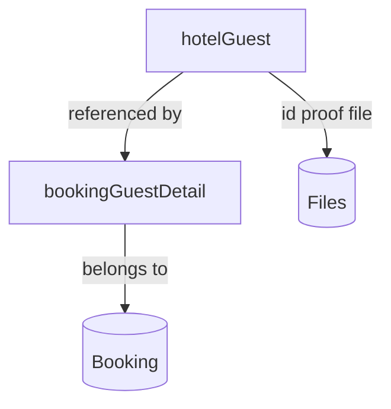

# 10 — Hotel Guests

Manage guest profiles for the hotel: personal details, contact info, government ID proofs (uploaded via [Files](07-files.md:1)), and lookup of a guest's booking history. Guest profiles are reusable across bookings and are referenced by [Bookings & Folio](11-bookings-folio.md:1).

- **Entities:** `hotelGuest`
- **Base path:** `/api/v1/hotel/guests`
- **Frontend module:** Hotel → Guests

See [Conventions](00-conventions.md:1) for the response envelope, auth, tenancy scoping, pagination, and error format. ID proof documents are uploaded first via [Files](07-files.md:1), then attached by `fileId`.

---

## Domain overview



Notes:
- A **hotelGuest** stores a durable profile (name, contact, nationality, ID proof). It is created once and reused across future stays.
- ID proof is stored as an uploaded file reference plus structured fields (`idType`, `idNumber`). The raw file is served through [Files](07-files.md:1) access controls.
- Guests are scoped to the organization/branch from the token. A `phone`/`email` combination is used for de-duplication.
- Soft-delete applies; a guest referenced by any booking is protected from hard removal.

---

## Endpoint Summary

| # | Action | Method | Path | Auth | Permission |
|---|--------|--------|------|------|------------|
| 1 | List guests | GET | `/api/v1/hotel/guests` | Bearer | `hotelGuest.read` |
| 2 | Get guest | GET | `/api/v1/hotel/guests/:id` | Bearer | `hotelGuest.read` |
| 3 | Create guest | POST | `/api/v1/hotel/guests` | Bearer | `hotelGuest.create` |
| 4 | Update guest | PATCH | `/api/v1/hotel/guests/:id` | Bearer | `hotelGuest.update` |
| 5 | Delete guest | DELETE | `/api/v1/hotel/guests/:id` | Bearer | `hotelGuest.delete` |
| 6 | Upload/replace ID proof | PUT | `/api/v1/hotel/guests/:id/id-proof` | Bearer | `hotelGuest.update` |
| 7 | Get guest booking history | GET | `/api/v1/hotel/guests/:id/bookings` | Bearer | `hotelGuest.read` |
| 8 | Search/lookup guest | GET | `/api/v1/hotel/guests/lookup` | Bearer | `hotelGuest.read` |

---

## 1. List guests

`GET /api/v1/hotel/guests`

### Query parameters

| Param | Type | Default | Description |
|-------|------|---------|-------------|
| `page` | number | `1` | Page number |
| `limit` | number | `20` | Items per page (max 100) |
| `search` | string | — | Matches `firstName`, `lastName`, `phone`, `email` |
| `nationality` | string | — | ISO country code filter |
| `idType` | string | — | `PASSPORT` \| `NATIONAL_ID` \| `DRIVING_LICENSE` \| `VOTER_ID` \| `OTHER` |
| `status` | string | — | `ACTIVE` \| `INACTIVE` \| `BLACKLISTED` |
| `sortBy` | string | `createdAt` | `firstName` \| `lastName` \| `createdAt` |
| `sortOrder` | string | `desc` | `asc` \| `desc` |
| `includeDeleted` | boolean | `false` | Include soft-deleted rows |

### Response — `200 OK`

```json
{
  "success": true,
  "message": "Guests retrieved successfully",
  "data": [
    {
      "id": "g-0001",
      "firstName": "Aarav",
      "lastName": "Sharma",
      "email": "aarav.sharma@example.com",
      "phone": "+919812345678",
      "nationality": "IN",
      "idType": "PASSPORT",
      "idNumber": "P1234567",
      "hasIdProof": true,
      "status": "ACTIVE",
      "totalStays": 3,
      "createdAt": "2026-01-10T08:00:00.000Z",
      "updatedAt": "2026-07-20T10:00:00.000Z"
    }
  ],
  "meta": { "page": 1, "limit": 20, "total": 1, "totalPages": 1, "hasNext": false, "hasPrev": false }
}
```

### Errors

| Status | Code | When |
|--------|------|------|
| 401 | `UNAUTHENTICATED` | Missing/invalid token |
| 403 | `FORBIDDEN` | Missing `hotelGuest.read` |

---

## 2. Get guest

`GET /api/v1/hotel/guests/:id`

### Response — `200 OK`

```json
{
  "success": true,
  "message": "Guest retrieved successfully",
  "data": {
    "id": "g-0001",
    "firstName": "Aarav",
    "lastName": "Sharma",
    "email": "aarav.sharma@example.com",
    "phone": "+919812345678",
    "gender": "MALE",
    "dateOfBirth": "1990-05-14",
    "nationality": "IN",
    "address": {
      "line1": "12 MG Road",
      "line2": "",
      "city": "Bengaluru",
      "state": "Karnataka",
      "country": "IN",
      "postalCode": "560001"
    },
    "idType": "PASSPORT",
    "idNumber": "P1234567",
    "idProof": {
      "fileId": "file-idp-001",
      "url": "https://cdn.example.com/file-idp-001.jpg",
      "uploadedAt": "2026-01-10T08:05:00.000Z"
    },
    "notes": "Prefers high floor, non-smoking",
    "status": "ACTIVE",
    "totalStays": 3,
    "createdAt": "2026-01-10T08:00:00.000Z",
    "updatedAt": "2026-07-20T10:00:00.000Z"
  },
  "meta": {}
}
```

### Errors

| Status | Code | When |
|--------|------|------|
| 404 | `GUEST_NOT_FOUND` | No guest with that id in scope |

---

## 3. Create guest

`POST /api/v1/hotel/guests`

### Request

```json
{
  "firstName": "Aarav",
  "lastName": "Sharma",
  "email": "aarav.sharma@example.com",
  "phone": "+919812345678",
  "gender": "MALE",
  "dateOfBirth": "1990-05-14",
  "nationality": "IN",
  "address": {
    "line1": "12 MG Road",
    "city": "Bengaluru",
    "state": "Karnataka",
    "country": "IN",
    "postalCode": "560001"
  },
  "idType": "PASSPORT",
  "idNumber": "P1234567",
  "idProofFileId": "file-idp-001",
  "notes": "Prefers high floor, non-smoking",
  "status": "ACTIVE"
}
```

### Fields

| Field | Type | Required | Notes |
|-------|------|----------|-------|
| `firstName` | string | Yes | — |
| `lastName` | string | No | — |
| `email` | string | No | Valid email; part of de-dup key |
| `phone` | string | Yes | E.164 format; part of de-dup key |
| `gender` | string | No | `MALE` \| `FEMALE` \| `OTHER` |
| `dateOfBirth` | string(date) | No | `YYYY-MM-DD` |
| `nationality` | string | No | ISO 3166-1 alpha-2 |
| `address` | object | No | Structured address |
| `idType` | string | No | `PASSPORT` \| `NATIONAL_ID` \| `DRIVING_LICENSE` \| `VOTER_ID` \| `OTHER` |
| `idNumber` | string | No | Required if `idType` set |
| `idProofFileId` | string | No | Uploaded file reference (see [Files](07-files.md:1)) |
| `notes` | string | No | Free-text preferences |
| `status` | string | No | `ACTIVE` (default) |

### Response — `201 Created`

```json
{
  "success": true,
  "message": "Guest created successfully",
  "data": { "id": "g-0002", "firstName": "Aarav", "lastName": "Sharma", "phone": "+919812345678", "status": "ACTIVE" },
  "meta": {}
}
```

### Errors

| Status | Code | When |
|--------|------|------|
| 403 | `FORBIDDEN` | Missing `hotelGuest.create` |
| 409 | `GUEST_ALREADY_EXISTS` | Same `phone`/`email` guest exists (see `meta.data.existingGuestId`) |
| 422 | `VALIDATION_ERROR` | Missing `phone`, invalid email, or `idNumber` without `idType` |
| 422 | `FILE_NOT_FOUND` | `idProofFileId` does not reference an uploaded file |

---

## 4. Update guest

`PATCH /api/v1/hotel/guests/:id`

Partial update. Use endpoint 6 to change the ID proof file; `idType`/`idNumber` can be updated here.

### Request

```json
{ "email": "aarav.new@example.com", "notes": "VIP - late checkout preferred", "status": "ACTIVE" }
```

### Response — `200 OK`

```json
{
  "success": true,
  "message": "Guest updated successfully",
  "data": { "id": "g-0001", "email": "aarav.new@example.com", "status": "ACTIVE", "updatedAt": "2026-08-05T07:20:00.000Z" },
  "meta": {}
}
```

### Errors

| Status | Code | When |
|--------|------|------|
| 404 | `GUEST_NOT_FOUND` | No guest with that id |
| 409 | `GUEST_ALREADY_EXISTS` | New `phone`/`email` collides with another guest |
| 422 | `VALIDATION_ERROR` | Invalid values |

---

## 5. Delete guest

`DELETE /api/v1/hotel/guests/:id`

Soft-deletes. Protected if the guest is referenced by any booking.

### Response — `200 OK`

```json
{
  "success": true,
  "message": "Guest deleted successfully",
  "data": { "id": "g-0002", "deletedAt": "2026-08-05T07:25:00.000Z" },
  "meta": {}
}
```

### Errors

| Status | Code | When |
|--------|------|------|
| 404 | `GUEST_NOT_FOUND` | No guest with that id |
| 409 | `GUEST_IN_USE` | Guest is referenced by one or more bookings |

---

## 6. Upload / replace ID proof

`PUT /api/v1/hotel/guests/:id/id-proof`

Attaches or replaces the guest's government ID proof. Upload the file first via [Files](07-files.md:1), then submit its `fileId` along with structured ID details. Replacing supersedes the previous proof (old file is detached and eligible for cleanup).

### Request

```json
{
  "idType": "NATIONAL_ID",
  "idNumber": "AADH-1234-5678",
  "fileId": "file-idp-777",
  "issuingCountry": "IN",
  "expiryDate": "2032-12-31"
}
```

### Fields

| Field | Type | Required | Notes |
|-------|------|----------|-------|
| `idType` | string | Yes | `PASSPORT` \| `NATIONAL_ID` \| `DRIVING_LICENSE` \| `VOTER_ID` \| `OTHER` |
| `idNumber` | string | Yes | Document number |
| `fileId` | string | Yes | Uploaded image/PDF reference |
| `issuingCountry` | string | No | ISO 3166-1 alpha-2 |
| `expiryDate` | string(date) | No | `YYYY-MM-DD` |

### Response — `200 OK`

```json
{
  "success": true,
  "message": "ID proof updated successfully",
  "data": {
    "id": "g-0001",
    "idType": "NATIONAL_ID",
    "idNumber": "AADH-1234-5678",
    "idProof": {
      "fileId": "file-idp-777",
      "url": "https://cdn.example.com/file-idp-777.jpg",
      "issuingCountry": "IN",
      "expiryDate": "2032-12-31",
      "uploadedAt": "2026-08-05T07:30:00.000Z"
    }
  },
  "meta": {}
}
```

### Errors

| Status | Code | When |
|--------|------|------|
| 404 | `GUEST_NOT_FOUND` | No guest with that id |
| 422 | `FILE_NOT_FOUND` | `fileId` invalid |
| 422 | `INVALID_FILE_TYPE` | File is not an image or PDF |
| 422 | `VALIDATION_ERROR` | Missing `idType`/`idNumber`/`fileId` |

---

## 7. Get guest booking history

`GET /api/v1/hotel/guests/:id/bookings`

Returns the guest's past and upcoming stays (summary view). Full booking detail lives in [Bookings & Folio](11-bookings-folio.md:1).

### Query parameters

| Param | Type | Default | Description |
|-------|------|---------|-------------|
| `page` | number | `1` | Page number |
| `limit` | number | `10` | Items per page (max 50) |
| `status` | string | — | Filter by booking status |
| `sortOrder` | string | `desc` | By `checkIn` date |

### Response — `200 OK`

```json
{
  "success": true,
  "message": "Guest bookings retrieved successfully",
  "data": [
    {
      "bookingId": "bk-1001",
      "bookingRef": "BK-2026-001001",
      "status": "CHECKED_OUT",
      "checkIn": "2026-06-01",
      "checkOut": "2026-06-04",
      "nights": 3,
      "roomNumbers": ["101"],
      "totalAmount": 1440000,
      "currencyCode": "INR"
    }
  ],
  "meta": { "page": 1, "limit": 10, "total": 1, "totalPages": 1, "hasNext": false, "hasPrev": false }
}
```

### Errors

| Status | Code | When |
|--------|------|------|
| 404 | `GUEST_NOT_FOUND` | No guest with that id |

---

## 8. Search / lookup guest

`GET /api/v1/hotel/guests/lookup`

Fast lookup used at booking time to find an existing guest by phone, email, or ID number before creating a new profile. Returns 0–N lightweight matches.

### Query parameters

| Param | Type | Required | Description |
|-------|------|----------|-------------|
| `phone` | string | No* | Exact/E.164 phone match |
| `email` | string | No* | Exact email match |
| `idNumber` | string | No* | Exact ID document number |

\* At least one of `phone`, `email`, or `idNumber` is required.

### Response — `200 OK`

```json
{
  "success": true,
  "message": "Guest lookup completed",
  "data": [
    {
      "id": "g-0001",
      "firstName": "Aarav",
      "lastName": "Sharma",
      "phone": "+919812345678",
      "email": "aarav.sharma@example.com",
      "idType": "PASSPORT",
      "idNumber": "P1234567",
      "status": "ACTIVE"
    }
  ],
  "meta": { "matchedOn": "phone" }
}
```

### Errors

| Status | Code | When |
|--------|------|------|
| 422 | `VALIDATION_ERROR` | None of `phone`/`email`/`idNumber` provided |

---

## Related

- [Files](07-files.md:1) — upload ID proof documents before attaching them.
- [Locations](03-locations.md:1) — country/state/city references for guest addresses.
- [Bookings & Folio](11-bookings-folio.md:1) — bookings reference guest profiles via `bookingGuestDetail`.
- [Rooms Setup](09-rooms-setup.md:1) — room inventory that guests are booked into.