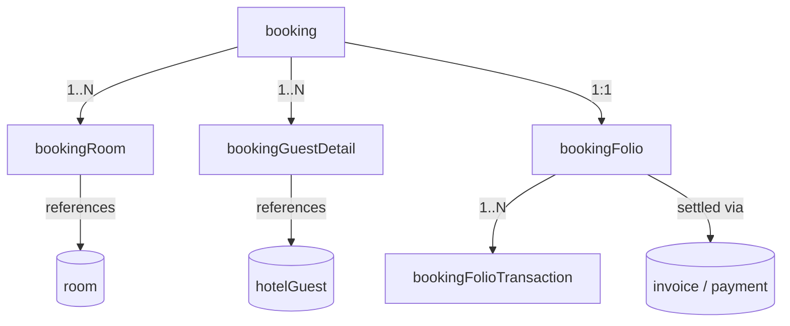
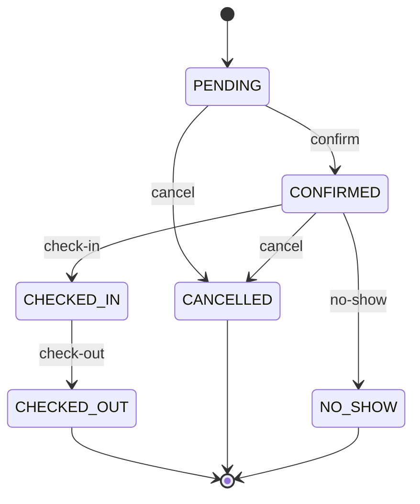

# 11 — Bookings & Folio

The core hotel operations module: create and manage room bookings, attach guests and rooms, drive the stay lifecycle (confirm → check-in → check-out → cancel/no-show), and maintain each booking's **folio** — the running guest billing account where room charges, extra services, taxes, discounts, and payments accumulate before final settlement via [Billing](19-billing.md:1).

- **Entities:** `booking`, `bookingRoom`, `bookingGuestDetail`, `bookingFolio`, `bookingFolioTransaction`
- **Base path:** `/api/v1/hotel/bookings`
- **Frontend module:** Hotel → Bookings (Reservations, Front Desk, Folio)

See [Conventions](00-conventions.md:1) for the response envelope, auth, tenancy scoping, pagination, error format, money (minor units), idempotency, and optimistic concurrency.

---

## Domain overview



Notes:
- A **booking** groups one or more rooms for a date range under a single reservation reference (`bookingRef`).
- Each **bookingRoom** pins a specific room (or room type until assignment) with per-room rate and occupancy.
- **bookingGuestDetail** links [hotelGuest](10-hotel-guests.md:1) profiles to the booking (primary + additional guests).
- **bookingFolio** is created 1:1 with the booking and owns `bookingId`. It accumulates **bookingFolioTransaction** rows (charges, services, taxes, discounts, payments) via a polymorphic `folioFor` reference.
- Final settlement produces an [invoice + payment](19-billing.md:1); the folio is then **closed**.

---

## Booking status lifecycle



**Statuses:** `PENDING`, `CONFIRMED`, `CHECKED_IN`, `CHECKED_OUT`, `CANCELLED`, `NO_SHOW`.
**Folio statuses:** `OPEN`, `CLOSED`, `SETTLED`.

---

## Endpoint Summary

### Bookings

| # | Action | Method | Path | Auth | Permission |
|---|--------|--------|------|------|------------|
| 1 | Search availability | GET | `/api/v1/hotel/bookings/availability` | Bearer | `booking.read` |
| 2 | List bookings | GET | `/api/v1/hotel/bookings` | Bearer | `booking.read` |
| 3 | Get booking | GET | `/api/v1/hotel/bookings/:id` | Bearer | `booking.read` |
| 4 | Create booking | POST | `/api/v1/hotel/bookings` | Bearer | `booking.create` |
| 5 | Update booking | PATCH | `/api/v1/hotel/bookings/:id` | Bearer | `booking.update` |
| 6 | Confirm booking | POST | `/api/v1/hotel/bookings/:id/confirm` | Bearer | `booking.confirm` |
| 7 | Check-in | POST | `/api/v1/hotel/bookings/:id/check-in` | Bearer | `booking.checkin` |
| 8 | Check-out | POST | `/api/v1/hotel/bookings/:id/check-out` | Bearer | `booking.checkout` |
| 9 | Cancel booking | POST | `/api/v1/hotel/bookings/:id/cancel` | Bearer | `booking.cancel` |
| 10 | Mark no-show | POST | `/api/v1/hotel/bookings/:id/no-show` | Bearer | `booking.update` |

### Booking rooms & guests

| # | Action | Method | Path | Auth | Permission |
|---|--------|--------|------|------|------------|
| 11 | Add room to booking | POST | `/api/v1/hotel/bookings/:id/rooms` | Bearer | `booking.update` |
| 12 | Update booking room | PATCH | `/api/v1/hotel/bookings/:id/rooms/:roomId` | Bearer | `booking.update` |
| 13 | Assign physical room | POST | `/api/v1/hotel/bookings/:id/rooms/:roomId/assign` | Bearer | `booking.update` |
| 14 | Remove room from booking | DELETE | `/api/v1/hotel/bookings/:id/rooms/:roomId` | Bearer | `booking.update` |
| 15 | Add guest to booking | POST | `/api/v1/hotel/bookings/:id/guests` | Bearer | `booking.update` |
| 16 | Remove guest from booking | DELETE | `/api/v1/hotel/bookings/:id/guests/:guestDetailId` | Bearer | `booking.update` |

### Folio

| # | Action | Method | Path | Auth | Permission |
|---|--------|--------|------|------|------------|
| 17 | Get folio | GET | `/api/v1/hotel/bookings/:id/folio` | Bearer | `folio.read` |
| 18 | Get folio summary | GET | `/api/v1/hotel/bookings/:id/folio/summary` | Bearer | `folio.read` |
| 19 | Add folio transaction | POST | `/api/v1/hotel/bookings/:id/folio/transactions` | Bearer | `folio.charge` |
| 20 | Void folio transaction | POST | `/api/v1/hotel/bookings/:id/folio/transactions/:txnId/void` | Bearer | `folio.void` |
| 21 | Record folio payment | POST | `/api/v1/hotel/bookings/:id/folio/payments` | Bearer | `folio.payment` |
| 22 | Close / settle folio | POST | `/api/v1/hotel/bookings/:id/folio/close` | Bearer | `folio.close` |

---

## 1. Search availability

`GET /api/v1/hotel/bookings/availability`

Finds bookable rooms for a date range and occupancy. Complements the room-type availability in [Rooms Setup](09-rooms-setup.md:1) but returns booking-ready results with rates.

### Query parameters

| Param | Type | Required | Description |
|-------|------|----------|-------------|
| `checkIn` | string(date) | Yes | `YYYY-MM-DD` |
| `checkOut` | string(date) | Yes | Must be after `checkIn` |
| `adults` | number | No | Default `1` |
| `children` | number | No | Default `0` |
| `roomTypeId` | string | No | Restrict to a room type |
| `rooms` | number | No | Rooms needed (default `1`) |

### Response — `200 OK`

```json
{
  "success": true,
  "message": "Availability retrieved successfully",
  "data": {
    "checkIn": "2026-09-10",
    "checkOut": "2026-09-13",
    "nights": 3,
    "roomTypes": [
      {
        "roomTypeId": "rt-001",
        "name": "Deluxe King",
        "availableCount": 4,
        "baseRate": 480000,
        "totalRate": 1440000,
        "currencyCode": "INR",
        "maxOccupancy": 2
      }
    ]
  },
  "meta": {}
}
```

### Errors

| Status | Code | When |
|--------|------|------|
| 422 | `VALIDATION_ERROR` | Missing dates or `checkOut <= checkIn` |

---

## 2. List bookings

`GET /api/v1/hotel/bookings`

### Query parameters

| Param | Type | Default | Description |
|-------|------|---------|-------------|
| `page` | number | `1` | Page number |
| `limit` | number | `20` | Items per page (max 100) |
| `search` | string | — | Matches `bookingRef`, guest name/phone |
| `status` | string | — | Booking status filter |
| `checkInFrom` | string(date) | — | Range filter on check-in |
| `checkInTo` | string(date) | — | Range filter on check-in |
| `roomId` | string | — | Bookings touching a room |
| `guestId` | string | — | Bookings for a guest |
| `sortBy` | string | `checkIn` | `checkIn` \| `createdAt` \| `bookingRef` |
| `sortOrder` | string | `desc` | `asc` \| `desc` |

### Response — `200 OK`

```json
{
  "success": true,
  "message": "Bookings retrieved successfully",
  "data": [
    {
      "id": "bk-1001",
      "bookingRef": "BK-2026-001001",
      "status": "CONFIRMED",
      "checkIn": "2026-09-10",
      "checkOut": "2026-09-13",
      "nights": 3,
      "primaryGuest": { "id": "g-0001", "name": "Aarav Sharma", "phone": "+919812345678" },
      "roomCount": 1,
      "totalAmount": 1440000,
      "paidAmount": 500000,
      "balanceAmount": 940000,
      "currencyCode": "INR",
      "source": "DIRECT",
      "createdAt": "2026-08-01T09:00:00.000Z"
    }
  ],
  "meta": { "page": 1, "limit": 20, "total": 1, "totalPages": 1, "hasNext": false, "hasPrev": false }
}
```

### Errors

| Status | Code | When |
|--------|------|------|
| 403 | `FORBIDDEN` | Missing `booking.read` |

---

## 3. Get booking

`GET /api/v1/hotel/bookings/:id`

Returns full booking with rooms, guests, and folio balance.

### Response — `200 OK`

```json
{
  "success": true,
  "message": "Booking retrieved successfully",
  "data": {
    "id": "bk-1001",
    "bookingRef": "BK-2026-001001",
    "status": "CONFIRMED",
    "checkIn": "2026-09-10",
    "checkOut": "2026-09-13",
    "nights": 3,
    "source": "DIRECT",
    "specialRequests": "High floor, non-smoking",
    "rooms": [
      {
        "id": "br-1",
        "roomTypeId": "rt-001",
        "roomTypeName": "Deluxe King",
        "roomId": "rm-101",
        "roomNumber": "101",
        "ratePerNight": 480000,
        "adults": 2,
        "children": 0,
        "status": "RESERVED"
      }
    ],
    "guests": [
      { "id": "bgd-1", "guestId": "g-0001", "name": "Aarav Sharma", "isPrimary": true }
    ],
    "folio": {
      "id": "fol-1001",
      "status": "OPEN",
      "totalCharges": 1440000,
      "totalPayments": 500000,
      "balance": 940000,
      "currencyCode": "INR"
    },
    "createdAt": "2026-08-01T09:00:00.000Z",
    "updatedAt": "2026-08-02T10:00:00.000Z"
  },
  "meta": {}
}
```

### Errors

| Status | Code | When |
|--------|------|------|
| 404 | `BOOKING_NOT_FOUND` | No booking with that id in scope |

---

## 4. Create booking

`POST /api/v1/hotel/bookings`

Creates a booking (status `PENDING`), its rooms, guest links, and an `OPEN` folio pre-seeded with room-charge transactions. Send `Idempotency-Key` to safely retry.

### Request

```json
{
  "checkIn": "2026-09-10",
  "checkOut": "2026-09-13",
  "source": "DIRECT",
  "specialRequests": "High floor, non-smoking",
  "rooms": [
    {
      "roomTypeId": "rt-001",
      "roomId": "rm-101",
      "ratePerNight": 480000,
      "adults": 2,
      "children": 0
    }
  ],
  "guests": [
    { "guestId": "g-0001", "isPrimary": true },
    { "guestId": "g-0007", "isPrimary": false }
  ],
  "extraServices": [
    { "extraServiceForHotelId": "svc-001", "quantity": 3 }
  ]
}
```

### Fields

| Field | Type | Required | Notes |
|-------|------|----------|-------|
| `checkIn` | string(date) | Yes | `YYYY-MM-DD` |
| `checkOut` | string(date) | Yes | After `checkIn` |
| `source` | string | No | `DIRECT` \| `WALK_IN` \| `PHONE` \| `OTA` \| `CORPORATE` |
| `specialRequests` | string | No | Free text |
| `rooms` | array | Yes | ≥1 room; `roomId` optional (assign later) |
| `rooms[].roomTypeId` | string | Yes | Room type |
| `rooms[].roomId` | string | No | Pin physical room now |
| `rooms[].ratePerNight` | number | Yes | Minor units |
| `rooms[].adults` | number | No | Default `1` |
| `rooms[].children` | number | No | Default `0` |
| `guests` | array | Yes | ≥1 guest; exactly one `isPrimary: true` |
| `extraServices` | array | No | Optional pre-added services |

### Response — `201 Created`

```json
{
  "success": true,
  "message": "Booking created successfully",
  "data": {
    "id": "bk-1002",
    "bookingRef": "BK-2026-001002",
    "status": "PENDING",
    "checkIn": "2026-09-10",
    "checkOut": "2026-09-13",
    "folio": { "id": "fol-1002", "status": "OPEN", "balance": 1440000, "currencyCode": "INR" }
  },
  "meta": {}
}
```

### Errors

| Status | Code | When |
|--------|------|------|
| 403 | `FORBIDDEN` | Missing `booking.create` |
| 409 | `ROOM_UNAVAILABLE` | A requested room is booked for the range |
| 409 | `IDEMPOTENCY_CONFLICT` | Reused key with different payload |
| 422 | `VALIDATION_ERROR` | Bad dates, empty rooms, no primary guest, etc. |
| 422 | `GUEST_NOT_FOUND` | A `guestId` is invalid |

---

## 5. Update booking

`PATCH /api/v1/hotel/bookings/:id`

Partial update of booking-level fields (dates, requests, source). Date changes re-price room-charge folio transactions and re-validate availability. Only allowed while `PENDING` or `CONFIRMED`.

### Request

```json
{ "checkOut": "2026-09-14", "specialRequests": "Late check-out requested" }
```

### Response — `200 OK`

```json
{
  "success": true,
  "message": "Booking updated successfully",
  "data": { "id": "bk-1001", "checkOut": "2026-09-14", "nights": 4, "updatedAt": "2026-08-05T07:40:00.000Z" },
  "meta": {}
}
```

### Errors

| Status | Code | When |
|--------|------|------|
| 404 | `BOOKING_NOT_FOUND` | No booking with that id |
| 409 | `ROOM_UNAVAILABLE` | New dates conflict |
| 409 | `INVALID_STATE_TRANSITION` | Booking already checked-in/out/cancelled |
| 422 | `VALIDATION_ERROR` | Invalid values |

---

## 6. Confirm booking

`POST /api/v1/hotel/bookings/:id/confirm`

Transitions `PENDING → CONFIRMED`. Optionally requires a deposit; if `depositAmount` given, a payment folio transaction is recorded.

### Request

```json
{ "depositAmount": 500000, "paymentMethod": "CARD", "reference": "txn_abc123" }
```

### Response — `200 OK`

```json
{
  "success": true,
  "message": "Booking confirmed successfully",
  "data": { "id": "bk-1001", "status": "CONFIRMED", "folio": { "balance": 940000 } },
  "meta": {}
}
```

### Errors

| Status | Code | When |
|--------|------|------|
| 404 | `BOOKING_NOT_FOUND` | No booking |
| 409 | `INVALID_STATE_TRANSITION` | Not in `PENDING` |
| 422 | `VALIDATION_ERROR` | Invalid deposit/payment fields |

---

## 7. Check-in

`POST /api/v1/hotel/bookings/:id/check-in`

Transitions `CONFIRMED → CHECKED_IN`. All rooms must have a physical `roomId` assigned (see endpoint 13). Marks assigned rooms `OCCUPIED` in [Rooms Setup](09-rooms-setup.md:1).

### Request

```json
{ "actualCheckInAt": "2026-09-10T14:30:00.000Z", "keyCardsIssued": 2 }
```

### Response — `200 OK`

```json
{
  "success": true,
  "message": "Guest checked in successfully",
  "data": {
    "id": "bk-1001",
    "status": "CHECKED_IN",
    "checkedInAt": "2026-09-10T14:30:00.000Z",
    "rooms": [ { "id": "br-1", "roomNumber": "101", "status": "OCCUPIED" } ]
  },
  "meta": {}
}
```

### Errors

| Status | Code | When |
|--------|------|------|
| 404 | `BOOKING_NOT_FOUND` | No booking |
| 409 | `INVALID_STATE_TRANSITION` | Not in `CONFIRMED` |
| 409 | `ROOM_NOT_ASSIGNED` | One or more rooms lack a physical assignment |

---

## 8. Check-out

`POST /api/v1/hotel/bookings/:id/check-out`

Transitions `CHECKED_IN → CHECKED_OUT`. The folio must be settled (balance `0`) or `forceSettle` supplied to auto-generate a final [invoice](19-billing.md:1). Frees rooms (sets `DIRTY`).

### Request

```json
{ "actualCheckOutAt": "2026-09-13T11:00:00.000Z", "generateInvoice": true }
```

### Response — `200 OK`

```json
{
  "success": true,
  "message": "Guest checked out successfully",
  "data": {
    "id": "bk-1001",
    "status": "CHECKED_OUT",
    "checkedOutAt": "2026-09-13T11:00:00.000Z",
    "folio": { "status": "SETTLED", "balance": 0 },
    "invoiceId": "inv-5001"
  },
  "meta": {}
}
```

### Errors

| Status | Code | When |
|--------|------|------|
| 404 | `BOOKING_NOT_FOUND` | No booking |
| 409 | `INVALID_STATE_TRANSITION` | Not in `CHECKED_IN` |
| 409 | `FOLIO_NOT_SETTLED` | Outstanding balance and `generateInvoice` not set |

---

## 9. Cancel booking

`POST /api/v1/hotel/bookings/:id/cancel`

Cancels a `PENDING`/`CONFIRMED` booking. Applies the cancellation policy; may record a cancellation fee folio transaction and a refund of any deposit.

### Request

```json
{ "reason": "Guest changed plans", "cancellationFee": 100000, "refundDeposit": true }
```

### Response — `200 OK`

```json
{
  "success": true,
  "message": "Booking cancelled successfully",
  "data": { "id": "bk-1001", "status": "CANCELLED", "cancellationFee": 100000, "refundedAmount": 400000 },
  "meta": {}
}
```

### Errors

| Status | Code | When |
|--------|------|------|
| 404 | `BOOKING_NOT_FOUND` | No booking |
| 409 | `INVALID_STATE_TRANSITION` | Already checked-in/out/cancelled |

---

## 10. Mark no-show

`POST /api/v1/hotel/bookings/:id/no-show`

Transitions `CONFIRMED → NO_SHOW` after the check-in window lapses. May apply a no-show charge.

### Request

```json
{ "noShowFee": 480000 }
```

### Response — `200 OK`

```json
{
  "success": true,
  "message": "Booking marked as no-show",
  "data": { "id": "bk-1001", "status": "NO_SHOW", "noShowFee": 480000 },
  "meta": {}
}
```

### Errors

| Status | Code | When |
|--------|------|------|
| 404 | `BOOKING_NOT_FOUND` | No booking |
| 409 | `INVALID_STATE_TRANSITION` | Not in `CONFIRMED` |

---

## 11. Add room to booking

`POST /api/v1/hotel/bookings/:id/rooms`

Adds another room to an existing `PENDING`/`CONFIRMED` booking and seeds its room-charge folio transactions.

### Request

```json
{ "roomTypeId": "rt-002", "roomId": "rm-205", "ratePerNight": 620000, "adults": 2, "children": 1 }
```

### Response — `201 Created`

```json
{
  "success": true,
  "message": "Room added to booking",
  "data": { "id": "br-3", "roomTypeId": "rt-002", "roomId": "rm-205", "ratePerNight": 620000, "status": "RESERVED" },
  "meta": {}
}
```

### Errors

| Status | Code | When |
|--------|------|------|
| 404 | `BOOKING_NOT_FOUND` | No booking |
| 409 | `ROOM_UNAVAILABLE` | Room booked for the range |
| 409 | `INVALID_STATE_TRANSITION` | Booking checked-out/cancelled |

---

## 12. Update booking room

`PATCH /api/v1/hotel/bookings/:id/rooms/:roomId`

Update rate/occupancy of a booking room. Rate changes re-price folio room charges.

### Request

```json
### Request

```json
{ "ratePerNight": 500000, "adults": 2, "children": 0 }
```

### Fields

| Field | Type | Required | Notes |
|-------|------|----------|-------|
| `ratePerNight` | number | No | Minor units; re-prices room charges |
| `adults` | number | No | Occupancy |
| `children` | number | No | Occupancy |

### Response — `200 OK`

```json
{
  "success": true,
  "message": "Booking room updated",
  "data": { "id": "br-1", "ratePerNight": 500000, "adults": 2, "children": 0, "updatedAt": "2026-08-05T07:45:00.000Z" },
  "meta": {}
}
```

### Errors

| Status | Code | When |
|--------|------|------|
| 404 | `BOOKING_NOT_FOUND` | No booking |
| 404 | `BOOKING_ROOM_NOT_FOUND` | No such booking room |
| 409 | `INVALID_STATE_TRANSITION` | Booking checked-out/cancelled |
| 422 | `VALIDATION_ERROR` | Invalid values |

---

## 13. Assign physical room

`POST /api/v1/hotel/bookings/:id/rooms/:roomId/assign`

Pins a specific physical [room](09-rooms-setup.md:1) to a booking room that was reserved by type only. Required before check-in.

### Request

```json
{ "physicalRoomId": "rm-101" }
```

### Response — `200 OK`

```json
{
  "success": true,
  "message": "Room assigned",
  "data": { "id": "br-1", "roomId": "rm-101", "roomNumber": "101", "status": "RESERVED" },
  "meta": {}
}
```

### Errors

| Status | Code | When |
|--------|------|------|
| 404 | `BOOKING_ROOM_NOT_FOUND` | No such booking room |
| 409 | `ROOM_UNAVAILABLE` | Physical room booked for the range |
| 422 | `ROOM_TYPE_MISMATCH` | Room's type differs from reserved type |

---

## 14. Remove room from booking

`DELETE /api/v1/hotel/bookings/:id/rooms/:roomId`

Removes a booking room and voids its room-charge folio transactions. A booking must retain at least one room.

### Response — `200 OK`

```json
{
  "success": true,
  "message": "Room removed from booking",
  "data": { "id": "br-3", "removed": true },
  "meta": {}
}
```

### Errors

| Status | Code | When |
|--------|------|------|
| 404 | `BOOKING_ROOM_NOT_FOUND` | No such booking room |
| 409 | `LAST_ROOM` | Cannot remove the only room |
| 409 | `INVALID_STATE_TRANSITION` | Booking checked-in/out/cancelled |

---

## 15. Add guest to booking

`POST /api/v1/hotel/bookings/:id/guests`

Links an additional [hotelGuest](10-hotel-guests.md:1) to the booking.

### Request

```json
{ "guestId": "g-0009", "isPrimary": false }
```

### Fields

| Field | Type | Required | Notes |
|-------|------|----------|-------|
| `guestId` | string | Yes | Existing guest id |
| `isPrimary` | boolean | No | Setting `true` demotes the current primary |

### Response — `201 Created`

```json
{
  "success": true,
  "message": "Guest added to booking",
  "data": { "id": "bgd-3", "guestId": "g-0009", "name": "Meera Nair", "isPrimary": false },
  "meta": {}
}
```

### Errors

| Status | Code | When |
|--------|------|------|
| 404 | `BOOKING_NOT_FOUND` | No booking |
| 409 | `GUEST_ALREADY_ADDED` | Guest already linked |
| 422 | `GUEST_NOT_FOUND` | Invalid `guestId` |

---

## 16. Remove guest from booking

`DELETE /api/v1/hotel/bookings/:id/guests/:guestDetailId`

Unlinks a guest. The primary guest cannot be removed; promote another first.

### Response — `200 OK`

```json
{
  "success": true,
  "message": "Guest removed from booking",
  "data": { "id": "bgd-3", "removed": true },
  "meta": {}
}
```

### Errors

| Status | Code | When |
|--------|------|------|
| 404 | `BOOKING_GUEST_NOT_FOUND` | No such guest link |
| 409 | `CANNOT_REMOVE_PRIMARY` | Guest is primary |

---

## 17. Get folio

`GET /api/v1/hotel/bookings/:id/folio`

Returns the folio with its full transaction ledger.

### Response — `200 OK`

```json
{
  "success": true,
  "message": "Folio retrieved successfully",
  "data": {
    "id": "fol-1001",
    "bookingId": "bk-1001",
    "status": "OPEN",
    "currencyCode": "INR",
    "totalCharges": 1560000,
    "totalPayments": 500000,
    "balance": 1060000,
    "transactions": [
      {
        "id": "ft-1",
        "type": "ROOM_CHARGE",
        "folioFor": { "type": "BOOKING_ROOM", "id": "br-1" },
        "description": "Room 101 — night 2026-09-10",
        "amount": 480000,
        "direction": "DEBIT",
        "postedAt": "2026-09-10T00:00:00.000Z",
        "status": "POSTED"
      },
      {
        "id": "ft-9",
        "type": "PAYMENT",
        "description": "Deposit — CARD",
        "amount": 500000,
        "direction": "CREDIT",
        "postedAt": "2026-08-02T10:00:00.000Z",
        "status": "POSTED"
      }
    ]
  },
  "meta": {}
}
```

### Errors

| Status | Code | When |
|--------|------|------|
| 404 | `FOLIO_NOT_FOUND` | No folio for booking |

---

## 18. Get folio summary

`GET /api/v1/hotel/bookings/:id/folio/summary`

Returns totals grouped by transaction type (for the front-desk summary panel).

### Response — `200 OK`

```json
{
  "success": true,
  "message": "Folio summary retrieved successfully",
  "data": {
    "currencyCode": "INR",
    "charges": {
      "ROOM_CHARGE": 1440000,
      "EXTRA_SERVICE": 90000,
      "TAX": 30000
    },
    "discounts": 0,
    "totalCharges": 1560000,
    "totalPayments": 500000,
    "balance": 1060000
  },
  "meta": {}
}
```

### Errors

| Status | Code | When |
|--------|------|------|
| 404 | `FOLIO_NOT_FOUND` | No folio for booking |

---

## 19. Add folio transaction

`POST /api/v1/hotel/bookings/:id/folio/transactions`

Posts a manual charge, extra-service, tax, or discount transaction to an `OPEN` folio. Use `Idempotency-Key`.

### Request

```json
{
  "type": "EXTRA_SERVICE",
  "description": "Airport pickup",
  "amount": 90000,
  "direction": "DEBIT",
  "folioFor": { "type": "EXTRA_SERVICE", "id": "svc-001" },
  "quantity": 1,
  "taxRate": 5
}
```

### Fields

| Field | Type | Required | Notes |
|-------|------|----------|-------|
| `type` | string | Yes | `ROOM_CHARGE` \| `EXTRA_SERVICE` \| `TAX` \| `DISCOUNT` \| `ADJUSTMENT` |
| `description` | string | Yes | Line description |
| `amount` | number | Yes | Minor units |
| `direction` | string | Yes | `DEBIT` (charge) \| `CREDIT` (discount/reduction) |
| `folioFor` | object | No | Polymorphic reference `{type, id}` |
| `quantity` | number | No | Default `1` |
| `taxRate` | number | No | Percentage; posts a companion `TAX` line if set |

### Response — `201 Created`

```json
{
  "success": true,
  "message": "Folio transaction added",
  "data": {
    "id": "ft-12",
    "type": "EXTRA_SERVICE",
    "amount": 90000,
    "direction": "DEBIT",
    "status": "POSTED",
    "folioBalance": 1060000
  },
  "meta": {}
}
```

### Errors

| Status | Code | When |
|--------|------|------|
| 404 | `FOLIO_NOT_FOUND` | No folio |
| 409 | `FOLIO_CLOSED` | Folio not `OPEN` |
| 422 | `VALIDATION_ERROR` | Invalid type/direction/amount |

---

## 20. Void folio transaction

`POST /api/v1/hotel/bookings/:id/folio/transactions/:txnId/void`

Reverses a posted transaction by creating an offsetting entry and marking the original `VOIDED`. Payments must be refunded via endpoint 21, not voided.

### Request

```json
{ "reason": "Charged in error" }
```

### Response — `200 OK`

```json
{
  "success": true,
  "message": "Folio transaction voided",
  "data": { "id": "ft-12", "status": "VOIDED", "reversalId": "ft-13", "folioBalance": 970000 },
  "meta": {}
}
```

### Errors

| Status | Code | When |
|--------|------|------|
| 404 | `FOLIO_TXN_NOT_FOUND` | No such transaction |
| 409 | `ALREADY_VOIDED` | Transaction already voided |
| 409 | `CANNOT_VOID_PAYMENT` | Use refund flow for payments |

---

## 21. Record folio payment

`POST /api/v1/hotel/bookings/:id/folio/payments`

Records a payment (or refund) against the folio. Creates a `PAYMENT`/`REFUND` folio transaction and a linked [payment](19-billing.md:1) record. Use `Idempotency-Key`.

### Request

```json
{
  "amount": 1060000,
  "paymentMethod": "CARD",
  "reference": "txn_final_998",
  "isRefund": false
}
```

### Fields

| Field | Type | Required | Notes |
|-------|------|----------|-------|
| `amount` | number | Yes | Minor units |
| `paymentMethod` | string | Yes | `CASH` \| `CARD` \| `UPI` \| `BANK_TRANSFER` \| `CHEQUE` \| `ONLINE` |
| `reference` | string | No | Gateway/txn reference |
| `isRefund` | boolean | No | `true` records an outbound refund |

### Response — `201 Created`

```json
{
  "success": true,
  "message": "Payment recorded",
  "data": {
    "id": "ft-14",
    "type": "PAYMENT",
    "amount": 1060000,
    "direction": "CREDIT",
    "paymentId": "pay-3001",
    "folioBalance": 0
  },
  "meta": {}
}
```

### Errors

| Status | Code | When |
|--------|------|------|
| 404 | `FOLIO_NOT_FOUND` | No folio |
| 409 | `FOLIO_CLOSED` | Folio not `OPEN` |
| 409 | `IDEMPOTENCY_CONFLICT` | Reused key with different payload |
| 422 | `VALIDATION_ERROR` | Invalid amount/method |

---

## 22. Close / settle folio

`POST /api/v1/hotel/bookings/:id/folio/close`

Closes the folio. Balance must be `0`, or `generateInvoice: true` to settle by emitting a final [invoice](19-billing.md:1). Sets folio `SETTLED` then `CLOSED`.

### Request

```json
{ "generateInvoice": true }
```

### Response — `200 OK`

```json
{
  "success": true,
  "message": "Folio closed successfully",
  "data": {
    "id": "fol-1001",
    "status": "CLOSED",
    "balance": 0,
    "invoiceId": "inv-5001"
  },
  "meta": {}
}
```

### Errors

| Status | Code | When |
|--------|------|------|
| 404 | `FOLIO_NOT_FOUND` | No folio |
| 409 | `FOLIO_NOT_SETTLED` | Outstanding balance and `generateInvoice` not set |
| 409 | `FOLIO_ALREADY_CLOSED` | Folio already closed |

---

## Related

- [Hotel Guests](10-hotel-guests.md:1) — guest profiles linked via `bookingGuestDetail`
- [Rooms Setup](09-rooms-setup.md:1) — room types, physical rooms, extra services, and room status
- [Billing](19-billing.md:1) — invoice + payment generated on settlement/checkout
- [Files](07-files.md:1) — guest ID proofs and attachments
{ "ratePerNight": 500000, "adults": 2, "children": 0