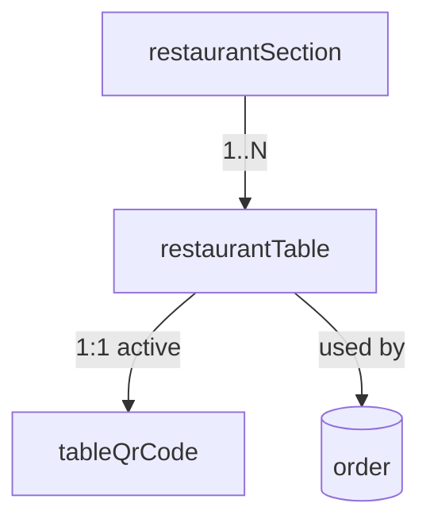
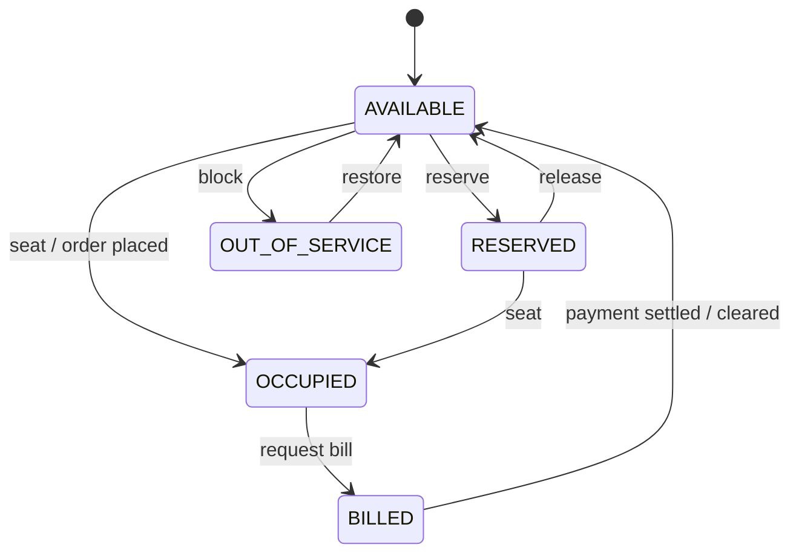

# 12 — Restaurant Setup

Configure the restaurant floor plan: **sections** (zones like Ground Floor, Rooftop, Bar), **tables** within each section (with capacity and live status), and per-table **QR codes** used for contactless menu access and self-ordering. This module is the foundation the [Orders & Kitchen](14-orders-kitchen.md:1) flow builds on.

- **Entities:** `restaurantSection`, `restaurantTable`, `tableQrCode`
- **Base path:** `/api/v1/restaurant`
- **Frontend module:** Restaurant → Setup (Floor Plan, Tables, QR Codes)

See [Conventions](00-conventions.md:1) for the response envelope, auth, tenancy scoping, pagination, error format, and soft-delete.

---

## Domain overview



Notes:
- A **restaurantSection** groups tables into a physical/logical zone.
- A **restaurantTable** belongs to one section, has a `capacity`, and carries a live `status` reflecting current occupancy.
- A **tableQrCode** encodes a stable deep link to the table's ordering page. Regenerating rotates the token and invalidates the previous QR.

---

## Table status lifecycle



**Table statuses:** `AVAILABLE`, `OCCUPIED`, `RESERVED`, `BILLED`, `OUT_OF_SERVICE`.

---

## Endpoint Summary

### Sections

| # | Action | Method | Path | Auth | Permission |
|---|--------|--------|------|------|------------|
| 1 | List sections | GET | `/api/v1/restaurant/sections` | Bearer | `restaurant.section.read` |
| 2 | Get section | GET | `/api/v1/restaurant/sections/:id` | Bearer | `restaurant.section.read` |
| 3 | Create section | POST | `/api/v1/restaurant/sections` | Bearer | `restaurant.section.create` |
| 4 | Update section | PATCH | `/api/v1/restaurant/sections/:id` | Bearer | `restaurant.section.update` |
| 5 | Delete section | DELETE | `/api/v1/restaurant/sections/:id` | Bearer | `restaurant.section.delete` |

### Tables

| # | Action | Method | Path | Auth | Permission |
|---|--------|--------|------|------|------------|
| 6 | List tables | GET | `/api/v1/restaurant/tables` | Bearer | `restaurant.table.read` |
| 7 | Get table | GET | `/api/v1/restaurant/tables/:id` | Bearer | `restaurant.table.read` |
| 8 | Create table | POST | `/api/v1/restaurant/tables` | Bearer | `restaurant.table.create` |
| 9 | Update table | PATCH | `/api/v1/restaurant/tables/:id` | Bearer | `restaurant.table.update` |
| 10 | Delete table | DELETE | `/api/v1/restaurant/tables/:id` | Bearer | `restaurant.table.delete` |
| 11 | Update table status | PATCH | `/api/v1/restaurant/tables/:id/status` | Bearer | `restaurant.table.update` |

### QR codes

| # | Action | Method | Path | Auth | Permission |
|---|--------|--------|------|------|------------|
| 12 | Get table QR code | GET | `/api/v1/restaurant/tables/:id/qr` | Bearer | `restaurant.table.read` |
| 13 | Generate table QR code | POST | `/api/v1/restaurant/tables/:id/qr` | Bearer | `restaurant.table.update` |
| 14 | Regenerate table QR code | POST | `/api/v1/restaurant/tables/:id/qr/regenerate` | Bearer | `restaurant.table.update` |

---

## 1. List sections

`GET /api/v1/restaurant/sections`

### Query parameters

| Param | Type | Default | Description |
|-------|------|---------|-------------|
| `page` | number | `1` | Page number |
| `limit` | number | `20` | Items per page (max 100) |
| `search` | string | — | Matches section `name` |
| `status` | string | — | `ACTIVE` \| `INACTIVE` |
| `sortBy` | string | `displayOrder` | `displayOrder` \| `name` \| `createdAt` |
| `sortOrder` | string | `asc` | `asc` \| `desc` |
| `includeDeleted` | boolean | `false` | Include soft-deleted |

### Response — `200 OK`

```json
{
  "success": true,
  "message": "Sections retrieved successfully",
  "data": [
    {
      "id": "sec-001",
      "name": "Ground Floor",
      "description": "Main dining hall",
      "displayOrder": 1,
      "status": "ACTIVE",
      "tableCount": 12,
      "createdAt": "2026-07-01T09:00:00.000Z"
    }
  ],
  "meta": { "page": 1, "limit": 20, "total": 1, "totalPages": 1, "hasNext": false, "hasPrev": false }
}
```

### Errors

| Status | Code | When |
|--------|------|------|
| 403 | `FORBIDDEN` | Missing `restaurant.section.read` |

---

## 2. Get section

`GET /api/v1/restaurant/sections/:id`

### Response — `200 OK`

```json
{
  "success": true,
  "message": "Section retrieved successfully",
  "data": {
    "id": "sec-001",
    "name": "Ground Floor",
    "description": "Main dining hall",
    "displayOrder": 1,
    "status": "ACTIVE",
    "tableCount": 12,
    "createdAt": "2026-07-01T09:00:00.000Z",
    "updatedAt": "2026-07-10T09:00:00.000Z"
  },
  "meta": {}
}
```

### Errors

| Status | Code | When |
|--------|------|------|
| 404 | `SECTION_NOT_FOUND` | No section with that id in scope |

---

## 3. Create section

`POST /api/v1/restaurant/sections`

### Request

```json
{
  "name": "Rooftop",
  "description": "Open-air seating",
  "displayOrder": 3,
  "status": "ACTIVE"
}
```

### Fields

| Field | Type | Required | Notes |
|-------|------|----------|-------|
| `name` | string | Yes | Unique per branch |
| `description` | string | No | Free text |
| `displayOrder` | number | No | Sort order in floor plan; default appends last |
| `status` | string | No | `ACTIVE` (default) \| `INACTIVE` |

### Response — `201 Created`

```json
{
  "success": true,
  "message": "Section created successfully",
  "data": { "id": "sec-003", "name": "Rooftop", "displayOrder": 3, "status": "ACTIVE" },
  "meta": {}
}
```

### Errors

| Status | Code | When |
|--------|------|------|
| 403 | `FORBIDDEN` | Missing `restaurant.section.create` |
| 409 | `SECTION_NAME_EXISTS` | Duplicate name in branch |
| 422 | `VALIDATION_ERROR` | Missing/invalid fields |

---

## 4. Update section

`PATCH /api/v1/restaurant/sections/:id`

### Request

```json
{ "displayOrder": 2, "status": "INACTIVE" }
```

### Response — `200 OK`

```json
{
  "success": true,
  "message": "Section updated successfully",
  "data": { "id": "sec-003", "displayOrder": 2, "status": "INACTIVE", "updatedAt": "2026-08-05T07:50:00.000Z" },
  "meta": {}
}
```

### Errors

| Status | Code | When |
|--------|------|------|
| 404 | `SECTION_NOT_FOUND` | No such section |
| 409 | `SECTION_NAME_EXISTS` | Duplicate name |
| 422 | `VALIDATION_ERROR` | Invalid values |

---

## 5. Delete section

`DELETE /api/v1/restaurant/sections/:id`

Soft-deletes a section. Blocked if it still has non-deleted tables.

### Response — `200 OK`

```json
{
  "success": true,
  "message": "Section deleted successfully",
  "data": { "id": "sec-003", "deleted": true },
  "meta": {}
}
```

### Errors

| Status | Code | When |
|--------|------|------|
| 404 | `SECTION_NOT_FOUND` | No such section |
| 409 | `SECTION_HAS_TABLES` | Section still contains tables |

---

## 6. List tables

`GET /api/v1/restaurant/tables`

### Query parameters

| Param | Type | Default | Description |
|-------|------|---------|-------------|
| `page` | number | `1` | Page number |
| `limit` | number | `20` | Items per page (max 100) |
| `search` | string | — | Matches table `name`/`code` |
| `sectionId` | string | — | Filter by section |
| `status` | string | — | Table status filter |
| `minCapacity` | number | — | Tables seating at least N |
| `sortBy` | string | `name` | `name` \| `capacity` \| `createdAt` |
| `sortOrder` | string | `asc` | `asc` \| `desc` |

### Response — `200 OK`

```json
{
  "success": true,
  "message": "Tables retrieved successfully",
  "data": [
    {
      "id": "tbl-101",
      "name": "T1",
      "code": "GF-T1",
      "sectionId": "sec-001",
      "sectionName": "Ground Floor",
      "capacity": 4,
      "status": "AVAILABLE",
      "hasQr": true,
      "createdAt": "2026-07-01T09:05:00.000Z"
    }
  ],
  "meta": { "page": 1, "limit": 20, "total": 1, "totalPages": 1, "hasNext": false, "hasPrev": false }
}
```

### Errors

| Status | Code | When |
|--------|------|------|
| 403 | `FORBIDDEN` | Missing `restaurant.table.read` |

---

## 7. Get table

`GET /api/v1/restaurant/tables/:id`

### Response — `200 OK`

```json
{
  "success": true,
  "message": "Table retrieved successfully",
  "data": {
    "id": "tbl-101",
    "name": "T1",
    "code": "GF-T1",
    "sectionId": "sec-001",
    "sectionName": "Ground Floor",
    "capacity": 4,
    "status": "AVAILABLE",
    "activeOrderId": null,
    "qr": {
      "id": "qr-501",
      "token": "tbl_9f2c8a...",
      "url": "https://order.example.com/t/tbl_9f2c8a",
      "imageFileId": "file-9001"
    },
    "createdAt": "2026-07-01T09:05:00.000Z",
    "updatedAt": "2026-07-01T09:05:00.000Z"
  },
  "meta": {}
}
```

### Errors

| Status | Code | When |
|--------|------|------|
| 404 | `TABLE_NOT_FOUND` | No such table |

---

## 8. Create table

`POST /api/v1/restaurant/tables`

Optionally auto-generates a QR code on creation.

### Request

```json
{
  "name": "T13",
  "code": "GF-T13",
  "sectionId": "sec-001",
  "capacity": 2,
  "generateQr": true
}
```

### Fields

| Field | Type | Required | Notes |
|-------|------|----------|-------|
| `name` | string | Yes | Unique within section |
| `code` | string | No | Short code; unique per branch |
| `sectionId` | string | Yes | Owning section |
| `capacity` | number | Yes | Seats (≥1) |
| `generateQr` | boolean | No | Create a QR immediately (default `false`) |

### Response — `201 Created`

```json
{
  "success": true,
  "message": "Table created successfully",
  "data": {
    "id": "tbl-113",
    "name": "T13",
    "code": "GF-T13",
    "sectionId": "sec-001",
    "capacity": 2,
    "status": "AVAILABLE",
    "qr": { "id": "qr-513", "token": "tbl_a1b2c3", "url": "https://order.example.com/t/tbl_a1b2c3" }
  },
  "meta": {}
}
```

### Errors

| Status | Code | When |
|--------|------|------|
| 403 | `FORBIDDEN` | Missing `restaurant.table.create` |
| 404 | `SECTION_NOT_FOUND` | `sectionId` invalid |
| 409 | `TABLE_NAME_EXISTS` | Duplicate name in section |
| 409 | `TABLE_CODE_EXISTS` | Duplicate code in branch |
| 422 | `VALIDATION_ERROR` | Missing/invalid fields |

---

## 9. Update table

`PATCH /api/v1/restaurant/tables/:id`

Update name, code, section, or capacity. Does not change live `status` (use endpoint 11).

### Request

```json
{ "capacity": 6, "sectionId": "sec-002" }
```

### Response — `200 OK`

```json
{
  "success": true,
  "message": "Table updated successfully",
  "data": { "id": "tbl-101", "capacity": 6, "sectionId": "sec-002", "updatedAt": "2026-08-05T07:55:00.000Z" },
  "meta": {}
}
```

### Errors

| Status | Code | When |
|--------|------|------|
| 404 | `TABLE_NOT_FOUND` | No such table |
| 404 | `SECTION_NOT_FOUND` | New `sectionId` invalid |
| 409 | `TABLE_NAME_EXISTS` | Duplicate name |
| 422 | `VALIDATION_ERROR` | Invalid values |

---

## 10. Delete table

`DELETE /api/v1/restaurant/tables/:id`

Soft-deletes a table. Blocked if the table has an active order.

### Response — `200 OK`

```json
{
  "success": true,
  "message": "Table deleted successfully",
  "data": { "id": "tbl-113", "deleted": true },
  "meta": {}
}
```

### Errors

| Status | Code | When |
|--------|------|------|
| 404 | `TABLE_NOT_FOUND` | No such table |
| 409 | `TABLE_HAS_ACTIVE_ORDER` | Table currently occupied with an open order |

---

## 11. Update table status

`PATCH /api/v1/restaurant/tables/:id/status`

Transitions the live floor-plan status. Status is usually driven automatically by [Orders](14-orders-kitchen.md:1), but staff can override (e.g. reserve, block for cleaning).

### Request

```json
{ "status": "RESERVED", "note": "Reserved for 8pm party of 4" }
```

### Fields

| Field | Type | Required | Notes |
|-------|------|----------|-------|
| `status` | string | Yes | `AVAILABLE` \| `OCCUPIED` \| `RESERVED` \| `BILLED` \| `OUT_OF_SERVICE` |
| `note` | string | No | Reason/context |

### Response — `200 OK`

```json
{
  "success": true,
  "message": "Table status updated",
  "data": { "id": "tbl-101", "status": "RESERVED", "updatedAt": "2026-08-05T08:00:00.000Z" },
  "meta": {}
}
```

### Errors

| Status | Code | When |
|--------|------|------|
| 404 | `TABLE_NOT_FOUND` | No such table |
| 409 | `INVALID_STATUS_TRANSITION` | Illegal transition (e.g. `OCCUPIED → RESERVED` with open order) |
| 422 | `VALIDATION_ERROR` | Invalid status value |

---

## 12. Get table QR code

`GET /api/v1/restaurant/tables/:id/qr`

Returns the active QR code with its deep link and rendered image reference (via [Files](07-files.md:1)).

### Response — `200 OK`

```json
{
  "success": true,
  "message": "QR code retrieved successfully",
  "data": {
    "id": "qr-501",
    "tableId": "tbl-101",
    "token": "tbl_9f2c8a",
    "url": "https://order.example.com/t/tbl_9f2c8a",
    "imageFileId": "file-9001",
    "imageUrl": "https://cdn.example.com/qr/qr-501.png",
    "status": "ACTIVE",
    "createdAt": "2026-07-01T09:06:00.000Z"
  },
  "meta": {}
}
```

### Errors

| Status | Code | When |
|--------|------|------|
| 404 | `TABLE_NOT_FOUND` | No such table |
| 404 | `QR_NOT_FOUND` | Table has no QR code yet |

---

## 13. Generate table QR code

`POST /api/v1/restaurant/tables/:id/qr`

Creates a QR code for a table that has none. Renders a PNG stored via [Files](07-files.md:1). Returns `409` if one already exists — use regenerate instead.

### Request

```json
{ "size": 512, "format": "PNG" }
```

### Fields

| Field | Type | Required | Notes |
|-------|------|----------|-------|
| `size` | number | No | Pixel size (default `512`) |
| `format` | string | No | `PNG` (default) \| `SVG` |

### Response — `201 Created`

```json
{
  "success": true,
  "message": "QR code generated successfully",
  "data": {
    "id": "qr-513",
    "tableId": "tbl-113",
    "token": "tbl_a1b2c3",
    "url": "https://order.example.com/t/tbl_a1b2c3",
    "imageFileId": "file-9013",
    "status": "ACTIVE"
  },
  "meta": {}
}
```

### Errors

| Status | Code | When |
|--------|------|------|
| 404 | `TABLE_NOT_FOUND` | No such table |
| 409 | `QR_ALREADY_EXISTS` | Active QR present; regenerate instead |

---

## 14. Regenerate table QR code

`POST /api/v1/restaurant/tables/:id/qr/regenerate`

Rotates the QR token and image, marking the previous one `REVOKED`. Old printed codes stop working immediately.

### Response — `200 OK`

```json
{
  "success": true,
  "message": "QR code regenerated successfully",
  "data": {
    "id": "qr-777",
    "tableId": "tbl-101",
    "token": "tbl_newtok9",
    "url": "https://order.example.com/t/tbl_newtok9",
    "imageFileId": "file-9101",
    "status": "ACTIVE",
    "previousQrId": "qr-501"
  },
  "meta": {}
}
```

### Errors

| Status | Code | When |
|--------|------|------|
| 404 | `TABLE_NOT_FOUND` | No such table |
| 404 | `QR_NOT_FOUND` | No existing QR to regenerate |

---

## Related

- [Orders & Kitchen](14-orders-kitchen.md:1) — dine-in orders reference tables and drive their status
- [Menu](13-menu.md:1) — the menu surfaced by scanning a table QR
- [Files](07-files.md:1) — QR code image storage
- [RBAC](05-rbac.md:1) — permission codes used by these endpoints