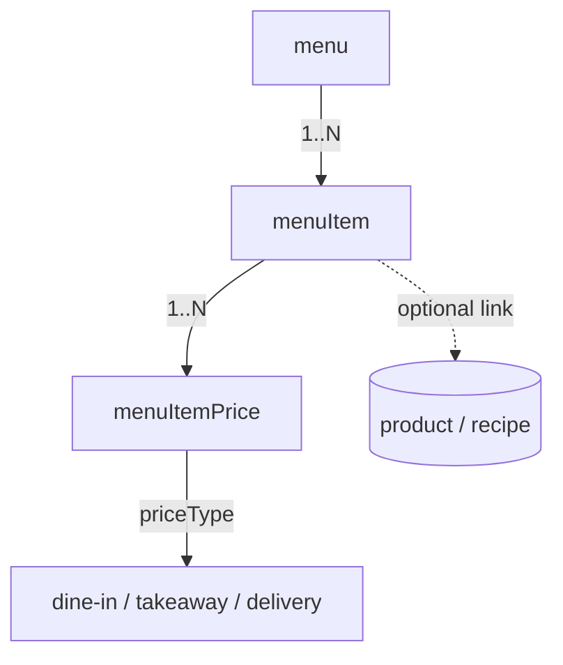

# 13 — Menu

Define what the restaurant sells: **menus** (e.g. All-Day, Breakfast, Bar), the **menu items** within them (dishes/drinks with category, images, modifiers), and **per-context prices** (dine-in, takeaway, delivery, or channel-specific rates). Menu items can be linked to an inventory [product](16-inventory.md:1)/recipe so that selling an item deducts stock.

- **Entities:** `menu`, `menuItem`, `menuItemPrice`
- **Base path:** `/api/v1/restaurant`
- **Frontend module:** Restaurant → Menu (Menus, Items, Pricing)

See [Conventions](00-conventions.md:1) for the response envelope, auth, tenancy scoping, pagination, error format, and soft-delete.

---

## Domain overview



Notes:
- A **menu** is a named grouping of items, optionally scheduled (active hours/days) and toggleable.
- A **menuItem** belongs to a menu, has a `category`, `availability` flag, optional image, and optional link to an inventory product/recipe.
- A **menuItemPrice** holds a price for a given **priceType** (channel/service context). Every item has at least one default price.
- Prices are stored in **minor units** per the branch [currency](08-currency.md:1).

**Price types:** `DINE_IN`, `TAKEAWAY`, `DELIVERY`, `ONLINE`.
**Item categories (example set):** `STARTER`, `MAIN`, `DESSERT`, `BEVERAGE`, `ALCOHOL`, `SIDE`, `COMBO`.

---

## Endpoint Summary

### Menus

| # | Action | Method | Path | Auth | Permission |
|---|--------|--------|------|------|------------|
| 1 | List menus | GET | `/api/v1/restaurant/menus` | Bearer | `restaurant.menu.read` |
| 2 | Get menu | GET | `/api/v1/restaurant/menus/:id` | Bearer | `restaurant.menu.read` |
| 3 | Create menu | POST | `/api/v1/restaurant/menus` | Bearer | `restaurant.menu.create` |
| 4 | Update menu | PATCH | `/api/v1/restaurant/menus/:id` | Bearer | `restaurant.menu.update` |
| 5 | Delete menu | DELETE | `/api/v1/restaurant/menus/:id` | Bearer | `restaurant.menu.delete` |
| 6 | Toggle menu active | PATCH | `/api/v1/restaurant/menus/:id/active` | Bearer | `restaurant.menu.update` |

### Menu items

| # | Action | Method | Path | Auth | Permission |
|---|--------|--------|------|------|------------|
| 7 | List menu items | GET | `/api/v1/restaurant/menu-items` | Bearer | `restaurant.menuItem.read` |
| 8 | Get menu item | GET | `/api/v1/restaurant/menu-items/:id` | Bearer | `restaurant.menuItem.read` |
| 9 | Create menu item | POST | `/api/v1/restaurant/menu-items` | Bearer | `restaurant.menuItem.create` |
| 10 | Update menu item | PATCH | `/api/v1/restaurant/menu-items/:id` | Bearer | `restaurant.menuItem.update` |
| 11 | Delete menu item | DELETE | `/api/v1/restaurant/menu-items/:id` | Bearer | `restaurant.menuItem.delete` |
| 12 | Toggle item availability | PATCH | `/api/v1/restaurant/menu-items/:id/availability` | Bearer | `restaurant.menuItem.update` |
| 13 | Link item to product/recipe | POST | `/api/v1/restaurant/menu-items/:id/link-product` | Bearer | `restaurant.menuItem.update` |
| 14 | Unlink item from product/recipe | DELETE | `/api/v1/restaurant/menu-items/:id/link-product` | Bearer | `restaurant.menuItem.update` |

### Item prices

| # | Action | Method | Path | Auth | Permission |
|---|--------|--------|------|------|------------|
| 15 | List item prices | GET | `/api/v1/restaurant/menu-items/:id/prices` | Bearer | `restaurant.menuItem.read` |
| 16 | Add/set item price | POST | `/api/v1/restaurant/menu-items/:id/prices` | Bearer | `restaurant.menuItem.update` |
| 17 | Update item price | PATCH | `/api/v1/restaurant/menu-items/:id/prices/:priceId` | Bearer | `restaurant.menuItem.update` |
| 18 | Delete item price | DELETE | `/api/v1/restaurant/menu-items/:id/prices/:priceId` | Bearer | `restaurant.menuItem.update` |

---

## 1. List menus

`GET /api/v1/restaurant/menus`

### Query parameters

| Param | Type | Default | Description |
|-------|------|---------|-------------|
| `page` | number | `1` | Page number |
| `limit` | number | `20` | Items per page (max 100) |
| `search` | string | — | Matches menu `name` |
| `isActive` | boolean | — | Filter by active flag |
| `sortBy` | string | `displayOrder` | `displayOrder` \| `name` \| `createdAt` |
| `sortOrder` | string | `asc` | `asc` \| `desc` |
| `includeDeleted` | boolean | `false` | Include soft-deleted |

### Response — `200 OK`

```json
{
  "success": true,
  "message": "Menus retrieved successfully",
  "data": [
    {
      "id": "menu-01",
      "name": "All-Day Menu",
      "description": "Available all day",
      "isActive": true,
      "displayOrder": 1,
      "availableFrom": null,
      "availableTo": null,
      "activeDays": ["MON","TUE","WED","THU","FRI","SAT","SUN"],
      "itemCount": 42,
      "createdAt": "2026-07-01T09:00:00.000Z"
    }
  ],
  "meta": { "page": 1, "limit": 20, "total": 1, "totalPages": 1, "hasNext": false, "hasPrev": false }
}
```

### Errors

| Status | Code | When |
|--------|------|------|
| 403 | `FORBIDDEN` | Missing `restaurant.menu.read` |

---

## 2. Get menu

`GET /api/v1/restaurant/menus/:id`

Optional `?includeItems=true` embeds a summarized item list.

### Response — `200 OK`

```json
{
  "success": true,
  "message": "Menu retrieved successfully",
  "data": {
    "id": "menu-01",
    "name": "All-Day Menu",
    "description": "Available all day",
    "isActive": true,
    "displayOrder": 1,
    "availableFrom": null,
    "availableTo": null,
    "activeDays": ["MON","TUE","WED","THU","FRI","SAT","SUN"],
    "itemCount": 42,
    "createdAt": "2026-07-01T09:00:00.000Z",
    "updatedAt": "2026-07-20T09:00:00.000Z"
  },
  "meta": {}
}
```

### Errors

| Status | Code | When |
|--------|------|------|
| 404 | `MENU_NOT_FOUND` | No such menu |

---

## 3. Create menu

`POST /api/v1/restaurant/menus`

### Request

```json
{
  "name": "Breakfast",
  "description": "Served 7am–11am",
  "displayOrder": 2,
  "isActive": true,
  "availableFrom": "07:00",
  "availableTo": "11:00",
  "activeDays": ["MON","TUE","WED","THU","FRI"]
}
```

### Fields

| Field | Type | Required | Notes |
|-------|------|----------|-------|
| `name` | string | Yes | Unique per branch |
| `description` | string | No | Free text |
| `displayOrder` | number | No | Sort order; default appends |
| `isActive` | boolean | No | Default `true` |
| `availableFrom` | string | No | `HH:mm`; null = all day |
| `availableTo` | string | No | `HH:mm`; null = all day |
| `activeDays` | string[] | No | Subset of `MON..SUN`; default all |

### Response — `201 Created`

```json
{
  "success": true,
  "message": "Menu created successfully",
  "data": { "id": "menu-02", "name": "Breakfast", "isActive": true, "displayOrder": 2 },
  "meta": {}
}
```

### Errors

| Status | Code | When |
|--------|------|------|
| 403 | `FORBIDDEN` | Missing `restaurant.menu.create` |
| 409 | `MENU_NAME_EXISTS` | Duplicate name in branch |
| 422 | `VALIDATION_ERROR` | Bad time range / invalid days |

---

## 4. Update menu

`PATCH /api/v1/restaurant/menus/:id`

### Request

```json
{ "availableTo": "11:30", "displayOrder": 1 }
```

### Response — `200 OK`

```json
{
  "success": true,
  "message": "Menu updated successfully",
  "data": { "id": "menu-02", "availableTo": "11:30", "displayOrder": 1, "updatedAt": "2026-08-05T08:10:00.000Z" },
  "meta": {}
}
```

### Errors

| Status | Code | When |
|--------|------|------|
| 404 | `MENU_NOT_FOUND` | No such menu |
| 409 | `MENU_NAME_EXISTS` | Duplicate name |
| 422 | `VALIDATION_ERROR` | Invalid values |

---

## 5. Delete menu

`DELETE /api/v1/restaurant/menus/:id`

Soft-deletes a menu and cascades a soft-delete to its items (their prices go with them). Blocked if any item is referenced by open orders.

### Response — `200 OK`

```json
{
  "success": true,
  "message": "Menu deleted successfully",
  "data": { "id": "menu-02", "deleted": true, "itemsDeleted": 12 },
  "meta": {}
}
```

### Errors

| Status | Code | When |
|--------|------|------|
| 404 | `MENU_NOT_FOUND` | No such menu |
| 409 | `MENU_ITEMS_IN_USE` | Items referenced by open orders |

---

## 6. Toggle menu active

`PATCH /api/v1/restaurant/menus/:id/active`

Quickly enable/disable a whole menu without editing schedule.

### Request

```json
{ "isActive": false }
```

### Response — `200 OK`

```json
{
  "success": true,
  "message": "Menu availability updated",
  "data": { "id": "menu-02", "isActive": false, "updatedAt": "2026-08-05T08:12:00.000Z" },
  "meta": {}
}
```

### Errors

| Status | Code | When |
|--------|------|------|
| 404 | `MENU_NOT_FOUND` | No such menu |
| 422 | `VALIDATION_ERROR` | `isActive` not boolean |

---

## 7. List menu items

`GET /api/v1/restaurant/menu-items`

### Query parameters

| Param | Type | Default | Description |
|-------|------|---------|-------------|
| `page` | number | `1` | Page number |
| `limit` | number | `20` | Items per page (max 100) |
| `search` | string | — | Matches item `name` |
| `menuId` | string | — | Filter by menu |
| `category` | string | — | Filter by category |
| `isAvailable` | boolean | — | Availability filter |
| `isVeg` | boolean | — | Vegetarian filter |
| `priceType` | string | `DINE_IN` | Which price to surface in `price` |
| `sortBy` | string | `displayOrder` | `displayOrder` \| `name` \| `createdAt` |
| `sortOrder` | string | `asc` | `asc` \| `desc` |

### Response — `200 OK`

```json
{
  "success": true,
  "message": "Menu items retrieved successfully",
  "data": [
    {
      "id": "mi-101",
      "menuId": "menu-01",
      "name": "Margherita Pizza",
      "category": "MAIN",
      "isVeg": true,
      "isAvailable": true,
      "displayOrder": 5,
      "imageFileId": "file-7001",
      "price": { "priceType": "DINE_IN", "amount": 45000, "currency": "INR" },
      "linkedProductId": "prod-880",
      "createdAt": "2026-07-01T09:10:00.000Z"
    }
  ],
  "meta": { "page": 1, "limit": 20, "total": 1, "totalPages": 1, "hasNext": false, "hasPrev": false }
}
```

### Errors

| Status | Code | When |
|--------|------|------|
| 403 | `FORBIDDEN` | Missing `restaurant.menuItem.read` |

---

## 8. Get menu item

`GET /api/v1/restaurant/menu-items/:id`

Includes all prices and modifier groups.

### Response — `200 OK`

```json
{
  "success": true,
  "message": "Menu item retrieved successfully",
  "data": {
    "id": "mi-101",
    "menuId": "menu-01",
    "name": "Margherita Pizza",
    "description": "Classic tomato, mozzarella, basil",
    "category": "MAIN",
    "isVeg": true,
    "isAvailable": true,
    "displayOrder": 5,
    "imageFileId": "file-7001",
    "imageUrl": "https://cdn.example.com/menu/mi-101.jpg",
    "preparationTimeMins": 15,
    "linkedProductId": "prod-880",
    "linkedRecipeId": "rec-880",
    "prices": [
      { "id": "mp-1", "priceType": "DINE_IN", "amount": 45000, "currency": "INR", "isDefault": true },
      { "id": "mp-2", "priceType": "DELIVERY", "amount": 49000, "currency": "INR", "isDefault": false }
    ],
    "modifierGroups": [
      { "name": "Size", "required": true, "options": ["Regular","Large"] },
      { "name": "Extra Toppings", "required": false, "options": ["Olives","Jalapeños","Extra Cheese"] }
    ],
    "createdAt": "2026-07-01T09:10:00.000Z",
    "updatedAt": "2026-07-15T09:10:00.000Z"
  },
  "meta": {}
}
```

### Errors

| Status | Code | When |
|--------|------|------|
| 404 | `MENU_ITEM_NOT_FOUND` | No such item |

---

## 9. Create menu item

`POST /api/v1/restaurant/menu-items`

Creates an item with at least one price (the default).

### Request

```json
{
  "menuId": "menu-01",
  "name": "Margherita Pizza",
  "description": "Classic tomato, mozzarella, basil",
  "category": "MAIN",
  "isVeg": true,
  "isAvailable": true,
  "displayOrder": 5,
  "imageFileId": "file-7001",
  "preparationTimeMins": 15,
  "prices": [
    { "priceType": "DINE_IN", "amount": 45000, "isDefault": true },
    { "priceType": "DELIVERY", "amount": 49000 }
  ],
  "modifierGroups": [
    { "name": "Size", "required": true, "options": ["Regular","Large"] }
  ]
}
```

### Fields

| Field | Type | Required | Notes |
|-------|------|----------|-------|
| `menuId` | string | Yes | Owning menu |
| `name` | string | Yes | Unique within menu |
| `description` | string | No | Free text |
| `category` | string | Yes | Item category enum |
| `isVeg` | boolean | No | Default `false` |
| `isAvailable` | boolean | No | Default `true` |
| `displayOrder` | number | No | Sort order |
| `imageFileId` | string | No | From [Files](07-files.md:1) |
| `preparationTimeMins` | number | No | Kitchen prep estimate |
| `prices` | array | Yes | ≥1 price; exactly one `isDefault:true` |
| `prices[].priceType` | string | Yes | Price type enum; unique per item |
| `prices[].amount` | number | Yes | Minor units |
| `prices[].isDefault` | boolean | No | Marks the fallback price |
| `modifierGroups` | array | No | Optional modifier definitions |

### Response — `201 Created`

```json
{
  "success": true,
  "message": "Menu item created successfully",
  "data": {
    "id": "mi-101",
    "menuId": "menu-01",
    "name": "Margherita Pizza",
    "category": "MAIN",
    "isAvailable": true,
    "prices": [
      { "id": "mp-1", "priceType": "DINE_IN", "amount": 45000, "isDefault": true },
      { "id": "mp-2", "priceType": "DELIVERY", "amount": 49000, "isDefault": false }
    ]
  },
  "meta": {}
}
```

### Errors

| Status | Code | When |
|--------|------|------|
| 403 | `FORBIDDEN` | Missing `restaurant.menuItem.create` |
| 404 | `MENU_NOT_FOUND` | `menuId` invalid |
| 409 | `MENU_ITEM_NAME_EXISTS` | Duplicate name in menu |
| 409 | `DUPLICATE_PRICE_TYPE` | Same `priceType` listed twice |
| 422 | `NO_DEFAULT_PRICE` | No price marked `isDefault` |
| 422 | `VALIDATION_ERROR` | Missing/invalid fields |

---

## 10. Update menu item

`PATCH /api/v1/restaurant/menu-items/:id`

Updates item attributes (not prices — use price endpoints 16–18). Modifier groups may be replaced wholesale.

### Request

```json
{ "description": "Wood-fired classic", "preparationTimeMins": 12, "imageFileId": "file-7050" }
```

### Response — `200 OK`

```json
{
  "success": true,
  "message": "Menu item updated successfully",
  "data": { "id": "mi-101", "preparationTimeMins": 12, "updatedAt": "2026-08-05T08:20:00.000Z" },
  "meta": {}
}
```

### Errors

| Status | Code | When |
|--------|------|------|
| 404 | `MENU_ITEM_NOT_FOUND` | No such item |
| 409 | `MENU_ITEM_NAME_EXISTS` | Duplicate name |
| 422 | `VALIDATION_ERROR` | Invalid values |

---

## 11. Delete menu item

`DELETE /api/v1/restaurant/menu-items/:id`

Soft-deletes the item and its prices. Blocked if referenced by open orders.

### Response — `200 OK`

```json
{
  "success": true,
  "message": "Menu item deleted successfully",
  "data": { "id": "mi-101", "deleted": true },
  "meta": {}
}
```

### Errors

| Status | Code | When |
|--------|------|------|
| 404 | `MENU_ITEM_NOT_FOUND` | No such item |
| 409 | `MENU_ITEM_IN_USE` | Referenced by an open order |

---

## 12. Toggle item availability

`PATCH /api/v1/restaurant/menu-items/:id/availability`

Fast "86 the dish" toggle used from the POS/floor when something runs out.

### Request

```json
{ "isAvailable": false, "reason": "Out of stock" }
```

### Response — `200 OK`

```json
{
  "success": true,
  "message": "Availability updated",
  "data": { "id": "mi-101", "isAvailable": false, "updatedAt": "2026-08-05T08:22:00.000Z" },
  "meta": {}
}
```

### Errors

| Status | Code | When |
|--------|------|------|
| 404 | `MENU_ITEM_NOT_FOUND` | No such item |
| 422 | `VALIDATION_ERROR` | `isAvailable` not boolean |

---

## 13. Link item to product/recipe

`POST /api/v1/restaurant/menu-items/:id/link-product`

Associates a menu item with an inventory [product](16-inventory.md:1) or [recipe](16-inventory.md:1) so selling deducts stock. Provide exactly one of `productId` or `recipeId`.

### Request

```json
{ "recipeId": "rec-880" }
```

### Fields

| Field | Type | Required | Notes |
|-------|------|----------|-------|
| `productId` | string | Cond. | Link to a single product (direct stock item) |
| `recipeId` | string | Cond. | Link to a recipe (multi-ingredient deduction) |

Exactly one of the two must be provided.

### Response — `200 OK`

```json
{
  "success": true,
  "message": "Menu item linked to recipe",
  "data": { "id": "mi-101", "linkedRecipeId": "rec-880", "linkedProductId": null },
  "meta": {}
}
```

### Errors

| Status | Code | When |
|--------|------|------|
| 404 | `MENU_ITEM_NOT_FOUND` | No such item |
| 404 | `PRODUCT_NOT_FOUND` | `productId` invalid |
| 404 | `RECIPE_NOT_FOUND` | `recipeId` invalid |
| 422 | `LINK_TARGET_REQUIRED` | Neither or both of product/recipe provided |

---

## 14. Unlink item from product/recipe

`DELETE /api/v1/restaurant/menu-items/:id/link-product`

Removes any product/recipe association. Selling the item will no longer deduct stock.

### Response — `200 OK`

```json
{
  "success": true,
  "message": "Menu item unlinked",
  "data": { "id": "mi-101", "linkedRecipeId": null, "linkedProductId": null },
  "meta": {}
}
```

### Errors

| Status | Code | When |
|--------|------|------|
| 404 | `MENU_ITEM_NOT_FOUND` | No such item |

---

## 15. List item prices

`GET /api/v1/restaurant/menu-items/:id/prices`

### Response — `200 OK`

```json
{
  "success": true,
  "message": "Prices retrieved successfully",
  "data": [
    { "id": "mp-1", "priceType": "DINE_IN", "amount": 45000, "currency": "INR", "isDefault": true },
    { "id": "mp-2", "priceType": "DELIVERY", "amount": 49000, "currency": "INR", "isDefault": false }
  ],
  "meta": {}
}
```

### Errors

| Status | Code | When |
|--------|------|------|
| 404 | `MENU_ITEM_NOT_FOUND` | No such item |

---

## 16. Add/set item price

`POST /api/v1/restaurant/menu-items/:id/prices`

Adds a new price for a `priceType`, or updates it if one already exists for that type (upsert). Marking a price `isDefault:true` clears the flag on the previous default.

### Request

```json
{ "priceType": "TAKEAWAY", "amount": 47000, "isDefault": false }
```

### Fields

| Field | Type | Required | Notes |
|-------|------|----------|-------|
| `priceType` | string | Yes | Price type enum; upserts per type |
| `amount` | number | Yes | Minor units |
| `isDefault` | boolean | No | If `true`, becomes the item's default price |

### Response — `201 Created`

```json
{
  "success": true,
  "message": "Price set successfully",
  "data": { "id": "mp-3", "priceType": "TAKEAWAY", "amount": 47000, "isDefault": false },
  "meta": {}
}
```

### Errors

| Status | Code | When |
|--------|------|------|
| 403 | `FORBIDDEN` | Missing `restaurant.menuItem.update` |
| 404 | `MENU_ITEM_NOT_FOUND` | No such item |
| 422 | `VALIDATION_ERROR` | Invalid `priceType`/`amount` |

---

## 17. Update item price

`PATCH /api/v1/restaurant/menu-items/:id/prices/:priceId`

### Request

```json
{ "amount": 48000, "isDefault": true }
```

### Fields

| Field | Type | Required | Notes |
|-------|------|----------|-------|
| `amount` | number | No | Minor units |
| `isDefault` | boolean | No | If `true`, clears previous default |

### Response — `200 OK`

```json
{
  "success": true,
  "message": "Price updated successfully",
  "data": { "id": "mp-3", "priceType": "TAKEAWAY", "amount": 48000, "isDefault": true, "updatedAt": "2026-08-05T08:30:00.000Z" },
  "meta": {}
}
```

### Errors

| Status | Code | When |
|--------|------|------|
| 404 | `MENU_ITEM_NOT_FOUND` | No such item |
| 404 | `PRICE_NOT_FOUND` | No such price for this item |
| 422 | `VALIDATION_ERROR` | Invalid values |

---

## 18. Delete item price

`DELETE /api/v1/restaurant/menu-items/:id/prices/:priceId`

Removes a price. Cannot delete the last remaining price, nor the current default unless another price is promoted first.

### Response — `200 OK`

```json
{
  "success": true,
  "message": "Price deleted successfully",
  "data": { "id": "mp-3", "deleted": true },
  "meta": {}
}
```

### Errors

| Status | Code | When |
|--------|------|------|
| 404 | `MENU_ITEM_NOT_FOUND` | No such item |
| 404 | `PRICE_NOT_FOUND` | No such price |
| 409 | `CANNOT_DELETE_LAST_PRICE` | Only one price remains |
| 409 | `CANNOT_DELETE_DEFAULT_PRICE` | Price is default; promote another first |

---

## Related

- [Orders & Kitchen](14-orders-kitchen.md:1) — orders reference menu items and their prices.
- [Restaurant Setup](12-restaurant-setup.md:1) — sections, tables, QR codes.
- [Inventory](16-inventory.md:1) — products/recipes linked to menu items for stock deduction.
- [Files](07-files.md:1) — menu item images.
- [Currency](08-currency.md:1) — price minor-unit scaling.