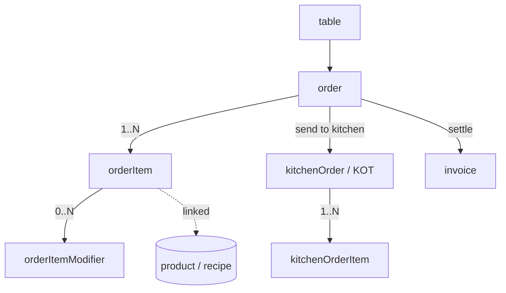
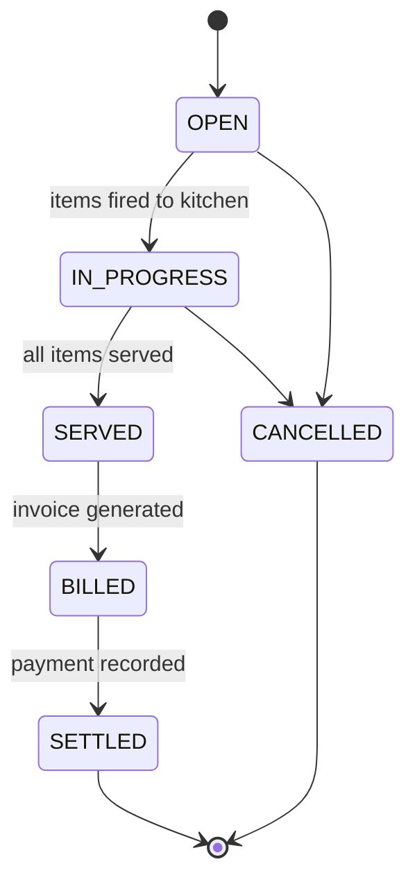

# 14 — Orders & Kitchen

The operational heart of the restaurant: **orders** placed against a [table](12-restaurant-setup.md:1) (or as takeaway/delivery), the **order items** and their **modifiers**, and the **kitchen orders** (KOTs) routed to prep stations via a Kitchen Display System (KDS). Selling an order item deducts stock for any linked [product/recipe](16-inventory.md:1); completing/settling an order drives [billing](19-billing.md:1).

- **Entities:** `order`, `orderItem`, `orderItemModifier`, `kitchenOrder`, `kitchenOrderItem`
- **Base path:** `/api/v1/restaurant`
- **Frontend module:** Restaurant → Orders (POS) / KDS (Kitchen Display)

See [Conventions](00-conventions.md:1) for the response envelope, auth, tenancy scoping, pagination, error format, soft-delete, and the `Idempotency-Key` header (required on money/stock mutations).

---

## Domain overview



Notes:
- An **order** has an `orderType` and moves through a status lifecycle. It references a table only for `DINE_IN`.
- Each **orderItem** captures the menu item, quantity, unit price snapshot, and computed line total. **Modifiers** adjust price and are sent to the kitchen.
- Sending items to the kitchen creates a **kitchenOrder** (KOT) with a batch of **kitchenOrderItems**; the KDS updates their prep status.
- Stock deduction happens when items are fired to the kitchen (configurable: on-fire vs. on-settle).

**Order types:** `DINE_IN`, `TAKEAWAY`, `DELIVERY`, `ONLINE`.
**Order statuses:** `OPEN`, `IN_PROGRESS`, `SERVED`, `BILLED`, `SETTLED`, `CANCELLED`.
**Kitchen order statuses:** `QUEUED`, `PREPARING`, `READY`, `SERVED`, `CANCELLED`.
**Kitchen item statuses:** `QUEUED`, `PREPARING`, `READY`, `SERVED`, `CANCELLED`.

---

## Order status lifecycle



---

## Endpoint Summary

### Orders

| # | Action | Method | Path | Auth | Permission |
|---|--------|--------|------|------|------------|
| 1 | List orders | GET | `/api/v1/restaurant/orders` | Bearer | `restaurant.order.read` |
| 2 | Get order | GET | `/api/v1/restaurant/orders/:id` | Bearer | `restaurant.order.read` |
| 3 | Create/open order | POST | `/api/v1/restaurant/orders` | Bearer | `restaurant.order.create` |
| 4 | Update order | PATCH | `/api/v1/restaurant/orders/:id` | Bearer | `restaurant.order.update` |
| 5 | Cancel order | POST | `/api/v1/restaurant/orders/:id/cancel` | Bearer | `restaurant.order.cancel` |

### Order items

| # | Action | Method | Path | Auth | Permission |
|---|--------|--------|------|------|------------|
| 6 | Add items | POST | `/api/v1/restaurant/orders/:id/items` | Bearer | `restaurant.order.update` |
| 7 | Update item | PATCH | `/api/v1/restaurant/orders/:id/items/:itemId` | Bearer | `restaurant.order.update` |
| 8 | Remove item | DELETE | `/api/v1/restaurant/orders/:id/items/:itemId` | Bearer | `restaurant.order.update` |

### Order operations

| # | Action | Method | Path | Auth | Permission |
|---|--------|--------|------|------|------------|
| 9 | Send to kitchen (fire KOT) | POST | `/api/v1/restaurant/orders/:id/send-to-kitchen` | Bearer | `restaurant.order.update` |
| 10 | Split order | POST | `/api/v1/restaurant/orders/:id/split` | Bearer | `restaurant.order.update` |
| 11 | Merge orders | POST | `/api/v1/restaurant/orders/:id/merge` | Bearer | `restaurant.order.update` |
| 12 | Transfer to table | POST | `/api/v1/restaurant/orders/:id/transfer` | Bearer | `restaurant.order.update` |
| 13 | Generate bill | POST | `/api/v1/restaurant/orders/:id/bill` | Bearer | `restaurant.order.bill` |

### Kitchen (KDS / KOT)

| # | Action | Method | Path | Auth | Permission |
|---|--------|--------|------|------|------------|
| 14 | List kitchen orders (KDS feed) | GET | `/api/v1/restaurant/kitchen-orders` | Bearer | `restaurant.kitchen.read` |
| 15 | Get kitchen order | GET | `/api/v1/restaurant/kitchen-orders/:id` | Bearer | `restaurant.kitchen.read` |
| 16 | Update KOT status | PATCH | `/api/v1/restaurant/kitchen-orders/:id/status` | Bearer | `restaurant.kitchen.update` |
| 17 | Update kitchen item status | PATCH | `/api/v1/restaurant/kitchen-orders/:id/items/:itemId/status` | Bearer | `restaurant.kitchen.update` |
| 18 | Mark items served | POST | `/api/v1/restaurant/orders/:id/items/serve` | Bearer | `restaurant.order.update` |

---

## 1. List orders

`GET /api/v1/restaurant/orders`

### Query parameters

| Param | Type | Default | Description |
|-------|------|---------|-------------|
| `page` | number | `1` | Page number |
| `limit` | number | `20` | Items per page (max 100) |
| `status` | string | — | Filter by order status |
| `orderType` | string | — | Filter by order type |
| `tableId` | string | — | Filter by table |
| `dateFrom` | string | — | ISO date; created on/after |
| `dateTo` | string | — | ISO date; created on/before |
| `sortBy` | string | `createdAt` | `createdAt` \| `total` |
| `sortOrder` | string | `desc` | `asc` \| `desc` |

### Response — `200 OK`

```json
{
  "success": true,
  "message": "Orders retrieved successfully",
  "data": [
    {
      "id": "ord-9001",
      "orderNumber": "ORD-20260805-0007",
      "orderType": "DINE_IN",
      "tableId": "tbl-12",
      "tableLabel": "T12",
      "status": "IN_PROGRESS",
      "itemCount": 4,
      "subtotal": 128000,
      "taxTotal": 6400,
      "discountTotal": 0,
      "total": 134400,
      "currency": "INR",
      "openedBy": "usr-55",
      "createdAt": "2026-08-05T12:40:00.000Z"
    }
  ],
  "meta": { "page": 1, "limit": 20, "total": 1, "totalPages": 1, "hasNext": false, "hasPrev": false }
}
```

### Errors

| Status | Code | When |
|--------|------|------|
| 403 | `FORBIDDEN` | Missing `restaurant.order.read` |

---

## 2. Get order

`GET /api/v1/restaurant/orders/:id`

Returns the full order with items, modifiers, and any fired KOTs.

### Response — `200 OK`

```json
{
  "success": true,
  "message": "Order retrieved successfully",
  "data": {
    "id": "ord-9001",
    "orderNumber": "ORD-20260805-0007",
    "orderType": "DINE_IN",
    "tableId": "tbl-12",
    "tableLabel": "T12",
    "customerId": null,
    "guestCount": 3,
    "status": "IN_PROGRESS",
    "note": "One pizza no basil",
    "items": [
      {
        "id": "oi-1",
        "menuItemId": "mi-101",
        "name": "Margherita Pizza",
        "quantity": 2,
        "unitPrice": 45000,
        "priceType": "DINE_IN",
        "modifiers": [
          { "id": "om-1", "name": "Large", "priceDelta": 8000 }
        ],
        "lineTotal": 106000,
        "kitchenStatus": "PREPARING",
        "fired": true
      },
      {
        "id": "oi-2",
        "menuItemId": "mi-210",
        "name": "Cola",
        "quantity": 2,
        "unitPrice": 11000,
        "priceType": "DINE_IN",
        "modifiers": [],
        "lineTotal": 22000,
        "kitchenStatus": null,
        "fired": false
      }
    ],
    "subtotal": 128000,
    "taxTotal": 6400,
    "discountTotal": 0,
    "total": 134400,
    "currency": "INR",
    "invoiceId": null,
    "createdAt": "2026-08-05T12:40:00.000Z",
    "updatedAt": "2026-08-05T12:52:00.000Z"
  },
  "meta": {}
}
```

### Errors

| Status | Code | When |
|--------|------|------|
| 404 | `ORDER_NOT_FOUND` | No such order |

---

## 3. Create/open order

`POST /api/v1/restaurant/orders`

Opens a new order. For `DINE_IN`, a `tableId` is required and the table transitions to `OCCUPIED`. Items may be included upfront or added later via endpoint 6.

### Request

```json
{
  "orderType": "DINE_IN",
  "tableId": "tbl-12",
  "guestCount": 3,
  "customerId": null,
  "note": "Window seat",
  "items": [
    {
      "menuItemId": "mi-101",
      "quantity": 2,
      "priceType": "DINE_IN",
      "modifiers": [{ "name": "Large", "priceDelta": 8000 }],
      "note": "No basil"
    }
  ]
}
```

### Fields

| Field | Type | Required | Notes |
|-------|------|----------|-------|
| `orderType` | string | Yes | Order type enum |
| `tableId` | string | Cond. | Required when `orderType=DINE_IN` |
| `guestCount` | number | No | Covers count for dine-in |
| `customerId` | string | No | Link to [customer](15-customers.md:1) |
| `note` | string | No | Order-level note |
| `items` | array | No | Optional initial items (same shape as endpoint 6) |

### Headers

| Header | Required | Notes |
|--------|----------|-------|
| `Idempotency-Key` | Recommended | Prevents duplicate order creation on retry |

### Response — `201 Created`

```json
{
  "success": true,
  "message": "Order opened successfully",
  "data": {
    "id": "ord-9001",
    "orderNumber": "ORD-20260805-0007",
    "orderType": "DINE_IN",
    "tableId": "tbl-12",
    "status": "OPEN",
    "itemCount": 1,
    "total": 106000,
    "currency": "INR"
  },
  "meta": {}
}
```

### Errors

| Status | Code | When |
|--------|------|------|
| 403 | `FORBIDDEN` | Missing `restaurant.order.create` |
| 404 | `TABLE_NOT_FOUND` | `tableId` invalid |
| 404 | `MENU_ITEM_NOT_FOUND` | An item's `menuItemId` invalid |
| 409 | `TABLE_OCCUPIED` | Table already has an open order |
| 422 | `TABLE_REQUIRED_FOR_DINE_IN` | Dine-in without `tableId` |
| 422 | `ITEM_UNAVAILABLE` | Menu item is 86'd/unavailable |
| 422 | `VALIDATION_ERROR` | Missing/invalid fields |

---

## 4. Update order

`PATCH /api/v1/restaurant/orders/:id`

Updates order-level attributes (note, guest count, customer link). Item edits use endpoints 6–8.

### Request

```json
{ "guestCount": 4, "note": "Add high chair", "customerId": "cust-300" }
```

### Response — `200 OK`

```json
{
  "success": true,
  "message": "Order updated successfully",
  "data": { "id": "ord-9001", "guestCount": 4, "customerId": "cust-300", "updatedAt": "2026-08-05T12:55:00.000Z" },
  "meta": {}
}
```

### Errors

| Status | Code | When |
|--------|------|------|
| 404 | `ORDER_NOT_FOUND` | No such order |
| 409 | `ORDER_NOT_EDITABLE` | Order is `SETTLED`/`CANCELLED` |
| 422 | `VALIDATION_ERROR` | Invalid values |

---

## 5. Cancel order

`POST /api/v1/restaurant/orders/:id/cancel`

Cancels an order. Fired KOT items are marked `CANCELLED`, any deducted stock is reversed, and a dine-in table is freed to `AVAILABLE`. Cannot cancel a `SETTLED` order.

### Request

```json
{ "reason": "Guest left", "voidFiredItems": true }
```

### Fields

| Field | Type | Required | Notes |
|-------|------|----------|-------|
| `reason` | string | Yes | Audit reason |
| `voidFiredItems` | boolean | No | Default `true`; reverses stock for fired items |

### Response — `200 OK`

```json
{
  "success": true,
  "message": "Order cancelled",
  "data": { "id": "ord-9001", "status": "CANCELLED", "tableId": "tbl-12", "tableStatus": "AVAILABLE", "stockReversed": true },
  "meta": {}
}
```

### Errors

| Status | Code | When |
|--------|------|------|
| 403 | `FORBIDDEN` | Missing `restaurant.order.cancel` |
| 404 | `ORDER_NOT_FOUND` | No such order |
| 409 | `ORDER_ALREADY_SETTLED` | Cannot cancel settled order |
| 422 | `VALIDATION_ERROR` | Missing reason |

---

## 6. Add items

`POST /api/v1/restaurant/orders/:id/items`

Adds one or more items to an open order. Newly added items start unfired until sent to the kitchen.

### Request

```json
{
  "items": [
    {
      "menuItemId": "mi-210",
      "quantity": 2,
      "priceType": "DINE_IN",
      "modifiers": [],
      "note": "Extra ice"
    }
  ]
}
```

### Fields

| Field | Type | Required | Notes |
|-------|------|----------|-------|
| `items` | array | Yes | ≥1 item |
| `items[].menuItemId` | string | Yes | Must be available |
| `items[].quantity` | number | Yes | ≥1 |
| `items[].priceType` | string | No | Defaults to order-type mapping |
| `items[].modifiers` | array | No | `{name, priceDelta}` entries |
| `items[].note` | string | No | Per-line note to kitchen |

### Response — `201 Created`

```json
{
  "success": true,
  "message": "Items added",
  "data": {
    "orderId": "ord-9001",
    "added": [{ "id": "oi-2", "menuItemId": "mi-210", "quantity": 2, "lineTotal": 22000 }],
    "orderTotal": 128000
  },
  "meta": {}
}
```

### Errors

| Status | Code | When |
|--------|------|------|
| 404 | `ORDER_NOT_FOUND` | No such order |
| 404 | `MENU_ITEM_NOT_FOUND` | Item invalid |
| 409 | `ORDER_NOT_EDITABLE` | Order billed/settled/cancelled |
| 422 | `ITEM_UNAVAILABLE` | Item is 86'd |
| 422 | `VALIDATION_ERROR` | Invalid quantity/fields |

---

## 7. Update item

`PATCH /api/v1/restaurant/orders/:id/items/:itemId`

Changes quantity, modifiers, or note on an item. Reducing quantity on an already-fired item requires a void reason and reverses stock proportionally.

### Request

```json
{ "quantity": 1, "voidReason": "Guest changed mind" }
```

### Fields

| Field | Type | Required | Notes |
|-------|------|----------|-------|
| `quantity` | number | No | New quantity ≥1 |
| `modifiers` | array | No | Replaces modifier set |
| `note` | string | No | Per-line note |
| `voidReason` | string | Cond. | Required if reducing a fired item |

### Response — `200 OK`

```json
{
  "success": true,
  "message": "Item updated",
  "data": { "id": "oi-1", "quantity": 1, "lineTotal": 53000, "orderTotal": 75000 },
  "meta": {}
}
```

### Errors

| Status | Code | When |
|--------|------|------|
| 404 | `ORDER_NOT_FOUND` | No such order |
| 404 | `ORDER_ITEM_NOT_FOUND` | No such item |
| 409 | `ORDER_NOT_EDITABLE` | Order billed/settled/cancelled |
| 422 | `VOID_REASON_REQUIRED` | Reducing fired item without reason |
| 422 | `VALIDATION_ERROR` | Invalid values |

---

## 8. Remove item

`DELETE /api/v1/restaurant/orders/:id/items/:itemId`

Removes an unfired item outright, or voids a fired item (reversing stock) with a reason.

### Query / body

```json
{ "voidReason": "Wrong item" }
```

### Response — `200 OK`

```json
{
  "success": true,
  "message": "Item removed",
  "data": { "id": "oi-2", "removed": true, "orderTotal": 106000, "stockReversed": false },
  "meta": {}
}
```

### Errors

| Status | Code | When |
|--------|------|------|
| 404 | `ORDER_NOT_FOUND` | No such order |
| 404 | `ORDER_ITEM_NOT_FOUND` | No such item |
| 409 | `ORDER_NOT_EDITABLE` | Order billed/settled/cancelled |
| 422 | `VOID_REASON_REQUIRED` | Voiding a fired item without reason |

---

## 9. Send to kitchen (fire KOT)

`POST /api/v1/restaurant/orders/:id/send-to-kitchen`

Fires unfired items to their prep stations, creating one or more **kitchenOrder** (KOT) records grouped by station. Deducts stock for linked products/recipes (when configured to deduct on fire) and moves the order to `IN_PROGRESS`.

### Request

```json
{
  "itemIds": ["oi-1", "oi-2"],
  "priority": "NORMAL"
}
```

### Fields

| Field | Type | Required | Notes |
|-------|------|----------|-------|
| `itemIds` | string[] | No | Specific items; omit to fire all unfired |
| `priority` | string | No | `NORMAL` \| `RUSH`; default `NORMAL` |

### Headers

| Header | Required | Notes |
|--------|----------|-------|
| `Idempotency-Key` | Recommended | Prevents duplicate KOTs on retry |

### Response — `201 Created`

```json
{
  "success": true,
  "message": "Sent to kitchen",
  "data": {
    "orderId": "ord-9001",
    "orderStatus": "IN_PROGRESS",
    "kitchenOrders": [
      {
        "id": "kot-501",
        "kotNumber": "KOT-0007-1",
        "station": "HOT_KITCHEN",
        "status": "QUEUED",
        "items": [{ "id": "koi-1", "name": "Margherita Pizza", "quantity": 2, "status": "QUEUED" }]
      },
      {
        "id": "kot-502",
        "kotNumber": "KOT-0007-2",
        "station": "BAR",
        "status": "QUEUED",
        "items": [{ "id": "koi-2", "name": "Cola", "quantity": 2, "status": "QUEUED" }]
      }
    ],
    "stockDeducted": true
  },
  "meta": {}
}
```

### Errors

| Status | Code | When |
|--------|------|------|
| 404 | `ORDER_NOT_FOUND` | No such order |
| 409 | `NO_ITEMS_TO_FIRE` | All items already fired |
| 409 | `ORDER_NOT_EDITABLE` | Order billed/settled/cancelled |
| 409 | `INSUFFICIENT_STOCK` | Linked stock cannot cover deduction |
| 422 | `VALIDATION_ERROR` | Invalid `itemIds`/`priority` |

---

## 10. Split order

`POST /api/v1/restaurant/orders/:id/split`

Splits selected items into a new order (e.g. separate checks). The new order inherits type/table context; the source order keeps the remainder.

### Request

```json
{
  "items": [
    { "itemId": "oi-1", "quantity": 1 }
  ],
  "newOrderTableId": "tbl-12"
}
```

### Fields

| Field | Type | Required | Notes |
|-------|------|----------|-------|
| `items` | array | Yes | Items (and split quantities) to move |
| `items[].itemId` | string | Yes | Source order item |
| `items[].quantity` | number | Yes | Portion to move (≤ current qty) |
| `newOrderTableId` | string | No | Table for the new order; defaults to source table |

### Response — `201 Created`

```json
{
  "success": true,
  "message": "Order split",
  "data": {
    "sourceOrderId": "ord-9001",
    "sourceOrderTotal": 53000,
    "newOrder": {
      "id": "ord-9002",
      "orderNumber": "ORD-20260805-0008",
      "orderType": "DINE_IN",
      "tableId": "tbl-12",
      "status": "OPEN",
      "itemCount": 1,
      "total": 53000,
      "currency": "INR"
    }
  },
  "meta": {}
}
```

### Errors

| Status | Code | When |
|--------|------|------|
| 404 | `ORDER_NOT_FOUND` | Source order not found |
| 404 | `ORDER_ITEM_NOT_FOUND` | A referenced item is not on the source order |
| 409 | `ORDER_NOT_EDITABLE` | Order billed/settled/cancelled |
| 422 | `SPLIT_QUANTITY_EXCEEDS` | Requested split quantity exceeds line quantity |
| 422 | `VALIDATION_ERROR` | Missing/invalid items |

---

## 11. Merge orders

`POST /api/v1/restaurant/orders/:id/merge`

Merges one or more source orders into the target order (`:id`). Items, modifiers, and fired KOT links move to the target; each merged source is closed with status `CANCELLED` (merged) and its table freed. Both orders must share the same currency and be editable.

### Request

```json
{
  "sourceOrderIds": ["ord-9002", "ord-9003"],
  "freeSourceTables": true
}
```

### Fields

| Field | Type | Required | Notes |
|-------|------|----------|-------|
| `sourceOrderIds` | string[] | Yes | ≥1 order to merge into the target |
| `freeSourceTables` | boolean | No | Default `true`; frees dine-in tables of merged orders |

### Response — `200 OK`

```json
{
  "success": true,
  "message": "Orders merged",
  "data": {
    "targetOrderId": "ord-9001",
    "mergedOrderIds": ["ord-9002", "ord-9003"],
    "itemCount": 6,
    "total": 210000,
    "currency": "INR",
    "freedTables": ["tbl-13", "tbl-14"]
  },
  "meta": {}
}
```

### Errors

| Status | Code | When |
|--------|------|------|
| 404 | `ORDER_NOT_FOUND` | Target or a source order not found |
| 409 | `ORDER_NOT_EDITABLE` | Target or a source is billed/settled/cancelled |
| 409 | `CURRENCY_MISMATCH` | Orders use different currencies |
| 422 | `VALIDATION_ERROR` | Missing/invalid source ids |

---

## 12. Transfer to table

`POST /api/v1/restaurant/orders/:id/transfer`

Moves a dine-in order to a different table. The current table is freed to `AVAILABLE`; the destination table becomes `OCCUPIED`. Fired KOTs keep their prep state.

### Request

```json
{ "toTableId": "tbl-20", "reason": "Guest moved" }
```

### Fields

| Field | Type | Required | Notes |
|-------|------|----------|-------|
| `toTableId` | string | Yes | Destination table id |
| `reason` | string | No | Audit note |

### Response — `200 OK`

```json
{
  "success": true,
  "message": "Order transferred",
  "data": {
    "id": "ord-9001",
    "fromTableId": "tbl-12",
    "fromTableStatus": "AVAILABLE",
    "toTableId": "tbl-20",
    "toTableStatus": "OCCUPIED"
  },
  "meta": {}
}
```

### Errors

| Status | Code | When |
|--------|------|------|
| 404 | `ORDER_NOT_FOUND` | No such order |
| 404 | `TABLE_NOT_FOUND` | Destination table invalid |
| 409 | `TABLE_OCCUPIED` | Destination table already has an open order |
| 409 | `NOT_DINE_IN` | Order is not a dine-in order |
| 409 | `ORDER_NOT_EDITABLE` | Order billed/settled/cancelled |

---

## 13. Generate bill

`POST /api/v1/restaurant/orders/:id/bill`

Finalizes the order and generates an [invoice](19-billing.md:1). Applies service charge, taxes, and any order-level discount, then moves the order to `BILLED`. Payment is recorded separately via the [billing](19-billing.md:1) module; once fully paid the order becomes `SETTLED`.

### Request

```json
{
  "discount": { "type": "PERCENT", "value": 10, "reason": "Loyalty" },
  "serviceChargePercent": 5,
  "splitBill": false
}
```

### Fields

| Field | Type | Required | Notes |
|-------|------|----------|-------|
| `discount` | object | No | `{type: PERCENT\|FIXED, value, reason}` |
| `serviceChargePercent` | number | No | Overrides outlet default |
| `splitBill` | boolean | No | Default `false`; when `true`, returns per-guest split lines |

### Headers

| Header | Required | Notes |
|--------|----------|-------|
| `Idempotency-Key` | Recommended | Prevents duplicate invoice generation on retry |

### Response — `201 Created`

```json
{
  "success": true,
  "message": "Bill generated",
  "data": {
    "orderId": "ord-9001",
    "orderStatus": "BILLED",
    "invoiceId": "inv-7001",
    "invoiceNumber": "INV-20260805-0042",
    "subtotal": 128000,
    "discountTotal": 12800,
    "serviceCharge": 5760,
    "taxTotal": 6048,
    "total": 127008,
    "currency": "INR"
  },
  "meta": {}
}
```

### Errors

| Status | Code | When |
|--------|------|------|
| 403 | `FORBIDDEN` | Missing `restaurant.order.bill` |
| 404 | `ORDER_NOT_FOUND` | No such order |
| 409 | `ORDER_ALREADY_BILLED` | Invoice already generated |
| 409 | `ORDER_EMPTY` | No items to bill |
| 409 | `ITEMS_NOT_SERVED` | Outlet requires all items served before billing |
| 422 | `VALIDATION_ERROR` | Invalid discount/service charge |

---

## 14. List kitchen orders (KDS feed)

`GET /api/v1/restaurant/kitchen-orders`

Returns the live Kitchen Display feed of KOTs, filterable by station and status. Sorted oldest-first (with `RUSH` prioritized) so cooks work the queue top-down.

### Query parameters

| Param | Type | Default | Description |
|-------|------|---------|-------------|
| `station` | string | — | Filter by prep station (e.g. `HOT_KITCHEN`, `BAR`) |
| `status` | string | `QUEUED,PREPARING` | Comma-separated statuses to include |
| `priority` | string | — | `NORMAL` \| `RUSH` |
| `limit` | number | `50` | Max KOTs (max 200) |

### Response — `200 OK`

```json
{
  "success": true,
  "message": "Kitchen orders retrieved successfully",
  "data": [
    {
      "id": "kot-501",
      "kotNumber": "KOT-0007-1",
      "orderId": "ord-9001",
      "orderNumber": "ORD-20260805-0007",
      "tableLabel": "T12",
      "station": "HOT_KITCHEN",
      "status": "PREPARING",
      "priority": "NORMAL",
      "elapsedSeconds": 320,
      "items": [
        { "id": "koi-1", "name": "Margherita Pizza", "quantity": 2, "note": "No basil", "status": "PREPARING" }
      ],
      "firedAt": "2026-08-05T12:47:00.000Z"
    }
  ],
  "meta": { "count": 1, "station": "HOT_KITCHEN" }
}
```

### Errors

| Status | Code | When |
|--------|------|------|
| 403 | `FORBIDDEN` | Missing `restaurant.kitchen.read` |

---

## 15. Get kitchen order

`GET /api/v1/restaurant/kitchen-orders/:id`

Returns a single KOT with its items and timing details.

### Response — `200 OK`

```json
{
  "success": true,
  "message": "Kitchen order retrieved successfully",
  "data": {
    "id": "kot-501",
    "kotNumber": "KOT-0007-1",
    "orderId": "ord-9001",
    "orderNumber": "ORD-20260805-0007",
    "tableLabel": "T12",
    "station": "HOT_KITCHEN",
    "status": "PREPARING",
    "priority": "NORMAL",
    "items": [
      { "id": "koi-1", "name": "Margherita Pizza", "quantity": 2, "note": "No basil", "status": "PREPARING" }
    ],
    "firedAt": "2026-08-05T12:47:00.000Z",
    "startedAt": "2026-08-05T12:48:10.000Z",
    "readyAt": null,
    "createdAt": "2026-08-05T12:47:00.000Z"
  },
  "meta": {}
}
```

### Errors

| Status | Code | When |
|--------|------|------|
| 404 | `KITCHEN_ORDER_NOT_FOUND` | No such KOT |

---

## 16. Update KOT status

`PATCH /api/v1/restaurant/kitchen-orders/:id/status`

Advances the whole KOT (e.g. `QUEUED → PREPARING → READY`). Setting `READY` cascades all its items to `READY`. Setting `CANCELLED` voids the KOT (reverses stock if configured).

### Request

```json
{ "status": "READY" }
```

### Fields

| Field | Type | Required | Notes |
|-------|------|----------|-------|
| `status` | string | Yes | Kitchen order status enum |
| `reason` | string | Cond. | Required when `status=CANCELLED` |

### Response — `200 OK`

```json
{
  "success": true,
  "message": "Kitchen order status updated",
  "data": { "id": "kot-501", "status": "READY", "readyAt": "2026-08-05T12:55:30.000Z" },
  "meta": {}
}
```

### Errors

| Status | Code | When |
|--------|------|------|
| 403 | `FORBIDDEN` | Missing `restaurant.kitchen.update` |
| 404 | `KITCHEN_ORDER_NOT_FOUND` | No such KOT |
| 409 | `INVALID_STATUS_TRANSITION` | Illegal lifecycle move |
| 422 | `REASON_REQUIRED` | Cancelling without a reason |

---

## 17. Update kitchen item status

`PATCH /api/v1/restaurant/kitchen-orders/:id/items/:itemId/status`

Advances a single kitchen item independently (useful when a KOT has mixed prep times). When all items in a KOT reach `READY`, the KOT auto-advances to `READY`.

### Request

```json
{ "status": "READY" }
```

### Response — `200 OK`

```json
{
  "success": true,
  "message": "Kitchen item status updated",
  "data": { "id": "koi-1", "kitchenOrderId": "kot-501", "status": "READY", "kotStatus": "READY" },
  "meta": {}
}
```

### Errors

| Status | Code | When |
|--------|------|------|
| 403 | `FORBIDDEN` | Missing `restaurant.kitchen.update` |
| 404 | `KITCHEN_ORDER_NOT_FOUND` | No such KOT |
| 404 | `KITCHEN_ITEM_NOT_FOUND` | No such item on the KOT |
| 409 | `INVALID_STATUS_TRANSITION` | Illegal lifecycle move |

---

## 18. Mark items served

`POST /api/v1/restaurant/orders/:id/items/serve`

Marks ready items as served to the guest. Order items and their kitchen items move to `SERVED`; when every fired item is served, the order advances to `SERVED` (ready to bill).

### Request

```json
{ "itemIds": ["oi-1", "oi-2"] }
```

### Fields

| Field | Type | Required | Notes |
|-------|------|----------|-------|
| `itemIds` | string[] | No | Specific items; omit to serve all `READY` items |

### Response — `200 OK`

```json
{
  "success": true,
  "message": "Items served",
  "data": {
    "orderId": "ord-9001",
    "served": ["oi-1", "oi-2"],
    "orderStatus": "SERVED"
  },
  "meta": {}
}
```

### Errors

| Status | Code | When |
|--------|------|------|
| 404 | `ORDER_NOT_FOUND` | No such order |
| 404 | `ORDER_ITEM_NOT_FOUND` | A referenced item is not on the order |
| 409 | `ITEM_NOT_READY` | An item is not yet `READY` in the kitchen |
| 422 | `VALIDATION_ERROR` | Invalid `itemIds` |

---

## Related

- [Restaurant Setup](12-restaurant-setup.md:1) — sections, tables, and QR codes that orders are placed against.
- [Menu](13-menu.md:1) — menu items and price types referenced by order items.
- [Customers](15-customers.md:1) — optional customer link and loyalty on orders.
- [Inventory](16-inventory.md:1) — product/recipe stock deducted when items are fired and reversed on void/cancel.
- [Billing](19-billing.md:1) — invoice and payment generated when an order is billed and settled.
