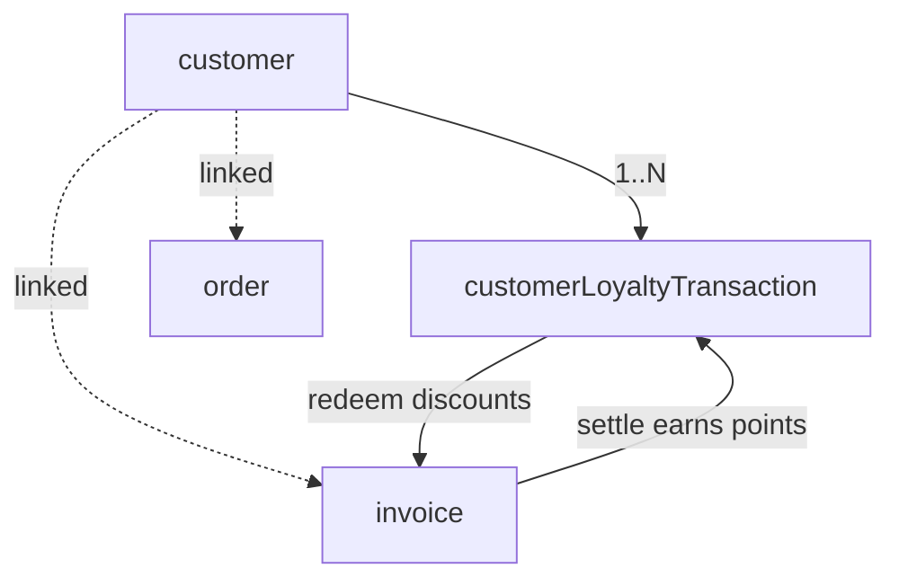

# 15 — Customers & Loyalty

Customers are the shared directory of walk-in and repeat patrons across the [restaurant](14-orders-kitchen.md:1) and [billing](19-billing.md:1) domains. Beyond contact details, customers carry a **loyalty balance** (points) and simple engagement metrics (visits, lifetime spend). Points accrue on settled invoices and can be redeemed against future bills.

- **Entities:** `customer`, `customerLoyaltyTransaction`
- **Base path:** `/api/v1/customers`
- **Frontend module:** CRM → Customers / Loyalty

See [Conventions](00-conventions.md:1) for the response envelope, auth, tenancy scoping, pagination, error format, soft-delete, and the `Idempotency-Key` header (required on loyalty balance mutations).

---

## Domain overview



Notes:
- A **customer** is scoped to an organization/branch and de-duplicated by phone or email within the tenant.
- Each **customerLoyaltyTransaction** is an immutable ledger entry (`EARN`, `REDEEM`, `ADJUST`, `EXPIRE`) that changes the running `loyaltyPoints` balance.
- Metrics `visitCount`, `lifetimeSpend`, and `lastVisitAt` are maintained by the billing flow when invoices settle.

**Customer types:** `WALK_IN`, `REGULAR`, `VIP`, `CORPORATE`.
**Loyalty transaction types:** `EARN`, `REDEEM`, `ADJUST`, `EXPIRE`.

---

## Endpoint Summary

### Customers

| # | Action | Method | Path | Auth | Permission |
|---|--------|--------|------|------|------------|
| 1 | List customers | GET | `/api/v1/customers` | Bearer | `crm.customer.read` |
| 2 | Get customer | GET | `/api/v1/customers/:id` | Bearer | `crm.customer.read` |
| 3 | Create customer | POST | `/api/v1/customers` | Bearer | `crm.customer.create` |
| 4 | Update customer | PATCH | `/api/v1/customers/:id` | Bearer | `crm.customer.update` |
| 5 | Delete customer | DELETE | `/api/v1/customers/:id` | Bearer | `crm.customer.delete` |
| 6 | Lookup by phone/email | GET | `/api/v1/customers/lookup` | Bearer | `crm.customer.read` |

### Loyalty

| # | Action | Method | Path | Auth | Permission |
|---|--------|--------|------|------|------------|
| 7 | Get loyalty summary | GET | `/api/v1/customers/:id/loyalty` | Bearer | `crm.loyalty.read` |
| 8 | List loyalty transactions | GET | `/api/v1/customers/:id/loyalty/transactions` | Bearer | `crm.loyalty.read` |
| 9 | Earn points | POST | `/api/v1/customers/:id/loyalty/earn` | Bearer | `crm.loyalty.manage` |
| 10 | Redeem points | POST | `/api/v1/customers/:id/loyalty/redeem` | Bearer | `crm.loyalty.manage` |
| 11 | Adjust points | POST | `/api/v1/customers/:id/loyalty/adjust` | Bearer | `crm.loyalty.manage` |

---

## 1. List customers

`GET /api/v1/customers`

### Query parameters

| Param | Type | Default | Description |
|-------|------|---------|-------------|
| `page` | number | `1` | Page number |
| `limit` | number | `20` | Items per page (max 100) |
| `search` | string | — | Matches name, phone, or email |
| `type` | string | — | Filter by customer type |
| `minPoints` | number | — | Only customers with ≥ this loyalty balance |
| `sortBy` | string | `createdAt` | `createdAt` \| `name` \| `lifetimeSpend` \| `loyaltyPoints` |
| `sortOrder` | string | `desc` | `asc` \| `desc` |
| `includeDeleted` | boolean | `false` | Include soft-deleted records |

### Response — `200 OK`

```json
{
  "success": true,
  "message": "Customers retrieved successfully",
  "data": [
    {
      "id": "cust-300",
      "name": "Ayesha Khan",
      "phone": "+919812345678",
      "email": "ayesha@example.com",
      "type": "VIP",
      "loyaltyPoints": 1240,
      "visitCount": 18,
      "lifetimeSpend": 452000,
      "currency": "INR",
      "lastVisitAt": "2026-08-01T19:30:00.000Z",
      "createdAt": "2025-11-02T10:00:00.000Z"
    }
  ],
  "meta": { "page": 1, "limit": 20, "total": 1, "totalPages": 1, "hasNext": false, "hasPrev": false }
}
```

### Errors

| Status | Code | When |
|--------|------|------|
| 403 | `FORBIDDEN` | Missing `crm.customer.read` |

---

## 2. Get customer

`GET /api/v1/customers/:id`

Returns the full customer profile including current loyalty balance and metrics.

### Response — `200 OK`

```json
{
  "success": true,
  "message": "Customer retrieved successfully",
  "data": {
    "id": "cust-300",
    "name": "Ayesha Khan",
    "phone": "+919812345678",
    "email": "ayesha@example.com",
    "type": "VIP",
    "gender": "FEMALE",
    "dateOfBirth": "1992-04-15",
    "address": {
      "line1": "12 Rose Lane",
      "city": "Mumbai",
      "state": "Maharashtra",
      "country": "IN",
      "postalCode": "400001"
    },
    "note": "Prefers window seating",
    "loyaltyPoints": 1240,
    "visitCount": 18,
    "lifetimeSpend": 452000,
    "currency": "INR",
    "lastVisitAt": "2026-08-01T19:30:00.000Z",
    "createdAt": "2025-11-02T10:00:00.000Z",
    "updatedAt": "2026-08-01T19:35:00.000Z"
  },
  "meta": {}
}
```

### Errors

| Status | Code | When |
|--------|------|------|
| 404 | `CUSTOMER_NOT_FOUND` | No such customer |

---

## 3. Create customer

`POST /api/v1/customers`

Creates a customer scoped to the tenant. De-duplicated by `phone` (and `email` when present) within the organization/branch.

### Request

```json
{
  "name": "Ayesha Khan",
  "phone": "+919812345678",
  "email": "ayesha@example.com",
  "type": "REGULAR",
  "gender": "FEMALE",
  "dateOfBirth": "1992-04-15",
  "address": {
    "line1": "12 Rose Lane",
    "city": "Mumbai",
    "state": "Maharashtra",
    "country": "IN",
    "postalCode": "400001"
  },
  "note": "Prefers window seating"
}
```

### Fields

| Field | Type | Required | Notes |
|-------|------|----------|-------|
| `name` | string | Yes | Display name |
| `phone` | string | Cond. | Required unless `email` provided; unique per tenant |
| `email` | string | Cond. | Required unless `phone` provided; unique per tenant |
| `type` | string | No | Customer type enum; default `WALK_IN` |
| `gender` | string | No | `MALE` \| `FEMALE` \| `OTHER` |
| `dateOfBirth` | string | No | ISO date |
| `address` | object | No | Postal address |
| `note` | string | No | Free-text note |

### Response — `201 Created`

```json
{
  "success": true,
  "message": "Customer created successfully",
  "data": {
    "id": "cust-300",
    "name": "Ayesha Khan",
    "phone": "+919812345678",
    "email": "ayesha@example.com",
    "type": "REGULAR",
    "loyaltyPoints": 0,
    "createdAt": "2026-08-05T12:00:00.000Z"
  },
  "meta": {}
}
```

### Errors

| Status | Code | When |
|--------|------|------|
| 403 | `FORBIDDEN` | Missing `crm.customer.create` |
| 409 | `CUSTOMER_PHONE_EXISTS` | Phone already registered in tenant |
| 409 | `CUSTOMER_EMAIL_EXISTS` | Email already registered in tenant |
| 422 | `CONTACT_REQUIRED` | Neither phone nor email provided |
| 422 | `VALIDATION_ERROR` | Missing/invalid fields |

---

## 4. Update customer

`PATCH /api/v1/customers/:id`

Partial update of profile attributes. Loyalty balance is **not** editable here — use loyalty endpoints (9–11).

### Request

```json
{ "type": "VIP", "note": "Anniversary in April", "email": "ayesha.k@example.com" }
```

### Response — `200 OK`

```json
{
  "success": true,
  "message": "Customer updated successfully",
  "data": { "id": "cust-300", "type": "VIP", "email": "ayesha.k@example.com", "updatedAt": "2026-08-05T12:10:00.000Z" },
  "meta": {}
}
```

### Errors

| Status | Code | When |
|--------|------|------|
| 404 | `CUSTOMER_NOT_FOUND` | No such customer |
| 409 | `CUSTOMER_PHONE_EXISTS` | New phone collides with another customer |
| 409 | `CUSTOMER_EMAIL_EXISTS` | New email collides with another customer |
| 422 | `VALIDATION_ERROR` | Invalid values |

---

## 5. Delete customer

`DELETE /api/v1/customers/:id`

Soft-deletes the customer (sets `deletedAt`). Loyalty ledger is retained for audit. A customer linked to open orders cannot be deleted.

### Response — `200 OK`

```json
{
  "success": true,
  "message": "Customer deleted successfully",
  "data": { "id": "cust-300", "deletedAt": "2026-08-05T12:20:00.000Z" },
  "meta": {}
}
```

### Errors

| Status | Code | When |
|--------|------|------|
| 403 | `FORBIDDEN` | Missing `crm.customer.delete` |
| 404 | `CUSTOMER_NOT_FOUND` | No such customer |
| 409 | `CUSTOMER_HAS_OPEN_ORDERS` | Customer linked to open orders |

---

## 6. Lookup by phone/email

`GET /api/v1/customers/lookup`

Fast single-record lookup used by the POS to attach a customer to an order. Returns `200` with `data:null` when no match (not a 404) so the POS can offer to create.

### Query parameters

| Param | Type | Required | Description |
|-------|------|----------|-------------|
| `phone` | string | Cond. | Phone to match; one of `phone`/`email` required |
| `email` | string | Cond. | Email to match |

### Response — `200 OK` (match)

```json
{
  "success": true,
  "message": "Customer found",
  "data": {
    "id": "cust-300",
    "name": "Ayesha Khan",
    "phone": "+919812345678",
    "type": "VIP",
    "loyaltyPoints": 1240
  },
  "meta": {}
}
```

### Response — `200 OK` (no match)

```json
{
  "success": true,
  "message": "No customer found",
  "data": null,
  "meta": {}
}
```

### Errors

| Status | Code | When |
|--------|------|------|
| 422 | `LOOKUP_KEY_REQUIRED` | Neither phone nor email supplied |

---

## 7. Get loyalty summary

`GET /api/v1/customers/:id/loyalty`

Returns the current balance and aggregate loyalty stats for the customer.

### Response — `200 OK`

```json
{
  "success": true,
  "message": "Loyalty summary retrieved successfully",
  "data": {
    "customerId": "cust-300",
    "loyaltyPoints": 1240,
    "totalEarned": 3800,
    "totalRedeemed": 2500,
    "totalExpired": 60,
    "pointValue": { "pointsPerUnit": 1, "redeemRate": 100, "currency": "INR" },
    "lastActivityAt": "2026-08-01T19:35:00.000Z"
  },
  "meta": {}
}
```

Notes: `redeemRate` indicates minor currency units granted per point on redemption (here 100 = ₹1.00 per point).

### Errors

| Status | Code | When |
|--------|------|------|
| 404 | `CUSTOMER_NOT_FOUND` | No such customer |

---

## 8. List loyalty transactions

`GET /api/v1/customers/:id/loyalty/transactions`

Paginated, newest-first ledger of loyalty movements.

### Query parameters

| Param | Type | Default | Description |
|-------|------|---------|-------------|
| `page` | number | `1` | Page number |
| `limit` | number | `20` | Items per page (max 100) |
| `type` | string | — | Filter by transaction type |
| `dateFrom` | string | — | ISO date; on/after |
| `dateTo` | string | — | ISO date; on/before |

### Response — `200 OK`

```json
{
  "success": true,
  "message": "Loyalty transactions retrieved successfully",
  "data": [
    {
      "id": "lt-9001",
      "type": "EARN",
      "points": 120,
      "balanceAfter": 1240,
      "reason": "Invoice settled",
      "referenceType": "INVOICE",
      "referenceId": "inv-7001",
      "createdBy": "usr-55",
      "createdAt": "2026-08-01T19:35:00.000Z"
    },
    {
      "id": "lt-9000",
      "type": "REDEEM",
      "points": -500,
      "balanceAfter": 1120,
      "reason": "Redeemed on bill",
      "referenceType": "INVOICE",
      "referenceId": "inv-6990",
      "createdBy": "usr-55",
      "createdAt": "2026-07-20T20:10:00.000Z"
    }
  ],
  "meta": { "page": 1, "limit": 20, "total": 2, "totalPages": 1, "hasNext": false, "hasPrev": false }
}
```

### Errors

| Status | Code | When |
|--------|------|------|
| 404 | `CUSTOMER_NOT_FOUND` | No such customer |

---

## 9. Earn points

`POST /api/v1/customers/:id/loyalty/earn`

Credits points to the customer. Normally called automatically by the [billing](19-billing.md:1) flow on invoice settlement, but exposed for manual/campaign grants.

### Request

```json
{
  "points": 120,
  "reason": "Invoice settled",
  "referenceType": "INVOICE",
  "referenceId": "inv-7001"
}
```

### Fields

| Field | Type | Required | Notes |
|-------|------|----------|-------|
| `points` | number | Yes | Positive integer to credit |
| `reason` | string | Yes | Audit reason |
| `referenceType` | string | No | e.g. `INVOICE`, `CAMPAIGN` |
| `referenceId` | string | No | Related record id |

### Headers

| Header | Required | Notes |
|--------|----------|-------|
| `Idempotency-Key` | Recommended | Prevents double-crediting on retry |

### Response — `201 Created`

```json
{
  "success": true,
  "message": "Points earned",
  "data": { "id": "lt-9001", "type": "EARN", "points": 120, "balanceAfter": 1240 },
  "meta": {}
}
```

### Errors

| Status | Code | When |
|--------|------|------|
| 403 | `FORBIDDEN` | Missing `crm.loyalty.manage` |
| 404 | `CUSTOMER_NOT_FOUND` | No such customer |
| 422 | `VALIDATION_ERROR` | Non-positive points/missing reason |

---

## 10. Redeem points

`POST /api/v1/customers/:id/loyalty/redeem`

Debits points from the balance (e.g. applied as a discount on a bill). Fails if the balance is insufficient.

### Request

```json
{
  "points": 500,
  "reason": "Redeemed on bill",
  "referenceType": "INVOICE",
  "referenceId": "inv-6990"
}
```

### Fields

| Field | Type | Required | Notes |
|-------|------|----------|-------|
| `points` | number | Yes | Positive integer to debit |
| `reason` | string | Yes | Audit reason |
| `referenceType` | string | No | e.g. `INVOICE` |
| `referenceId` | string | No | Related record id |

### Headers

| Header | Required | Notes |
|--------|----------|-------|
| `Idempotency-Key` | Recommended | Prevents double-redeeming on retry |

### Response — `201 Created`

```json
{
  "success": true,
  "message": "Points redeemed",
  "data": {
    "id": "lt-9002",
    "type": "REDEEM",
    "points": -500,
    "balanceAfter": 740,
    "redeemValue": 50000,
    "currency": "INR"
  },
  "meta": {}
}
```

### Errors

| Status | Code | When |
|--------|------|------|
| 403 | `FORBIDDEN` | Missing `crm.loyalty.manage` |
| 404 | `CUSTOMER_NOT_FOUND` | No such customer |
| 409 | `INSUFFICIENT_POINTS` | Balance below requested points |
| 422 | `VALIDATION_ERROR` | Non-positive points/missing reason |

---

## 11. Adjust points

`POST /api/v1/customers/:id/loyalty/adjust`

Manual correction (positive or negative) for disputes, goodwill, or expiry write-offs. Requires an elevated permission and always records a reason.

### Request

```json
{ "points": -60, "reason": "Points expiry (12-month policy)" }
```

### Fields

| Field | Type | Required | Notes |
|-------|------|----------|-------|
| `points` | number | Yes | Signed integer (may be negative) |
| `reason` | string | Yes | Audit reason (mandatory) |

### Response — `201 Created`

```json
{
  "success": true,
  "message": "Loyalty balance adjusted",
  "data": { "id": "lt-9003", "type": "ADJUST", "points": -60, "balanceAfter": 680 },
  "meta": {}
}
```

### Errors

| Status | Code | When |
|--------|------|------|
| 403 | `FORBIDDEN` | Missing `crm.loyalty.manage` |
| 404 | `CUSTOMER_NOT_FOUND` | No such customer |
| 409 | `NEGATIVE_BALANCE_NOT_ALLOWED` | Adjustment would drive balance below zero |
| 422 | `VALIDATION_ERROR` | Missing reason/zero points |

---

## Related

- [Orders & Kitchen](14-orders-kitchen.md:1) — attach a customer to an order via lookup; drives visit metrics.
- [Billing](19-billing.md:1) — invoice settlement earns points; redemptions apply as bill discounts.
- [Conventions](00-conventions.md:1) — envelope, pagination, error format, and idempotency rules.