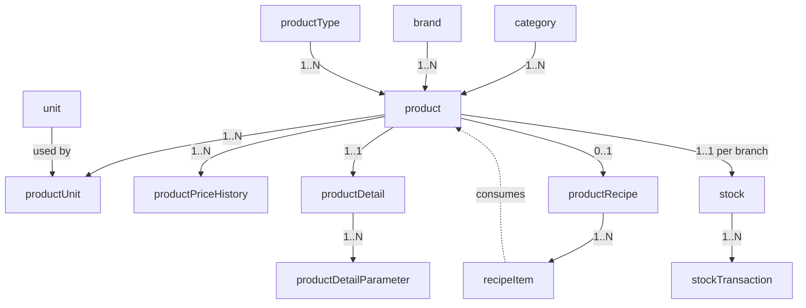

# 16 — Inventory & Products

The inventory domain is the shared catalog and stock ledger that feeds [restaurant recipes](14-orders-kitchen.md:1), [purchasing](18-purchase.md:1), and [billing](19-billing.md:1). It models **what** an item is (product, brand, category, type), **how** it is measured (units + conversions), **how much** it costs and its price history, structured **detail parameters**, **recipes** (bill of materials for prepared items), and the **stock ledger** (on-hand quantities plus an immutable transaction trail).

- **Entities:** `category`, `brand`, `unit`, `productType`, `product`, `productUnit`, `productPriceHistory`, `productDetail`, `productDetailParameter`, `productRecipe`, `recipeItem`, `stock`, `stockTransaction`
- **Base path:** `/api/v1/inventory`
- **Frontend module:** Inventory → Catalog / Stock / Recipes / Reports

See [Conventions](00-conventions.md:1) for the envelope, auth, tenancy scoping, pagination, error format, soft-delete, money (minor units), and the `Idempotency-Key` header (required on all stock-mutating endpoints).

---

## Domain overview



Notes:
- **unit** defines a measurement (e.g. `KG`, `GRAM`, `LITRE`, `PIECE`) with a `baseUnitId` and `conversionFactor` so quantities normalize to a base unit.
- **product** references one `category`, optional `brand`, and a `productType` (`RAW`, `SEMI_FINISHED`, `FINISHED`, `SERVICE`).
- **productUnit** declares which units a product can be transacted in (purchase unit vs. stock unit) with conversion.
- **productPriceHistory** captures cost changes over time (append-only).
- **productRecipe** + **recipeItem** define a bill of materials for prepared/finished products, consumed when a menu item fires to the kitchen.
- **stock** holds current on-hand per product per branch; **stockTransaction** is the append-only ledger (`PURCHASE_IN`, `SALE_OUT`, `ADJUSTMENT`, `TRANSFER_IN`, `TRANSFER_OUT`, `WASTAGE`, `PRODUCTION_IN`, `PRODUCTION_OUT`).

**Product types:** `RAW`, `SEMI_FINISHED`, `FINISHED`, `SERVICE`.
**Stock transaction types:** `PURCHASE_IN`, `SALE_OUT`, `ADJUSTMENT`, `TRANSFER_IN`, `TRANSFER_OUT`, `WASTAGE`, `PRODUCTION_IN`, `PRODUCTION_OUT`.

---

## Endpoint Summary

### Categories

| # | Action | Method | Path | Auth | Permission |
|---|--------|--------|------|------|------------|
| 1 | List categories | GET | `/api/v1/inventory/categories` | Bearer | `inventory.category.read` |
| 2 | Create category | POST | `/api/v1/inventory/categories` | Bearer | `inventory.category.create` |
| 3 | Update category | PATCH | `/api/v1/inventory/categories/:id` | Bearer | `inventory.category.update` |
| 4 | Delete category | DELETE | `/api/v1/inventory/categories/:id` | Bearer | `inventory.category.delete` |

### Brands

| # | Action | Method | Path | Auth | Permission |
|---|--------|--------|------|------|------------|
| 5 | List brands | GET | `/api/v1/inventory/brands` | Bearer | `inventory.brand.read` |
| 6 | Create brand | POST | `/api/v1/inventory/brands` | Bearer | `inventory.brand.create` |
| 7 | Update brand | PATCH | `/api/v1/inventory/brands/:id` | Bearer | `inventory.brand.update` |
| 8 | Delete brand | DELETE | `/api/v1/inventory/brands/:id` | Bearer | `inventory.brand.delete` |

### Units & Product Types

| # | Action | Method | Path | Auth | Permission |
|---|--------|--------|------|------|------------|
| 9 | List units | GET | `/api/v1/inventory/units` | Bearer | `inventory.unit.read` |
| 10 | Create unit | POST | `/api/v1/inventory/units` | Bearer | `inventory.unit.create` |
| 11 | Update unit | PATCH | `/api/v1/inventory/units/:id` | Bearer | `inventory.unit.update` |
| 12 | Delete unit | DELETE | `/api/v1/inventory/units/:id` | Bearer | `inventory.unit.delete` |
| 13 | List product types | GET | `/api/v1/inventory/product-types` | Bearer | `inventory.productType.read` |
| 14 | Create product type | POST | `/api/v1/inventory/product-types` | Bearer | `inventory.productType.create` |

### Products

| # | Action | Method | Path | Auth | Permission |
|---|--------|--------|------|------|------------|
| 15 | List products | GET | `/api/v1/inventory/products` | Bearer | `inventory.product.read` |
| 16 | Get product | GET | `/api/v1/inventory/products/:id` | Bearer | `inventory.product.read` |
| 17 | Create product | POST | `/api/v1/inventory/products` | Bearer | `inventory.product.create` |
| 18 | Update product | PATCH | `/api/v1/inventory/products/:id` | Bearer | `inventory.product.update` |
| 19 | Delete product | DELETE | `/api/v1/inventory/products/:id` | Bearer | `inventory.product.delete` |
| 20 | List product units | GET | `/api/v1/inventory/products/:id/units` | Bearer | `inventory.product.read` |
| 21 | Add product unit | POST | `/api/v1/inventory/products/:id/units` | Bearer | `inventory.product.update` |
| 22 | Get price history | GET | `/api/v1/inventory/products/:id/price-history` | Bearer | `inventory.product.read` |
| 23 | Update product detail | PUT | `/api/v1/inventory/products/:id/detail` | Bearer | `inventory.product.update` |

### Recipes

| # | Action | Method | Path | Auth | Permission |
|---|--------|--------|------|------|------------|
| 24 | Get product recipe | GET | `/api/v1/inventory/products/:id/recipe` | Bearer | `inventory.recipe.read` |
| 25 | Upsert product recipe | PUT | `/api/v1/inventory/products/:id/recipe` | Bearer | `inventory.recipe.manage` |

### Stock

| # | Action | Method | Path | Auth | Permission |
|---|--------|--------|------|------|------------|
| 26 | List stock (on-hand) | GET | `/api/v1/inventory/stock` | Bearer | `inventory.stock.read` |
| 27 | Get product stock | GET | `/api/v1/inventory/stock/:productId` | Bearer | `inventory.stock.read` |
| 28 | List stock transactions | GET | `/api/v1/inventory/stock-transactions` | Bearer | `inventory.stock.read` |
| 29 | Adjust stock | POST | `/api/v1/inventory/stock/adjust` | Bearer | `inventory.stock.adjust` |
| 30 | Transfer stock | POST | `/api/v1/inventory/stock/transfer` | Bearer | `inventory.stock.transfer` |
| 31 | Record wastage | POST | `/api/v1/inventory/stock/wastage` | Bearer | `inventory.stock.adjust` |
| 32 | Low-stock report | GET | `/api/v1/inventory/reports/low-stock` | Bearer | `inventory.stock.read` |
| 33 | Valuation report | GET | `/api/v1/inventory/reports/valuation` | Bearer | `inventory.stock.read` |

---

## Categories

### 1. List categories

`GET /api/v1/inventory/categories`

Standard list; supports `page`, `limit`, `search`, `sortBy` (`name`\|`createdAt`), `sortOrder`, `includeDeleted`.

#### Response — `200 OK`

```json
{
  "success": true,
  "message": "Categories retrieved successfully",
  "data": [
    { "id": "cat-1", "name": "Dairy", "parentId": null, "productCount": 12, "createdAt": "2025-10-01T09:00:00.000Z" }
  ],
  "meta": { "page": 1, "limit": 20, "total": 1, "totalPages": 1, "hasNext": false, "hasPrev": false }
}
```

### 2. Create category

`POST /api/v1/inventory/categories`

#### Request

```json
{ "name": "Dairy", "parentId": null, "description": "Milk & milk products" }
```

| Field | Type | Required | Notes |
|-------|------|----------|-------|
| `name` | string | Yes | Unique per tenant (within parent) |
| `parentId` | string | No | Nesting under a parent category |
| `description` | string | No | Free text |

#### Response — `201 Created`

```json
{ "success": true, "message": "Category created successfully", "data": { "id": "cat-1", "name": "Dairy" }, "meta": {} }
```

#### Errors

| Status | Code | When |
|--------|------|------|
| 409 | `CATEGORY_NAME_EXISTS` | Duplicate name under same parent |
| 422 | `VALIDATION_ERROR` | Missing/invalid fields |

### 3. Update category

`PATCH /api/v1/inventory/categories/:id`

```json
{ "name": "Dairy & Eggs" }
```

Returns `200` with the updated record. Errors: `404 CATEGORY_NOT_FOUND`, `409 CATEGORY_NAME_EXISTS`, `422 VALIDATION_ERROR`.

### 4. Delete category

`DELETE /api/v1/inventory/categories/:id`

Soft-deletes. Errors: `404 CATEGORY_NOT_FOUND`, `409 CATEGORY_HAS_PRODUCTS` (reassign products first).

---

## Brands

### 5. List brands

`GET /api/v1/inventory/brands` — standard list (`page`, `limit`, `search`, `sortBy`, `sortOrder`, `includeDeleted`).

```json
{
  "success": true,
  "message": "Brands retrieved successfully",
  "data": [ { "id": "brand-1", "name": "Amul", "productCount": 8, "createdAt": "2025-10-01T09:00:00.000Z" } ],
  "meta": { "page": 1, "limit": 20, "total": 1, "totalPages": 1, "hasNext": false, "hasPrev": false }
}
```

### 6. Create brand

`POST /api/v1/inventory/brands`

```json
{ "name": "Amul", "description": "Dairy cooperative" }
```

`201` with `{ id, name }`. Errors: `409 BRAND_NAME_EXISTS`, `422 VALIDATION_ERROR`.

### 7. Update brand

`PATCH /api/v1/inventory/brands/:id` — `200`. Errors: `404 BRAND_NOT_FOUND`, `409 BRAND_NAME_EXISTS`.

### 8. Delete brand

`DELETE /api/v1/inventory/brands/:id` — soft-delete `200`. Errors: `404 BRAND_NOT_FOUND`, `409 BRAND_HAS_PRODUCTS`.

---

## Units & Product Types

### 9. List units

`GET /api/v1/inventory/units`

```json
{
  "success": true,
  "message": "Units retrieved successfully",
  "data": [
    { "id": "unit-kg", "name": "Kilogram", "code": "KG", "baseUnitId": "unit-g", "conversionFactor": 1000, "isBaseUnit": false },
    { "id": "unit-g", "name": "Gram", "code": "GRAM", "baseUnitId": null, "conversionFactor": 1, "isBaseUnit": true }
  ],
  "meta": { "page": 1, "limit": 20, "total": 2, "totalPages": 1, "hasNext": false, "hasPrev": false }
}
```

### 10. Create unit

`POST /api/v1/inventory/units`

```json
{ "name": "Kilogram", "code": "KG", "baseUnitId": "unit-g", "conversionFactor": 1000 }
```

| Field | Type | Required | Notes |
|-------|------|----------|-------|
| `name` | string | Yes | Display name |
| `code` | string | Yes | Short code, unique per tenant |
| `baseUnitId` | string | No | Null → this is a base unit |
| `conversionFactor` | number | Yes | Multiplier to base unit (base unit = 1) |

`201` with the created unit. Errors: `409 UNIT_CODE_EXISTS`, `422 VALIDATION_ERROR` (e.g. `conversionFactor <= 0`).

### 11. Update unit

`PATCH /api/v1/inventory/units/:id` — `200`. Errors: `404 UNIT_NOT_FOUND`, `409 UNIT_CODE_EXISTS`, `409 UNIT_IN_USE` (conversion change blocked while referenced).

### 12. Delete unit

`DELETE /api/v1/inventory/units/:id` — soft-delete. Errors: `404 UNIT_NOT_FOUND`, `409 UNIT_IN_USE`.

### 13. List product types

`GET /api/v1/inventory/product-types`

```json
{
  "success": true,
  "message": "Product types retrieved successfully",
  "data": [ { "id": "pt-raw", "name": "Raw Material", "kind": "RAW", "isSystem": true } ],
  "meta": { "page": 1, "limit": 20, "total": 1, "totalPages": 1, "hasNext": false, "hasPrev": false }
}
```

### 14. Create product type

`POST /api/v1/inventory/product-types`

```json
{ "name": "Beverage Concentrate", "kind": "SEMI_FINISHED" }
```

`201`. Errors: `409 PRODUCT_TYPE_EXISTS`, `422 VALIDATION_ERROR`.

---

## Products

### 15. List products

`GET /api/v1/inventory/products`

#### Query parameters

| Param | Type | Default | Description |
|-------|------|---------|-------------|
| `page` | number | `1` | Page number |
| `limit` | number | `20` | Items per page (max 100) |
| `search` | string | — | Matches name, SKU, barcode |
| `categoryId` | string | — | Filter by category |
| `brandId` | string | — | Filter by brand |
| `productTypeId` | string | — | Filter by product type |
| `kind` | string | — | Filter by product kind enum |
| `isTracked` | boolean | — | Only stock-tracked products |
| `sortBy` | string | `name` | `name` \| `createdAt` \| `sku` |
| `sortOrder` | string | `asc` | `asc` \| `desc` |
| `includeDeleted` | boolean | `false` | Include soft-deleted |

#### Response — `200 OK`

```json
{
  "success": true,
  "message": "Products retrieved successfully",
  "data": [
    {
      "id": "prod-100",
      "name": "Full Cream Milk 1L",
      "sku": "MILK-FC-1L",
      "barcode": "8901234567890",
      "kind": "RAW",
      "categoryId": "cat-1",
      "brandId": "brand-1",
      "stockUnitId": "unit-l",
      "isTracked": true,
      "currentCost": 5800,
      "currency": "INR",
      "createdAt": "2025-10-05T09:00:00.000Z"
    }
  ],
  "meta": { "page": 1, "limit": 20, "total": 1, "totalPages": 1, "hasNext": false, "hasPrev": false }
}
```

### 16. Get product

`GET /api/v1/inventory/products/:id`

Returns the full product incl. units, latest cost, detail, and whether a recipe exists.

```json
{
  "success": true,
  "message": "Product retrieved successfully",
  "data": {
    "id": "prod-100",
    "name": "Full Cream Milk 1L",
    "sku": "MILK-FC-1L",
    "barcode": "8901234567890",
    "kind": "RAW",
    "categoryId": "cat-1",
    "brandId": "brand-1",
    "productTypeId": "pt-raw",
    "stockUnitId": "unit-l",
    "purchaseUnitId": "unit-l",
    "isTracked": true,
    "reorderLevel": 24,
    "currentCost": 5800,
    "currency": "INR",
    "hasRecipe": false,
    "units": [
      { "id": "pu-1", "unitId": "unit-l", "conversionToStock": 1, "isPurchaseUnit": true, "isStockUnit": true }
    ],
    "detail": { "shelfLifeDays": 3, "storage": "REFRIGERATED" },
    "createdAt": "2025-10-05T09:00:00.000Z",
    "updatedAt": "2026-08-01T09:00:00.000Z"
  },
  "meta": {}
}
```

Errors: `404 PRODUCT_NOT_FOUND`.

### 17. Create product

`POST /api/v1/inventory/products`

#### Request

```json
{
  "name": "Full Cream Milk 1L",
  "sku": "MILK-FC-1L",
  "barcode": "8901234567890",
  "kind": "RAW",
  "categoryId": "cat-1",
  "brandId": "brand-1",
  "productTypeId": "pt-raw",
  "stockUnitId": "unit-l",
  "purchaseUnitId": "unit-l",
  "isTracked": true,
  "reorderLevel": 24,
  "openingCost": 5800,
  "detail": { "shelfLifeDays": 3, "storage": "REFRIGERATED" }
}
```

| Field | Type | Required | Notes |
|-------|------|----------|-------|
| `name` | string | Yes | Display name |
| `sku` | string | No | Unique per tenant if provided |
| `barcode` | string | No | Unique per tenant if provided |
| `kind` | string | Yes | Product kind enum |
| `categoryId` | string | Yes | Must exist |
| `brandId` | string | No | Must exist |
| `productTypeId` | string | Yes | Must exist |
| `stockUnitId` | string | Yes | Base stock unit |
| `purchaseUnitId` | string | No | Defaults to `stockUnitId` |
| `isTracked` | boolean | No | Default `true`; `false` for services |
| `reorderLevel` | number | No | For low-stock alerts (stock unit) |
| `openingCost` | number | No | Minor units; seeds price history |
| `detail` | object | No | Structured detail attributes |

#### Response — `201 Created`

```json
{ "success": true, "message": "Product created successfully", "data": { "id": "prod-100", "name": "Full Cream Milk 1L", "sku": "MILK-FC-1L" }, "meta": {} }
```

#### Errors

| Status | Code | When |
|--------|------|------|
| 404 | `CATEGORY_NOT_FOUND` | `categoryId` invalid |
| 404 | `PRODUCT_TYPE_NOT_FOUND` | `productTypeId` invalid |
| 404 | `UNIT_NOT_FOUND` | `stockUnitId`/`purchaseUnitId` invalid |
| 409 | `PRODUCT_SKU_EXISTS` | Duplicate SKU |
| 409 | `PRODUCT_BARCODE_EXISTS` | Duplicate barcode |
| 422 | `VALIDATION_ERROR` | Missing/invalid fields |

### 18. Update product

`PATCH /api/v1/inventory/products/:id`

Partial update. Changing `stockUnitId` is blocked once stock transactions exist. Returns `200` with updated record.

Errors: `404 PRODUCT_NOT_FOUND`, `409 PRODUCT_SKU_EXISTS`, `409 PRODUCT_BARCODE_EXISTS`, `409 STOCK_UNIT_LOCKED`, `422 VALIDATION_ERROR`.

### 19. Delete product

`DELETE /api/v1/inventory/products/:id` — soft-delete.

Errors: `404 PRODUCT_NOT_FOUND`, `409 PRODUCT_HAS_STOCK` (non-zero on-hand), `409 PRODUCT_IN_RECIPE` (used as recipe item elsewhere).

### 20. List product units

`GET /api/v1/inventory/products/:id/units`

```json
{
  "success": true,
  "message": "Product units retrieved successfully",
  "data": [
    { "id": "pu-1", "unitId": "unit-l", "unitCode": "L", "conversionToStock": 1, "isPurchaseUnit": true, "isStockUnit": true },
    { "id": "pu-2", "unitId": "unit-crate", "unitCode": "CRATE", "conversionToStock": 12, "isPurchaseUnit": true, "isStockUnit": false }
  ],
  "meta": {}
}
```

### 21. Add product unit

`POST /api/v1/inventory/products/:id/units`

```json
{ "unitId": "unit-crate", "conversionToStock": 12, "isPurchaseUnit": true, "isStockUnit": false }
```

| Field | Type | Required | Notes |
|-------|------|----------|-------|
| `unitId` | string | Yes | Unit to associate |
| `conversionToStock` | number | Yes | How many stock units per this unit |
| `isPurchaseUnit` | boolean | No | Allowed for purchasing |
| `isStockUnit` | boolean | No | The base stock unit |

`201` with the created product unit. Errors: `404 PRODUCT_NOT_FOUND`, `404 UNIT_NOT_FOUND`, `409 PRODUCT_UNIT_EXISTS` (unit already associated), `409 STOCK_UNIT_CONFLICT` (only one unit may be the stock unit), `422 VALIDATION_ERROR` (e.g. `conversionToStock <= 0`).

### 22. Get price history

`GET /api/v1/inventory/products/:id/price-history`

Append-only cost changes over time, newest first. Supports `page`, `limit`, `from`, `to` (ISO dates).

```json
{
  "success": true,
  "message": "Price history retrieved successfully",
  "data": [
    { "id": "pph-3", "cost": 5800, "currency": "INR", "source": "PURCHASE", "referenceId": "pur-42", "effectiveAt": "2026-08-01T09:00:00.000Z", "createdBy": "user-9" },
    { "id": "pph-2", "cost": 5600, "currency": "INR", "source": "MANUAL", "referenceId": null, "effectiveAt": "2026-06-15T09:00:00.000Z", "createdBy": "user-9" },
    { "id": "pph-1", "cost": 5500, "currency": "INR", "source": "OPENING", "referenceId": null, "effectiveAt": "2025-10-05T09:00:00.000Z", "createdBy": "user-1" }
  ],
  "meta": { "page": 1, "limit": 20, "total": 3, "totalPages": 1, "hasNext": false, "hasPrev": false }
}
```

`source` is one of `OPENING`, `PURCHASE`, `MANUAL`. Errors: `404 PRODUCT_NOT_FOUND`.

### 23. Update product detail

`PUT /api/v1/inventory/products/:id/detail`

Replaces the `productDetail` record (structured attributes + `productDetailParameter` rows). Idempotent full-replace.

#### Request

```json
{
  "shelfLifeDays": 3,
  "storage": "REFRIGERATED",
  "hsnCode": "0401",
  "parameters": [
    { "key": "Fat %", "value": "6" },
    { "key": "Pasteurized", "value": "Yes" }
  ]
}
```

| Field | Type | Required | Notes |
|-------|------|----------|-------|
| `shelfLifeDays` | number | No | Shelf life in days |
| `storage` | string | No | e.g. `AMBIENT`, `REFRIGERATED`, `FROZEN` |
| `hsnCode` | string | No | Tax classification code |
| `parameters` | array | No | Replaces all detail parameters |
| `parameters[].key` | string | Yes | Parameter name |
| `parameters[].value` | string | Yes | Parameter value |

#### Response — `200 OK`

```json
{
  "success": true,
  "message": "Product detail updated successfully",
  "data": {
    "productId": "prod-100",
    "shelfLifeDays": 3,
    "storage": "REFRIGERATED",
    "hsnCode": "0401",
    "parameters": [
      { "id": "pdp-1", "key": "Fat %", "value": "6" },
      { "id": "pdp-2", "key": "Pasteurized", "value": "Yes" }
    ]
  },
  "meta": {}
}
```

Errors: `404 PRODUCT_NOT_FOUND`, `422 VALIDATION_ERROR`.

---

## Recipes

A recipe (`productRecipe`) is a bill of materials for a prepared/finished product. Each `recipeItem` references a component product and a quantity in that component's stock unit. When a linked [menu item fires to the kitchen](14-orders-kitchen.md:1), the recipe drives `PRODUCTION_OUT` stock consumption.

### 24. Get product recipe

`GET /api/v1/inventory/products/:id/recipe`

```json
{
  "success": true,
  "message": "Recipe retrieved successfully",
  "data": {
    "productId": "prod-500",
    "productName": "Masala Chai",
    "yieldQty": 1,
    "yieldUnitId": "unit-cup",
    "items": [
      { "id": "ri-1", "componentProductId": "prod-100", "componentName": "Full Cream Milk 1L", "quantity": 150, "unitId": "unit-ml", "unitCode": "ML" },
      { "id": "ri-2", "componentProductId": "prod-210", "componentName": "Tea Powder", "quantity": 8, "unitId": "unit-g", "unitCode": "GRAM" },
      { "id": "ri-3", "componentProductId": "prod-220", "componentName": "Sugar", "quantity": 10, "unitId": "unit-g", "unitCode": "GRAM" }
    ],
    "updatedAt": "2026-07-20T09:00:00.000Z"
  },
  "meta": {}
}
```

Errors: `404 PRODUCT_NOT_FOUND`, `404 RECIPE_NOT_FOUND` (no recipe defined yet).

### 25. Upsert product recipe

`PUT /api/v1/inventory/products/:id/recipe`

Creates or fully replaces the recipe and its items in one call (idempotent).

#### Request

```json
{
  "yieldQty": 1,
  "yieldUnitId": "unit-cup",
  "items": [
    { "componentProductId": "prod-100", "quantity": 150, "unitId": "unit-ml" },
    { "componentProductId": "prod-210", "quantity": 8, "unitId": "unit-g" },
    { "componentProductId": "prod-220", "quantity": 10, "unitId": "unit-g" }
  ]
}
```

| Field | Type | Required | Notes |
|-------|------|----------|-------|
| `yieldQty` | number | Yes | Output quantity per batch |
| `yieldUnitId` | string | Yes | Unit of the yield |
| `items` | array | Yes | At least one component |
| `items[].componentProductId` | string | Yes | Must exist; cannot equal the recipe product |
| `items[].quantity` | number | Yes | Must be `> 0` |
| `items[].unitId` | string | Yes | Convertible to the component's stock unit |

#### Response — `200 OK`

```json
{ "success": true, "message": "Recipe saved successfully", "data": { "productId": "prod-500", "itemCount": 3 }, "meta": {} }
```

#### Errors

| Status | Code | When |
|--------|------|------|
| 404 | `PRODUCT_NOT_FOUND` | Recipe product missing |
| 404 | `COMPONENT_NOT_FOUND` | A component product missing |
| 404 | `UNIT_NOT_FOUND` | A referenced unit missing |
| 409 | `RECIPE_SELF_REFERENCE` | Component equals recipe product |
| 409 | `UNIT_NOT_CONVERTIBLE` | Item unit not convertible to component stock unit |
| 422 | `VALIDATION_ERROR` | Empty items / invalid quantity |

---

## Stock

The `stock` table holds current on-hand per product per branch; `stockTransaction` is the append-only ledger. All stock-mutating endpoints (adjust, transfer, wastage) require the `Idempotency-Key` header and update on-hand atomically with a ledger entry.

### 26. List stock (on-hand)

`GET /api/v1/inventory/stock`

#### Query parameters

| Param | Type | Default | Description |
|-------|------|---------|-------------|
| `page` | number | `1` | Page number |
| `limit` | number | `20` | Items per page |
| `search` | string | — | Product name / SKU |
| `categoryId` | string | — | Filter by category |
| `belowReorder` | boolean | — | Only items at/below reorder level |
| `sortBy` | string | `name` | `name` \| `onHand` \| `value` |
| `sortOrder` | string | `asc` | `asc` \| `desc` |

#### Response — `200 OK`

```json
{
  "success": true,
  "message": "Stock retrieved successfully",
  "data": [
    {
      "productId": "prod-100",
      "productName": "Full Cream Milk 1L",
      "sku": "MILK-FC-1L",
      "stockUnitId": "unit-l",
      "stockUnitCode": "L",
      "onHand": 42,
      "reorderLevel": 24,
      "belowReorder": false,
      "avgCost": 5800,
      "stockValue": 243600,
      "currency": "INR",
      "updatedAt": "2026-08-05T05:00:00.000Z"
    }
  ],
  "meta": { "page": 1, "limit": 20, "total": 1, "totalPages": 1, "hasNext": false, "hasPrev": false }
}
```

`stockValue = onHand * avgCost` (minor units).

### 27. Get product stock

`GET /api/v1/inventory/stock/:productId`

Returns on-hand for one product with a short recent-movement summary.

```json
{
  "success": true,
  "message": "Product stock retrieved successfully",
  "data": {
    "productId": "prod-100",
    "onHand": 42,
    "stockUnitId": "unit-l",
    "avgCost": 5800,
    "stockValue": 243600,
    "currency": "INR",
    "lastTransactionAt": "2026-08-05T05:00:00.000Z",
    "recent": [
      { "id": "stx-9", "type": "PURCHASE_IN", "quantity": 24, "referenceId": "pur-42", "createdAt": "2026-08-05T05:00:00.000Z" },
      { "id": "stx-8", "type": "SALE_OUT", "quantity": -6, "referenceId": "ord-771", "createdAt": "2026-08-04T13:20:00.000Z" }
    ]
  },
  "meta": {}
}
```

Errors: `404 PRODUCT_NOT_FOUND`.

### 28. List stock transactions

`GET /api/v1/inventory/stock-transactions`

Append-only ledger, newest first.

#### Query parameters

| Param | Type | Default | Description |
|-------|------|---------|-------------|
| `page` | number | `1` | Page number |
| `limit` | number | `20` | Items per page |
| `productId` | string | — | Filter by product |
| `type` | string | — | Transaction type enum |
| `referenceId` | string | — | Filter by source doc |
| `from` | string | — | ISO date lower bound |
| `to` | string | — | ISO date upper bound |

#### Response — `200 OK`

```json
{
  "success": true,
  "message": "Stock transactions retrieved successfully",
  "data": [
    {
      "id": "stx-9",
      "productId": "prod-100",
      "productName": "Full Cream Milk 1L",
      "type": "PURCHASE_IN",
      "quantity": 24,
      "unitId": "unit-l",
      "unitCost": 5800,
      "balanceAfter": 42,
      "referenceType": "PURCHASE",
      "referenceId": "pur-42",
      "note": "GRN received",
      "createdBy": "user-9",
      "createdAt": "2026-08-05T05:00:00.000Z"
    }
  ],
  "meta": { "page": 1, "limit": 20, "total": 1, "totalPages": 1, "hasNext": false, "hasPrev": false }
}
```

`quantity` is signed relative to on-hand (positive for `*_IN`, negative for `*_OUT`/`WASTAGE`/negative `ADJUSTMENT`).

### 29. Adjust stock

`POST /api/v1/inventory/stock/adjust`

Manual correction (stock take, damage found, count reconciliation). Writes an `ADJUSTMENT` ledger entry and updates on-hand.

**Headers:** `Idempotency-Key: <uuid>` (required).

#### Request

```json
{
  "productId": "prod-100",
  "mode": "SET",
  "quantity": 40,
  "unitId": "unit-l",
  "reason": "STOCK_TAKE",
  "note": "Monthly count reconciliation"
}
```

| Field | Type | Required | Notes |
|-------|------|----------|-------|
| `productId` | string | Yes | Tracked product |
| `mode` | string | Yes | `SET` (absolute) or `DELTA` (relative +/-) |
| `quantity` | number | Yes | New on-hand (`SET`) or change (`DELTA`) in `unitId` |
| `unitId` | string | No | Defaults to stock unit; converted to stock unit |
| `reason` | string | Yes | `STOCK_TAKE`, `DAMAGE`, `CORRECTION`, `OTHER` |
| `note` | string | No | Free text |

#### Response — `200 OK`

```json
{
  "success": true,
  "message": "Stock adjusted successfully",
  "data": {
    "productId": "prod-100",
    "previousOnHand": 42,
    "onHand": 40,
    "transactionId": "stx-10",
    "delta": -2
  },
  "meta": {}
}
```

#### Errors

| Status | Code | When |
|--------|------|------|
| 404 | `PRODUCT_NOT_FOUND` | Product missing |
| 409 | `PRODUCT_NOT_TRACKED` | Product has `isTracked=false` |
| 409 | `NEGATIVE_STOCK` | Resulting on-hand would be `< 0` |
| 409 | `IDEMPOTENCY_CONFLICT` | Key reused with different payload |
| 422 | `VALIDATION_ERROR` | Invalid mode/quantity/unit |

### 30. Transfer stock

`POST /api/v1/inventory/stock/transfer`

Moves stock from the current branch to another branch. Writes a `TRANSFER_OUT` on the source and a `TRANSFER_IN` on the destination.

**Headers:** `Idempotency-Key: <uuid>` (required).

#### Request

```json
{
  "productId": "prod-100",
  "toBranchId": "branch-2",
  "quantity": 10,
  "unitId": "unit-l",
  "note": "Restock cafe outlet"
}
```

| Field | Type | Required | Notes |
|-------|------|----------|-------|
| `productId` | string | Yes | Tracked product |
| `toBranchId` | string | Yes | Destination branch in same org |
| `quantity` | number | Yes | Must be `> 0` (in `unitId`) |
| `unitId` | string | No | Defaults to stock unit |
| `note` | string | No | Free text |

#### Response — `200 OK`

```json
{
  "success": true,
  "message": "Stock transferred successfully",
  "data": {
    "productId": "prod-100",
    "fromBranchId": "branch-1",
    "toBranchId": "branch-2",
    "quantity": 10,
    "sourceOnHand": 30,
    "outTransactionId": "stx-11",
    "inTransactionId": "stx-12"
  },
  "meta": {}
}
```

#### Errors

| Status | Code | When |
|--------|------|------|
| 404 | `PRODUCT_NOT_FOUND` | Product missing |
| 404 | `BRANCH_NOT_FOUND` | Destination branch invalid |
| 409 | `SAME_BRANCH_TRANSFER` | Source equals destination |
| 409 | `INSUFFICIENT_STOCK` | Source on-hand less than quantity |
| 409 | `IDEMPOTENCY_CONFLICT` | Key reused with different payload |
| 422 | `VALIDATION_ERROR` | Invalid fields |

### 31. Record wastage

`POST /api/v1/inventory/stock/wastage`

Writes a `WASTAGE` ledger entry (spoilage, expiry, breakage) and decrements on-hand.

**Headers:** `Idempotency-Key: <uuid>` (required).

#### Request

```json
{
  "productId": "prod-100",
  "quantity": 3,
  "unitId": "unit-l",
  "reason": "EXPIRED",
  "note": "Past shelf life"
}
```

| Field | Type | Required | Notes |
|-------|------|----------|-------|
| `productId` | string | Yes | Tracked product |
| `quantity` | number | Yes | Must be `> 0` (in `unitId`) |
| `unitId` | string | No | Defaults to stock unit |
| `reason` | string | Yes | `EXPIRED`, `SPOILED`, `BREAKAGE`, `OTHER` |
| `note` | string | No | Free text |

#### Response — `200 OK`

```json
{
  "success": true,
  "message": "Wastage recorded successfully",
  "data": { "productId": "prod-100", "onHand": 37, "transactionId": "stx-13", "lossValue": 17400, "currency": "INR" },
  "meta": {}
}
```

Errors: `404 PRODUCT_NOT_FOUND`, `409 INSUFFICIENT_STOCK`, `409 IDEMPOTENCY_CONFLICT`, `422 VALIDATION_ERROR`.

### 32. Low-stock report

`GET /api/v1/inventory/reports/low-stock`

Products at/below their `reorderLevel`. Supports `page`, `limit`, `categoryId`, `brandId`.

```json
{
  "success": true,
  "message": "Low-stock report generated successfully",
  "data": [
    {
      "productId": "prod-210",
      "productName": "Tea Powder",
      "sku": "TEA-PWD-1K",
      "onHand": 2,
      "stockUnitCode": "KG",
      "reorderLevel": 5,
      "shortfall": 3,
      "preferredSupplierId": "sup-7",
      "preferredSupplierName": "Nilgiri Traders"
    }
  ],
  "meta": { "page": 1, "limit": 20, "total": 1, "totalPages": 1, "hasNext": false, "hasPrev": false, "generatedAt": "2026-08-05T06:45:00.000Z" }
}
```

Feeds the [purchase](18-purchase.md:1) reorder workflow. Errors: none beyond auth.

### 33. Valuation report

`GET /api/v1/inventory/reports/valuation`

Total stock value across the branch, grouped by category. Supports `categoryId`, `asOf` (ISO date; defaults now), and `groupBy` (`category` \| `productType`).

```json
{
  "success": true,
  "message": "Valuation report generated successfully",
  "data": {
    "asOf": "2026-08-05T06:45:00.000Z",
    "currency": "INR",
    "totalValue": 1284500,
    "groups": [
      { "key": "cat-1", "label": "Dairy", "productCount": 12, "totalOnHandValue": 486300 },
      { "key": "cat-2", "label": "Dry Goods", "productCount": 34, "totalOnHandValue": 798200 }
    ]
  },
  "meta": {}
}
```

Errors: `422 VALIDATION_ERROR` (bad `asOf`/`groupBy`).

---

## Related

- [Restaurant Orders & Kitchen](14-orders-kitchen.md:1) — kitchen fire consumes recipes (`PRODUCTION_OUT`) and sales decrement stock (`SALE_OUT`).
- [Suppliers & Batches](17-suppliers-batch.md:1) — preferred suppliers, batch/lot tracking for stock.
- [Purchase](18-purchase.md:1) — goods receipt creates `PURCHASE_IN` transactions and updates cost/price history.
- [Billing](19-billing.md:1) — product sales flow into invoices via the unified billing model.
- [Conventions](00-conventions.md:1) — envelope, auth, tenancy, pagination, idempotency, money in minor units.