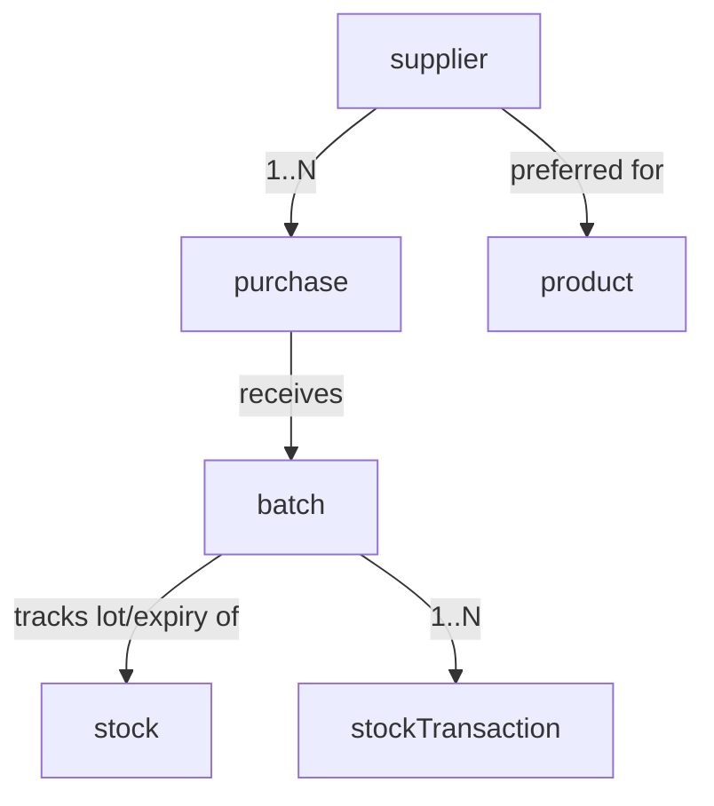

# 17 — Suppliers & Batches

The suppliers domain manages **vendors** you buy from, their contacts and payment terms, and the **batch/lot tracking** applied to stock received against those suppliers. Suppliers are referenced by the [purchase](18-purchase.md:1) workflow; batches attach expiry/lot metadata to [inventory](16-inventory.md:1) stock so you can trace and expire goods.

- **Entities:** `supplier`, `batch`
- **Base path:** `/api/v1/suppliers` and `/api/v1/batches`
- **Frontend module:** Purchasing → Suppliers ; Inventory → Batches

See [Conventions](00-conventions.md:1) for the envelope, auth, tenancy scoping, pagination, error format, soft-delete, and money (minor units).

---

## Domain overview



Notes:
- **supplier** holds vendor identity, contacts, addresses, tax registration, and default payment terms.
- **batch** captures a received lot of a product: lot number, manufacture/expiry dates, received quantity, and cost. Batches let stock movements reference a specific lot for FEFO (first-expiry-first-out) consumption and recalls.

**Supplier status:** `ACTIVE`, `INACTIVE`, `BLOCKED`.
**Batch status:** `ACTIVE`, `EXPIRED`, `QUARANTINED`, `CONSUMED`.

---

## Endpoint Summary

### Suppliers

| # | Action | Method | Path | Auth | Permission |
|---|--------|--------|------|------|------------|
| 1 | List suppliers | GET | `/api/v1/suppliers` | Bearer | `purchase.supplier.read` |
| 2 | Get supplier | GET | `/api/v1/suppliers/:id` | Bearer | `purchase.supplier.read` |
| 3 | Create supplier | POST | `/api/v1/suppliers` | Bearer | `purchase.supplier.create` |
| 4 | Update supplier | PATCH | `/api/v1/suppliers/:id` | Bearer | `purchase.supplier.update` |
| 5 | Delete supplier | DELETE | `/api/v1/suppliers/:id` | Bearer | `purchase.supplier.delete` |
| 6 | Set supplier status | PATCH | `/api/v1/suppliers/:id/status` | Bearer | `purchase.supplier.update` |
| 7 | Supplier ledger | GET | `/api/v1/suppliers/:id/ledger` | Bearer | `purchase.supplier.read` |

### Batches

| # | Action | Method | Path | Auth | Permission |
|---|--------|--------|------|------|------------|
| 8 | List batches | GET | `/api/v1/batches` | Bearer | `inventory.batch.read` |
| 9 | Get batch | GET | `/api/v1/batches/:id` | Bearer | `inventory.batch.read` |
| 10 | Create batch | POST | `/api/v1/batches` | Bearer | `inventory.batch.create` |
| 11 | Update batch | PATCH | `/api/v1/batches/:id` | Bearer | `inventory.batch.update` |
| 12 | Set batch status | PATCH | `/api/v1/batches/:id/status` | Bearer | `inventory.batch.update` |
| 13 | Expiring batches report | GET | `/api/v1/batches/reports/expiring` | Bearer | `inventory.batch.read` |

---

## Suppliers

### 1. List suppliers

`GET /api/v1/suppliers`

#### Query parameters

| Param | Type | Default | Description |
|-------|------|---------|-------------|
| `page` | number | `1` | Page number |
| `limit` | number | `20` | Items per page (max 100) |
| `search` | string | — | Matches name, code, phone, email, GSTIN |
| `status` | string | — | `ACTIVE` \| `INACTIVE` \| `BLOCKED` |
| `sortBy` | string | `name` | `name` \| `createdAt` \| `outstanding` |
| `sortOrder` | string | `asc` | `asc` \| `desc` |
| `includeDeleted` | boolean | `false` | Include soft-deleted |

#### Response — `200 OK`

```json
{
  "success": true,
  "message": "Suppliers retrieved successfully",
  "data": [
    {
      "id": "sup-7",
      "code": "SUP-0007",
      "name": "Nilgiri Traders",
      "contactPerson": "R. Kumar",
      "phone": "+91-98400-11223",
      "email": "sales@nilgiritraders.example",
      "gstin": "33ABCDE1234F1Z5",
      "status": "ACTIVE",
      "paymentTermsDays": 30,
      "outstanding": 154000,
      "currency": "INR",
      "createdAt": "2025-11-01T09:00:00.000Z"
    }
  ],
  "meta": { "page": 1, "limit": 20, "total": 1, "totalPages": 1, "hasNext": false, "hasPrev": false }
}
```

### 2. Get supplier

`GET /api/v1/suppliers/:id`

Returns the full supplier with addresses, bank details, and preferred products.

```json
{
  "success": true,
  "message": "Supplier retrieved successfully",
  "data": {
    "id": "sup-7",
    "code": "SUP-0007",
    "name": "Nilgiri Traders",
    "contactPerson": "R. Kumar",
    "phone": "+91-98400-11223",
    "email": "sales@nilgiritraders.example",
    "gstin": "33ABCDE1234F1Z5",
    "status": "ACTIVE",
    "paymentTermsDays": 30,
    "creditLimit": 500000,
    "currency": "INR",
    "billingAddress": { "line1": "12 Market Rd", "city": "Coimbatore", "state": "TN", "postalCode": "641001", "country": "IN" },
    "bank": { "accountName": "Nilgiri Traders", "accountNumber": "XXXXXX4321", "ifsc": "HDFC0000123" },
    "preferredProducts": [ { "productId": "prod-210", "productName": "Tea Powder" } ],
    "outstanding": 154000,
    "createdAt": "2025-11-01T09:00:00.000Z",
    "updatedAt": "2026-07-30T09:00:00.000Z"
  },
  "meta": {}
}
```

Errors: `404 SUPPLIER_NOT_FOUND`.

### 3. Create supplier

`POST /api/v1/suppliers`

#### Request

```json
{
  "name": "Nilgiri Traders",
  "contactPerson": "R. Kumar",
  "phone": "+91-98400-11223",
  "email": "sales@nilgiritraders.example",
  "gstin": "33ABCDE1234F1Z5",
  "paymentTermsDays": 30,
  "creditLimit": 500000,
  "billingAddress": { "line1": "12 Market Rd", "city": "Coimbatore", "state": "TN", "postalCode": "641001", "country": "IN" },
  "bank": { "accountName": "Nilgiri Traders", "accountNumber": "1234567890", "ifsc": "HDFC0000123" }
}
```

| Field | Type | Required | Notes |
|-------|------|----------|-------|
| `name` | string | Yes | Vendor display name |
| `code` | string | No | Auto-generated if omitted; unique per tenant |
| `contactPerson` | string | No | Primary contact |
| `phone` | string | No | E.164 recommended |
| `email` | string | No | Valid email |
| `gstin` | string | No | Tax registration; unique per tenant if provided |
| `paymentTermsDays` | number | No | Default net terms (days) |
| `creditLimit` | number | No | Minor units |
| `billingAddress` | object | No | Address block |
| `bank` | object | No | Bank details for payouts |

#### Response — `201 Created`

```json
{ "success": true, "message": "Supplier created successfully", "data": { "id": "sup-7", "code": "SUP-0007", "name": "Nilgiri Traders" }, "meta": {} }
```

#### Errors

| Status | Code | When |
|--------|------|------|
| 409 | `SUPPLIER_CODE_EXISTS` | Duplicate code |
| 409 | `SUPPLIER_GSTIN_EXISTS` | Duplicate GSTIN |
| 422 | `VALIDATION_ERROR` | Missing/invalid fields |

### 4. Update supplier

`PATCH /api/v1/suppliers/:id`

Partial update of any mutable field. Returns `200` with the updated record.

Errors: `404 SUPPLIER_NOT_FOUND`, `409 SUPPLIER_CODE_EXISTS`, `409 SUPPLIER_GSTIN_EXISTS`, `422 VALIDATION_ERROR`.

### 5. Delete supplier

`DELETE /api/v1/suppliers/:id`

Soft-deletes. Blocked when open purchases or non-zero outstanding exist.

Errors: `404 SUPPLIER_NOT_FOUND`, `409 SUPPLIER_HAS_OPEN_PURCHASES`, `409 SUPPLIER_HAS_OUTSTANDING`.

### 6. Set supplier status

`PATCH /api/v1/suppliers/:id/status`

```json
{ "status": "BLOCKED", "reason": "Repeated quality issues" }
```

| Field | Type | Required | Notes |
|-------|------|----------|-------|
| `status` | string | Yes | `ACTIVE` \| `INACTIVE` \| `BLOCKED` |
| `reason` | string | No | Recorded in audit log |

`200` with `{ id, status }`. A `BLOCKED` supplier cannot be selected on new purchases. Errors: `404 SUPPLIER_NOT_FOUND`, `422 VALIDATION_ERROR`.

### 7. Supplier ledger

`GET /api/v1/suppliers/:id/ledger`

Chronological account statement of purchase invoices (debits) and payments (credits) with a running balance. Supports `page`, `limit`, `from`, `to`.

```json
{
  "success": true,
  "message": "Supplier ledger retrieved successfully",
  "data": {
    "supplierId": "sup-7",
    "openingBalance": 0,
    "closingBalance": 154000,
    "currency": "INR",
    "entries": [
      { "date": "2026-07-10T09:00:00.000Z", "type": "PURCHASE_INVOICE", "referenceId": "pinv-31", "debit": 200000, "credit": 0, "balance": 200000 },
      { "date": "2026-07-25T09:00:00.000Z", "type": "PAYMENT", "referenceId": "pay-88", "debit": 0, "credit": 46000, "balance": 154000 }
    ]
  },
  "meta": { "page": 1, "limit": 20, "total": 2, "totalPages": 1, "hasNext": false, "hasPrev": false }
}
```

Errors: `404 SUPPLIER_NOT_FOUND`.

---

## Batches

A batch represents a received lot of a specific product. Batches are usually created automatically during [goods receipt](18-purchase.md:1) but can be created/edited manually for opening stock or corrections.

### 8. List batches

`GET /api/v1/batches`

#### Query parameters

| Param | Type | Default | Description |
|-------|------|---------|-------------|
| `page` | number | `1` | Page number |
| `limit` | number | `20` | Items per page |
| `search` | string | — | Lot number |
| `productId` | string | — | Filter by product |
| `supplierId` | string | — | Filter by supplier |
| `status` | string | — | Batch status enum |
| `expiringBefore` | string | — | ISO date; expiry on/before |
| `sortBy` | string | `expiryDate` | `expiryDate` \| `receivedAt` \| `remainingQty` |
| `sortOrder` | string | `asc` | `asc` \| `desc` |

#### Response — `200 OK`

```json
{
  "success": true,
  "message": "Batches retrieved successfully",
  "data": [
    {
      "id": "batch-55",
      "lotNumber": "LOT-2026-0714",
      "productId": "prod-100",
      "productName": "Full Cream Milk 1L",
      "supplierId": "sup-7",
      "receivedQty": 24,
      "remainingQty": 18,
      "stockUnitCode": "L",
      "unitCost": 5800,
      "currency": "INR",
      "manufactureDate": "2026-07-13",
      "expiryDate": "2026-07-16",
      "status": "ACTIVE",
      "receivedAt": "2026-07-14T05:00:00.000Z"
    }
  ],
  "meta": { "page": 1, "limit": 20, "total": 1, "totalPages": 1, "hasNext": false, "hasPrev": false }
}
```

### 9. Get batch

`GET /api/v1/batches/:id`

Returns the batch with its consumption movements.

```json
{
  "success": true,
  "message": "Batch retrieved successfully",
  "data": {
    "id": "batch-55",
    "lotNumber": "LOT-2026-0714",
    "productId": "prod-100",
    "supplierId": "sup-7",
    "purchaseId": "pur-42",
    "receivedQty": 24,
    "remainingQty": 18,
    "unitCost": 5800,
    "currency": "INR",
    "manufactureDate": "2026-07-13",
    "expiryDate": "2026-07-16",
    "status": "ACTIVE",
    "movements": [
      { "transactionId": "stx-9", "type": "PURCHASE_IN", "quantity": 24, "at": "2026-07-14T05:00:00.000Z" },
      { "transactionId": "stx-8", "type": "SALE_OUT", "quantity": -6, "at": "2026-07-15T13:20:00.000Z" }
    ]
  },
  "meta": {}
}
```

Errors: `404 BATCH_NOT_FOUND`.

### 10. Create batch

`POST /api/v1/batches`

Manual batch creation (opening stock / correction). For purchase receipts, batches are created by the [receive workflow](18-purchase.md:1).

#### Request

```json
{
  "lotNumber": "LOT-2026-0714",
  "productId": "prod-100",
  "supplierId": "sup-7",
  "receivedQty": 24,
  "unitId": "unit-l",
  "unitCost": 5800,
  "manufactureDate": "2026-07-13",
  "expiryDate": "2026-07-16"
}
```

| Field | Type | Required | Notes |
|-------|------|----------|-------|
| `lotNumber` | string | Yes | Unique per product per tenant |
| `productId` | string | Yes | Tracked product |
| `supplierId` | string | No | Origin supplier |
| `receivedQty` | number | Yes | Quantity in `unitId` (`> 0`) |
| `unitId` | string | No | Defaults to stock unit |
| `unitCost` | number | No | Minor units; updates cost/price history |
| `manufactureDate` | string | No | ISO date |
| `expiryDate` | string | No | ISO date; must be after manufacture |

#### Response — `201 Created`

```json
{ "success": true, "message": "Batch created successfully", "data": { "id": "batch-55", "lotNumber": "LOT-2026-0714", "remainingQty": 24 }, "meta": {} }
```

Creating a batch writes a `PURCHASE_IN` (or `ADJUSTMENT` for opening) [stock transaction](16-inventory.md:1).

#### Errors

| Status | Code | When |
|--------|------|------|
| 404 | `PRODUCT_NOT_FOUND` | Product missing |
| 404 | `SUPPLIER_NOT_FOUND` | Supplier missing |
| 409 | `BATCH_LOT_EXISTS` | Duplicate lot for product |
| 422 | `VALIDATION_ERROR` | Invalid dates/quantity |

### 11. Update batch

`PATCH /api/v1/batches/:id`

Edits metadata (lot number, dates). Quantity is not editable here — use [stock adjust](16-inventory.md:1). Returns `200`.

Errors: `404 BATCH_NOT_FOUND`, `409 BATCH_LOT_EXISTS`, `409 BATCH_CONSUMED` (fully consumed batches are read-only), `422 VALIDATION_ERROR`.

### 12. Set batch status

`PATCH /api/v1/batches/:id/status`

```json
{ "status": "QUARANTINED", "reason": "Awaiting QC" }
```

| Field | Type | Required | Notes |
|-------|------|----------|-------|
| `status` | string | Yes | `ACTIVE` \| `EXPIRED` \| `QUARANTINED` \| `CONSUMED` |
| `reason` | string | No | Recorded in audit log |

`QUARANTINED` batches are excluded from FEFO consumption. `200` with `{ id, status }`. Errors: `404 BATCH_NOT_FOUND`, `422 VALIDATION_ERROR`.

### 13. Expiring batches report

`GET /api/v1/batches/reports/expiring`

Active batches expiring within a window (drives wastage prevention and notifications). Supports `withinDays` (default `7`), `productId`, `categoryId`, `page`, `limit`.

```json
{
  "success": true,
  "message": "Expiring batches report generated successfully",
  "data": [
    {
      "id": "batch-55",
      "lotNumber": "LOT-2026-0714",
      "productId": "prod-100",
      "productName": "Full Cream Milk 1L",
      "remainingQty": 18,
      "stockUnitCode": "L",
      "expiryDate": "2026-07-16",
      "daysToExpiry": 1,
      "atRiskValue": 104400,
      "currency": "INR"
    }
  ],
  "meta": { "page": 1, "limit": 20, "total": 1, "totalPages": 1, "hasNext": false, "hasPrev": false, "generatedAt": "2026-08-05T06:45:00.000Z" }
}
```

Feeds [notifications](20-notifications.md:1) for near-expiry alerts. Errors: `422 VALIDATION_ERROR` (bad `withinDays`).

---

## Related

- [Inventory & Products](16-inventory.md:1) — batches track lots of products and drive stock transactions.
- [Purchase](18-purchase.md:1) — supplier selection and goods receipt auto-create batches and `PURCHASE_IN` movements.
- [Billing](19-billing.md:1) — supplier payments settle purchase invoices in the unified payment model.
- [Notifications](20-notifications.md:1) — near-expiry and low-stock alerts.
- [Conventions](00-conventions.md:1) — envelope, auth, tenancy, pagination, money in minor units.