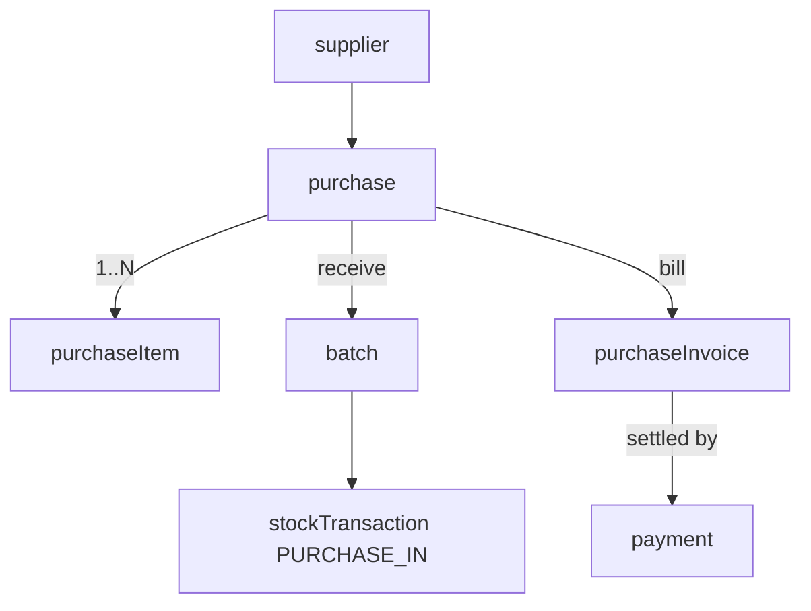
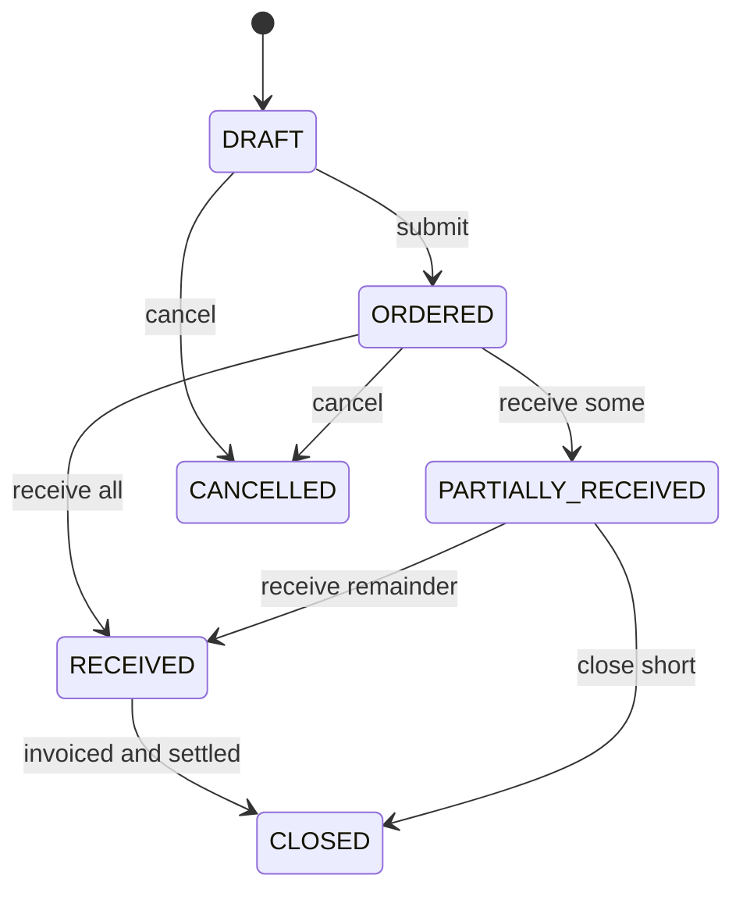

# 18 — Purchase

The purchase domain manages the **procurement lifecycle**: raising purchase orders to [suppliers](17-suppliers-batch.md:1), **receiving goods** (which creates [batches](17-suppliers-batch.md:1) and `PURCHASE_IN` [stock transactions](16-inventory.md:1)), and recording **purchase invoices** that feed the unified [billing](19-billing.md:1) payment model.

- **Entities:** `purchase`, `purchaseItem`, `purchaseInvoice`
- **Base path:** `/api/v1/purchases` and `/api/v1/purchase-invoices`
- **Frontend module:** Purchasing → Orders / Receiving / Bills

See [Conventions](00-conventions.md:1) for the envelope, auth, tenancy scoping, pagination, error format, soft-delete, money (minor units), and the `Idempotency-Key` header required on stock/money mutations.

---

## Domain overview



### Purchase status lifecycle



**Purchase status:** `DRAFT`, `ORDERED`, `PARTIALLY_RECEIVED`, `RECEIVED`, `CLOSED`, `CANCELLED`.
**Purchase invoice status:** `UNPAID`, `PARTIALLY_PAID`, `PAID`, `CANCELLED`.

---

## Endpoint Summary

### Purchases (orders + receiving)

| # | Action | Method | Path | Auth | Permission |
|---|--------|--------|------|------|------------|
| 1 | List purchases | GET | `/api/v1/purchases` | Bearer | `purchase.order.read` |
| 2 | Get purchase | GET | `/api/v1/purchases/:id` | Bearer | `purchase.order.read` |
| 3 | Create purchase | POST | `/api/v1/purchases` | Bearer | `purchase.order.create` |
| 4 | Update purchase (draft) | PATCH | `/api/v1/purchases/:id` | Bearer | `purchase.order.update` |
| 5 | Submit / place order | POST | `/api/v1/purchases/:id/submit` | Bearer | `purchase.order.update` |
| 6 | Cancel purchase | POST | `/api/v1/purchases/:id/cancel` | Bearer | `purchase.order.cancel` |
| 7 | Receive goods | POST | `/api/v1/purchases/:id/receive` | Bearer | `purchase.order.receive` |
| 8 | List purchase items | GET | `/api/v1/purchases/:id/items` | Bearer | `purchase.order.read` |
| 9 | Close purchase | POST | `/api/v1/purchases/:id/close` | Bearer | `purchase.order.update` |

### Purchase invoices

| # | Action | Method | Path | Auth | Permission |
|---|--------|--------|------|------|------------|
| 10 | List purchase invoices | GET | `/api/v1/purchase-invoices` | Bearer | `purchase.invoice.read` |
| 11 | Get purchase invoice | GET | `/api/v1/purchase-invoices/:id` | Bearer | `purchase.invoice.read` |
| 12 | Create purchase invoice | POST | `/api/v1/purchase-invoices` | Bearer | `purchase.invoice.create` |
| 13 | Record payment | POST | `/api/v1/purchase-invoices/:id/payments` | Bearer | `purchase.invoice.pay` |
| 14 | Cancel purchase invoice | POST | `/api/v1/purchase-invoices/:id/cancel` | Bearer | `purchase.invoice.cancel` |
| 15 | Purchase summary report | GET | `/api/v1/purchases/reports/summary` | Bearer | `purchase.order.read` |

---

## Purchases

### 1. List purchases

`GET /api/v1/purchases`

#### Query parameters

| Param | Type | Default | Description |
|-------|------|---------|-------------|
| `page` | number | `1` | Page number |
| `limit` | number | `20` | Items per page (max 100) |
| `search` | string | — | Matches PO number, supplier name |
| `supplierId` | string | — | Filter by supplier |
| `status` | string | — | Purchase status enum |
| `from` | string | — | ISO date; order date on/after |
| `to` | string | — | ISO date; order date on/before |
| `sortBy` | string | `orderedAt` | `orderedAt` \| `createdAt` \| `grandTotal` |
| `sortOrder` | string | `desc` | `asc` \| `desc` |
| `includeDeleted` | boolean | `false` | Include soft-deleted |

#### Response — `200 OK`

```json
{
  "success": true,
  "message": "Purchases retrieved successfully",
  "data": [
    {
      "id": "pur-42",
      "poNumber": "PO-2026-0042",
      "supplierId": "sup-7",
      "supplierName": "Nilgiri Traders",
      "status": "ORDERED",
      "itemCount": 3,
      "grandTotal": 236000,
      "currency": "INR",
      "orderedAt": "2026-07-10T09:00:00.000Z",
      "expectedAt": "2026-07-14T09:00:00.000Z",
      "createdAt": "2026-07-09T15:00:00.000Z"
    }
  ],
  "meta": { "page": 1, "limit": 20, "total": 1, "totalPages": 1, "hasNext": false, "hasPrev": false }
}
```

### 2. Get purchase

`GET /api/v1/purchases/:id`

Returns the purchase with its items and receipt progress.

```json
{
  "success": true,
  "message": "Purchase retrieved successfully",
  "data": {
    "id": "pur-42",
    "poNumber": "PO-2026-0042",
    "supplierId": "sup-7",
    "supplierName": "Nilgiri Traders",
    "status": "PARTIALLY_RECEIVED",
    "currency": "INR",
    "notes": "Deliver before noon",
    "subTotal": 200000,
    "taxTotal": 36000,
    "grandTotal": 236000,
    "orderedAt": "2026-07-10T09:00:00.000Z",
    "expectedAt": "2026-07-14T09:00:00.000Z",
    "items": [
      {
        "id": "pitem-1",
        "productId": "prod-100",
        "productName": "Full Cream Milk 1L",
        "unitId": "unit-l",
        "orderedQty": 24,
        "receivedQty": 24,
        "unitCost": 5800,
        "taxRate": 5,
        "lineTotal": 145000
      },
      {
        "id": "pitem-2",
        "productId": "prod-210",
        "productName": "Tea Powder",
        "unitId": "unit-kg",
        "orderedQty": 10,
        "receivedQty": 0,
        "unitCost": 55000,
        "taxRate": 18,
        "lineTotal": 91000
      }
    ],
    "updatedAt": "2026-07-14T05:10:00.000Z"
  },
  "meta": {}
}
```

Errors: `404 PURCHASE_NOT_FOUND`.

### 3. Create purchase

`POST /api/v1/purchases`

Creates a `DRAFT` purchase order.

#### Request

```json
{
  "supplierId": "sup-7",
  "expectedAt": "2026-07-14T09:00:00.000Z",
  "notes": "Deliver before noon",
  "items": [
    { "productId": "prod-100", "unitId": "unit-l", "orderedQty": 24, "unitCost": 5800, "taxRate": 5 },
    { "productId": "prod-210", "unitId": "unit-kg", "orderedQty": 10, "unitCost": 55000, "taxRate": 18 }
  ]
}
```

| Field | Type | Required | Notes |
|-------|------|----------|-------|
| `supplierId` | string | Yes | Must be `ACTIVE` supplier |
| `expectedAt` | string | No | Expected delivery ISO datetime |
| `notes` | string | No | Free text |
| `items` | array | Yes | At least one line |
| `items[].productId` | string | Yes | Purchasable product |
| `items[].unitId` | string | No | Purchase unit; defaults to product default |
| `items[].orderedQty` | number | Yes | `> 0` |
| `items[].unitCost` | number | Yes | Minor units |
| `items[].taxRate` | number | No | Percent; defaults to product tax |

Totals are computed server-side. `poNumber` auto-generated.

#### Response — `201 Created`

```json
{ "success": true, "message": "Purchase created successfully", "data": { "id": "pur-42", "poNumber": "PO-2026-0042", "status": "DRAFT", "grandTotal": 236000 }, "meta": {} }
```

#### Errors

| Status | Code | When |
|--------|------|------|
| 404 | `SUPPLIER_NOT_FOUND` | Supplier missing |
| 409 | `SUPPLIER_BLOCKED` | Supplier is `BLOCKED` |
| 404 | `PRODUCT_NOT_FOUND` | A line product missing |
| 422 | `VALIDATION_ERROR` | No items / invalid qty/cost |

### 4. Update purchase (draft)

`PATCH /api/v1/purchases/:id`

Editable only while `DRAFT`. Replaces header fields and/or the item set. Returns `200` with recomputed totals.

Errors: `404 PURCHASE_NOT_FOUND`, `409 PURCHASE_NOT_DRAFT`, `422 VALIDATION_ERROR`.

### 5. Submit / place order

`POST /api/v1/purchases/:id/submit`

Transitions `DRAFT → ORDERED`, locking items. Optional body records who approved.

```json
{ "orderedAt": "2026-07-10T09:00:00.000Z" }
```

`200` with `{ id, status: "ORDERED", orderedAt }`. Errors: `404 PURCHASE_NOT_FOUND`, `409 PURCHASE_NOT_DRAFT`, `409 PURCHASE_EMPTY`.

### 6. Cancel purchase

`POST /api/v1/purchases/:id/cancel`

```json
{ "reason": "Supplier out of stock" }
```

Allowed from `DRAFT` or `ORDERED` (nothing received). `200` with `{ id, status: "CANCELLED" }`. Errors: `404 PURCHASE_NOT_FOUND`, `409 PURCHASE_ALREADY_RECEIVED`, `409 PURCHASE_ALREADY_CANCELLED`.

### 7. Receive goods

`POST /api/v1/purchases/:id/receive`

**Requires `Idempotency-Key` header.** Records received quantities, creates a [batch](17-suppliers-batch.md:1) per line, and writes `PURCHASE_IN` [stock transactions](16-inventory.md:1). Supports partial receipt; status becomes `PARTIALLY_RECEIVED` or `RECEIVED`.

#### Request

```json
{
  "receivedAt": "2026-07-14T05:00:00.000Z",
  "lines": [
    {
      "purchaseItemId": "pitem-1",
      "receivedQty": 24,
      "lotNumber": "LOT-2026-0714",
      "manufactureDate": "2026-07-13",
      "expiryDate": "2026-07-16",
      "unitCost": 5800
    }
  ]
}
```

| Field | Type | Required | Notes |
|-------|------|----------|-------|
| `receivedAt` | string | No | Defaults to now |
| `lines` | array | Yes | Lines being received |
| `lines[].purchaseItemId` | string | Yes | Item on this PO |
| `lines[].receivedQty` | number | Yes | `> 0`, `≤` outstanding qty |
| `lines[].lotNumber` | string | No | Auto-generated if omitted |
| `lines[].manufactureDate` | string | No | ISO date |
| `lines[].expiryDate` | string | No | ISO date |
| `lines[].unitCost` | number | No | Overrides ordered cost; updates price history |

#### Response — `200 OK`

```json
{
  "success": true,
  "message": "Goods received successfully",
  "data": {
    "id": "pur-42",
    "status": "PARTIALLY_RECEIVED",
    "receipts": [
      { "purchaseItemId": "pitem-1", "receivedQty": 24, "batchId": "batch-55", "stockTransactionId": "stx-9" }
    ]
  },
  "meta": {}
}
```

#### Errors

| Status | Code | When |
|--------|------|------|
| 400 | `IDEMPOTENCY_KEY_REQUIRED` | Header missing |
| 404 | `PURCHASE_NOT_FOUND` | PO missing |
| 409 | `PURCHASE_NOT_RECEIVABLE` | Status not `ORDERED`/`PARTIALLY_RECEIVED` |
| 409 | `RECEIVE_QTY_EXCEEDS_ORDER` | `receivedQty` beyond outstanding |
| 422 | `VALIDATION_ERROR` | Invalid lines/dates |

### 8. List purchase items

`GET /api/v1/purchases/:id/items`

Returns line items with ordered vs received quantities. Errors: `404 PURCHASE_NOT_FOUND`.

### 9. Close purchase

`POST /api/v1/purchases/:id/close`

Closes a `RECEIVED` or short `PARTIALLY_RECEIVED` PO, marking outstanding quantities as not expected. `200` with `{ id, status: "CLOSED" }`. Errors: `404 PURCHASE_NOT_FOUND`, `409 PURCHASE_NOT_CLOSEABLE`.

---

## Purchase invoices

A purchase invoice records the supplier's bill against a PO. Payments are recorded here and reflected in the [supplier ledger](17-suppliers-batch.md:1) and unified [billing](19-billing.md:1) payment model.

### 10. List purchase invoices

`GET /api/v1/purchase-invoices`

#### Query parameters

| Param | Type | Default | Description |
|-------|------|---------|-------------|
| `page` | number | `1` | Page number |
| `limit` | number | `20` | Items per page |
| `search` | string | — | Invoice number, supplier |
| `supplierId` | string | — | Filter by supplier |
| `purchaseId` | string | — | Filter by PO |
| `status` | string | — | Invoice status enum |
| `from` | string | — | Invoice date on/after |
| `to` | string | — | Invoice date on/before |
| `sortBy` | string | `invoiceDate` | `invoiceDate` \| `dueDate` \| `grandTotal` |
| `sortOrder` | string | `desc` | `asc` \| `desc` |

#### Response — `200 OK`

```json
{
  "success": true,
  "message": "Purchase invoices retrieved successfully",
  "data": [
    {
      "id": "pinv-31",
      "invoiceNumber": "PINV-2026-0031",
      "supplierInvoiceNumber": "NT/2026/998",
      "supplierId": "sup-7",
      "purchaseId": "pur-42",
      "status": "PARTIALLY_PAID",
      "grandTotal": 200000,
      "paidTotal": 46000,
      "balance": 154000,
      "currency": "INR",
      "invoiceDate": "2026-07-14",
      "dueDate": "2026-08-13"
    }
  ],
  "meta": { "page": 1, "limit": 20, "total": 1, "totalPages": 1, "hasNext": false, "hasPrev": false }
}
```

### 11. Get purchase invoice

`GET /api/v1/purchase-invoices/:id`

Returns the invoice with lines and recorded payments.

```json
{
  "success": true,
  "message": "Purchase invoice retrieved successfully",
  "data": {
    "id": "pinv-31",
    "invoiceNumber": "PINV-2026-0031",
    "supplierInvoiceNumber": "NT/2026/998",
    "supplierId": "sup-7",
    "purchaseId": "pur-42",
    "status": "PARTIALLY_PAID",
    "subTotal": 169500,
    "taxTotal": 30500,
    "grandTotal": 200000,
    "paidTotal": 46000,
    "balance": 154000,
    "currency": "INR",
    "invoiceDate": "2026-07-14",
    "dueDate": "2026-08-13",
    "lines": [
      { "productId": "prod-100", "productName": "Full Cream Milk 1L", "quantity": 24, "unitCost": 5800, "taxRate": 5, "lineTotal": 145000 }
    ],
    "payments": [
      { "id": "pay-88", "amount": 46000, "method": "BANK_TRANSFER", "paidAt": "2026-07-25T09:00:00.000Z", "reference": "UTR123456" }
    ]
  },
  "meta": {}
}
```

Errors: `404 PURCHASE_INVOICE_NOT_FOUND`.

### 12. Create purchase invoice

`POST /api/v1/purchase-invoices`

Bills a PO (fully or a received subset). Lines default from received quantities.

#### Request

```json
{
  "purchaseId": "pur-42",
  "supplierInvoiceNumber": "NT/2026/998",
  "invoiceDate": "2026-07-14",
  "dueDate": "2026-08-13",
  "lines": [
    { "purchaseItemId": "pitem-1", "quantity": 24, "unitCost": 5800, "taxRate": 5 }
  ]
}
```

| Field | Type | Required | Notes |
|-------|------|----------|-------|
| `purchaseId` | string | Yes | Source PO |
| `supplierInvoiceNumber` | string | No | Vendor's own number |
| `invoiceDate` | string | Yes | ISO date |
| `dueDate` | string | No | Defaults from supplier terms |
| `lines` | array | No | Defaults to received lines if omitted |

#### Response — `201 Created`

```json
{ "success": true, "message": "Purchase invoice created successfully", "data": { "id": "pinv-31", "invoiceNumber": "PINV-2026-0031", "status": "UNPAID", "grandTotal": 200000, "balance": 200000 }, "meta": {} }
```

#### Errors

| Status | Code | When |
|--------|------|------|
| 404 | `PURCHASE_NOT_FOUND` | PO missing |
| 409 | `PURCHASE_NOT_RECEIVED` | Nothing received to bill |
| 409 | `INVOICE_QTY_EXCEEDS_RECEIVED` | Billed qty beyond received |
| 422 | `VALIDATION_ERROR` | Invalid dates/lines |

### 13. Record payment

`POST /api/v1/purchase-invoices/:id/payments`

**Requires `Idempotency-Key` header.** Records a supplier payment, creating a `payment` row (polymorphic `PaymentFor = PURCHASE_INVOICE`) in the unified [billing](19-billing.md:1) model and updating the invoice balance/status.

#### Request

```json
{ "amount": 46000, "method": "BANK_TRANSFER", "paidAt": "2026-07-25T09:00:00.000Z", "reference": "UTR123456", "notes": "Part payment" }
```

| Field | Type | Required | Notes |
|-------|------|----------|-------|
| `amount` | number | Yes | Minor units, `> 0`, `≤` balance |
| `method` | string | Yes | `CASH` \| `CARD` \| `UPI` \| `BANK_TRANSFER` \| `CHEQUE` \| `ONLINE` |
| `paidAt` | string | No | Defaults to now |
| `reference` | string | No | UTR/cheque/txn id |
| `notes` | string | No | Free text |

#### Response — `201 Created`

```json
{ "success": true, "message": "Payment recorded successfully", "data": { "paymentId": "pay-88", "invoiceId": "pinv-31", "amount": 46000, "status": "PARTIALLY_PAID", "balance": 154000 }, "meta": {} }
```

#### Errors

| Status | Code | When |
|--------|------|------|
| 400 | `IDEMPOTENCY_KEY_REQUIRED` | Header missing |
| 404 | `PURCHASE_INVOICE_NOT_FOUND` | Invoice missing |
| 409 | `INVOICE_ALREADY_PAID` | Balance is zero |
| 409 | `PAYMENT_EXCEEDS_BALANCE` | Amount too large |
| 422 | `VALIDATION_ERROR` | Invalid method/amount |

### 14. Cancel purchase invoice

`POST /api/v1/purchase-invoices/:id/cancel`

```json
{ "reason": "Duplicate entry" }
```

Allowed only when no payments are recorded (`UNPAID`). `200` with `{ id, status: "CANCELLED" }`. Errors: `404 PURCHASE_INVOICE_NOT_FOUND`, `409 INVOICE_HAS_PAYMENTS`.

### 15. Purchase summary report

`GET /api/v1/purchases/reports/summary`

Aggregated procurement spend by period/supplier/product. Supports `from`, `to`, `groupBy` (`supplier` \| `product` \| `month`).

```json
{
  "success": true,
  "message": "Purchase summary generated successfully",
  "data": {
    "groupBy": "supplier",
    "currency": "INR",
    "totalSpend": 236000,
    "rows": [
      { "key": "sup-7", "label": "Nilgiri Traders", "orders": 1, "receivedValue": 145000, "billedValue": 200000, "paidValue": 46000 }
    ]
  },
  "meta": {}
}
```

#### Query parameters

| Param | Type | Default | Description |
|-------|------|---------|-------------|
| `from` | string | — | ISO date; period start |
| `to` | string | — | ISO date; period end |
| `groupBy` | string | `supplier` | `supplier` \| `product` \| `month` |
| `supplierId` | string | — | Restrict to one supplier |

Errors: `422 VALIDATION_ERROR` for invalid dates or `groupBy`.

---

## Related

- [Suppliers & Batches](17-suppliers-batch.md:1) — supplier selection; receipts auto-create batches.
- [Inventory & Products](16-inventory.md:1) — goods receipt writes PURCHASE_IN stock transactions.
- [Billing](19-billing.md:1) — supplier payments in the unified payment model.
- [Notifications](20-notifications.md:1) — low-stock and delivery reminders.
- [Conventions](00-conventions.md:1)