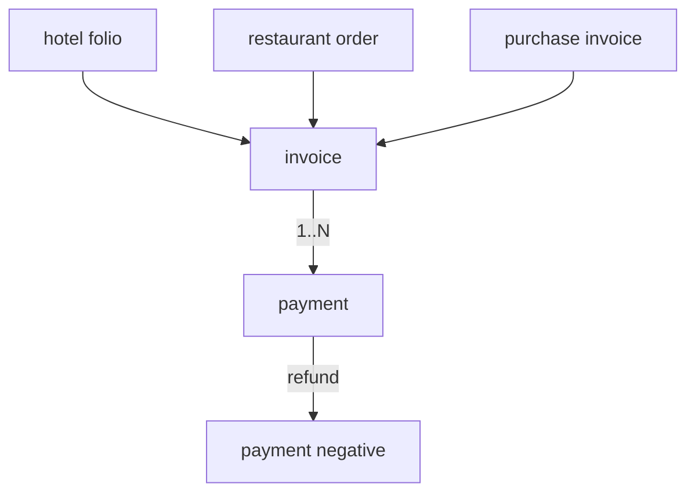
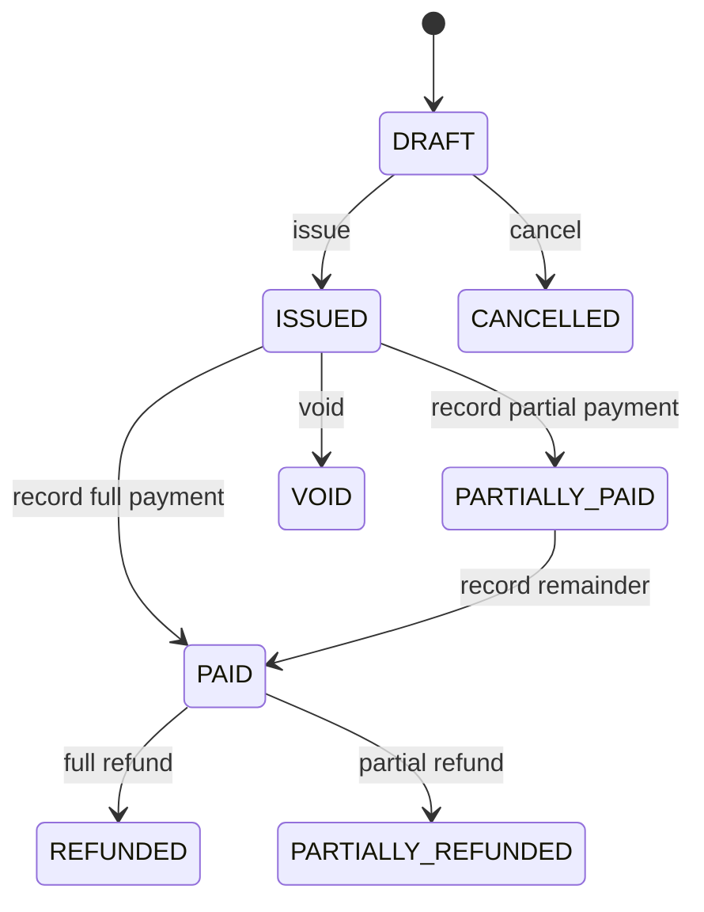

# 19 — Billing (Invoices & Payments)

The billing domain is the **unified financial ledger** for the platform. A single `invoice` table and a single `payment` table serve every revenue and payable source — [hotel folios](11-bookings-folio.md:1), [restaurant orders](14-orders-kitchen.md:1), and [purchase invoices](18-purchase.md:1) — through a **polymorphic reference** (`PaymentFor`). This gives one consistent model for generating bills, recording payments, issuing refunds, and reporting.

- **Entities:** `invoice`, `payment`
- **Base path:** `/api/v1/invoices` and `/api/v1/payments`
- **Frontend module:** Billing → Invoices / Payments / Refunds / Reports

See [Conventions](00-conventions.md:1) for the envelope, auth, tenancy scoping, pagination, error format, soft-delete, money (minor units), and the `Idempotency-Key` header required on money mutations.

---

## Domain overview



The `PaymentFor` enum links each invoice/payment to its source:

| PaymentFor | Source | Direction |
|------------|--------|-----------|
| `HOTEL_FOLIO` | Guest folio settlement | Receivable inbound |
| `RESTAURANT_ORDER` | POS order settlement | Receivable inbound |
| `PURCHASE_INVOICE` | Supplier bill | Payable outbound |
| `SUBSCRIPTION` | SaaS plan billing | Receivable inbound |

### Invoice status lifecycle



**Invoice status:** `DRAFT`, `ISSUED`, `PARTIALLY_PAID`, `PAID`, `PARTIALLY_REFUNDED`, `REFUNDED`, `CANCELLED`, `VOID`.
**Payment status:** `PENDING`, `COMPLETED`, `FAILED`, `REFUNDED`.
**Payment method:** `CASH`, `CARD`, `UPI`, `BANK_TRANSFER`, `CHEQUE`, `ONLINE`.

---

## Endpoint Summary

### Invoices

| # | Action | Method | Path | Auth | Permission |
|---|--------|--------|------|------|------------|
| 1 | List invoices | GET | `/api/v1/invoices` | Bearer | `billing.invoice.read` |
| 2 | Get invoice | GET | `/api/v1/invoices/:id` | Bearer | `billing.invoice.read` |
| 3 | Generate invoice | POST | `/api/v1/invoices` | Bearer | `billing.invoice.create` |
| 4 | Issue invoice | POST | `/api/v1/invoices/:id/issue` | Bearer | `billing.invoice.update` |
| 5 | Cancel / void invoice | POST | `/api/v1/invoices/:id/cancel` | Bearer | `billing.invoice.cancel` |
| 6 | Get invoice PDF | GET | `/api/v1/invoices/:id/pdf` | Bearer | `billing.invoice.read` |

### Payments

| # | Action | Method | Path | Auth | Permission |
|---|--------|--------|------|------|------------|
| 7 | List payments | GET | `/api/v1/payments` | Bearer | `billing.payment.read` |
| 8 | Get payment | GET | `/api/v1/payments/:id` | Bearer | `billing.payment.read` |
| 9 | Record payment | POST | `/api/v1/invoices/:id/payments` | Bearer | `billing.payment.create` |
| 10 | Refund payment | POST | `/api/v1/payments/:id/refund` | Bearer | `billing.payment.refund` |

### Reports

| # | Action | Method | Path | Auth | Permission |
|---|--------|--------|------|------|------------|
| 11 | Revenue report | GET | `/api/v1/invoices/reports/revenue` | Bearer | `billing.report.read` |
| 12 | Outstanding report | GET | `/api/v1/invoices/reports/outstanding` | Bearer | `billing.report.read` |
| 13 | Payment methods report | GET | `/api/v1/payments/reports/methods` | Bearer | `billing.report.read` |

---

## Invoices

### 1. List invoices

`GET /api/v1/invoices`

#### Query parameters

| Param | Type | Default | Description |
|-------|------|---------|-------------|
| `page` | number | `1` | Page number |
| `limit` | number | `20` | Items per page (max 100) |
| `search` | string | — | Matches invoice number, party name |
| `paymentFor` | string | — | `HOTEL_FOLIO` \| `RESTAURANT_ORDER` \| `PURCHASE_INVOICE` \| `SUBSCRIPTION` |
| `status` | string | — | Invoice status enum |
| `partyId` | string | — | Guest / customer / supplier id |
| `from` | string | — | ISO date; invoice date on/after |
| `to` | string | — | ISO date; invoice date on/before |
| `minAmount` | number | — | Grand total floor (minor units) |
| `maxAmount` | number | — | Grand total ceiling (minor units) |
| `sortBy` | string | `invoiceDate` | `invoiceDate` \| `grandTotal` \| `balance` \| `createdAt` |
| `sortOrder` | string | `desc` | `asc` \| `desc` |
| `includeDeleted` | boolean | `false` | Include soft-deleted |

#### Response — `200 OK`

```json
{
  "success": true,
  "message": "Invoices retrieved successfully",
  "data": [
    {
      "id": "inv-900",
      "invoiceNumber": "INV-2026-0900",
      "paymentFor": "HOTEL_FOLIO",
      "sourceId": "folio-12",
      "partyId": "guest-5",
      "partyName": "Aarav Mehta",
      "status": "PAID",
      "subTotal": 118644,
      "taxTotal": 21356,
      "discountTotal": 0,
      "grandTotal": 140000,
      "paidTotal": 140000,
      "balance": 0,
      "currency": "INR",
      "invoiceDate": "2026-07-15",
      "dueDate": "2026-07-15",
      "createdAt": "2026-07-15T11:00:00.000Z"
    }
  ],
  "meta": { "page": 1, "limit": 20, "total": 1, "totalPages": 1, "hasNext": false, "hasPrev": false }
}
```

### 2. Get invoice

`GET /api/v1/invoices/:id`

Returns the full invoice with line items and recorded payments.

```json
{
  "success": true,
  "message": "Invoice retrieved successfully",
  "data": {
    "id": "inv-900",
    "invoiceNumber": "INV-2026-0900",
    "paymentFor": "HOTEL_FOLIO",
    "sourceId": "folio-12",
    "partyId": "guest-5",
    "partyName": "Aarav Mehta",
    "billingAddress": "12 MG Road, Bengaluru, KA 560001",
    "gstin": "29ABCDE1234F1Z5",
    "status": "PAID",
    "currency": "INR",
    "subTotal": 118644,
    "taxTotal": 21356,
    "discountTotal": 0,
    "grandTotal": 140000,
    "paidTotal": 140000,
    "balance": 0,
    "invoiceDate": "2026-07-15",
    "dueDate": "2026-07-15",
    "lines": [
      { "description": "Deluxe Room x 2 nights", "quantity": 2, "unitPrice": 50000, "taxRate": 12, "lineTotal": 100000 },
      { "description": "Restaurant charges", "quantity": 1, "unitPrice": 25000, "taxRate": 5, "lineTotal": 25000 }
    ],
    "payments": [
      { "id": "pay-500", "amount": 140000, "method": "CARD", "status": "COMPLETED", "paidAt": "2026-07-15T11:05:00.000Z", "reference": "AUTH-99881" }
    ],
    "createdAt": "2026-07-15T11:00:00.000Z",
    "updatedAt": "2026-07-15T11:05:00.000Z"
  },
  "meta": {}
}
```

Errors: `404 INVOICE_NOT_FOUND`.

### 3. Generate invoice

`POST /api/v1/invoices`

Generates a `DRAFT` invoice from a source document (folio, order, purchase invoice) or from explicit lines. When `sourceId` is supplied, lines default from the source and totals are computed server-side.

#### Request

```json
{
  "paymentFor": "HOTEL_FOLIO",
  "sourceId": "folio-12",
  "partyId": "guest-5",
  "billingAddress": "12 MG Road, Bengaluru, KA 560001",
  "gstin": "29ABCDE1234F1Z5",
  "dueDate": "2026-07-15",
  "lines": [
    { "description": "Deluxe Room x 2 nights", "quantity": 2, "unitPrice": 50000, "taxRate": 12 },
    { "description": "Restaurant charges", "quantity": 1, "unitPrice": 25000, "taxRate": 5 }
  ],
  "discountTotal": 0
}
```

| Field | Type | Required | Notes |
|-------|------|----------|-------|
| `paymentFor` | string | Yes | Source type enum |
| `sourceId` | string | Conditional | Required unless supplying explicit `lines` for an ad-hoc invoice |
| `partyId` | string | Yes | Guest / customer / supplier |
| `billingAddress` | string | No | Snapshot at generation |
| `gstin` | string | No | Tax id snapshot |
| `dueDate` | string | No | Defaults to invoice date |
| `lines` | array | Conditional | Defaults from source when `sourceId` given |
| `lines[].description` | string | Yes | Line label |
| `lines[].quantity` | number | Yes | `> 0` |
| `lines[].unitPrice` | number | Yes | Minor units |
| `lines[].taxRate` | number | No | Percent |
| `discountTotal` | number | No | Minor units; whole-invoice discount |

#### Response — `201 Created`

```json
{
  "success": true,
  "message": "Invoice generated successfully",
  "data": { "id": "inv-900", "invoiceNumber": "INV-2026-0900", "status": "DRAFT", "grandTotal": 140000, "balance": 140000 },
  "meta": {}
}
```

#### Errors

| Status | Code | When |
|--------|------|------|
| 404 | `SOURCE_NOT_FOUND` | Folio/order/purchase invoice missing |
| 409 | `SOURCE_ALREADY_INVOICED` | Source already has an active invoice |
| 404 | `PARTY_NOT_FOUND` | Party missing |
| 422 | `VALIDATION_ERROR` | No lines / invalid amounts |

### 4. Issue invoice

`POST /api/v1/invoices/:id/issue`

Transitions `DRAFT → ISSUED`, freezing lines and assigning the final issue date. Optional body overrides the invoice date.

```json
{ "invoiceDate": "2026-07-15" }
```

`200` with `{ id, status: "ISSUED", invoiceNumber, invoiceDate }`. Errors: `404 INVOICE_NOT_FOUND`, `409 INVOICE_NOT_DRAFT`, `409 INVOICE_EMPTY`.

### 5. Cancel / void invoice

`POST /api/v1/invoices/:id/cancel`

Cancels a `DRAFT` invoice or voids an `ISSUED` one that has **no completed payments**. Voiding retains the number for audit; cancelling a draft removes it from sequences.

```json
{ "reason": "Duplicate generated from folio" }
```

`200` with `{ id, status: "CANCELLED" }` (draft) or `{ id, status: "VOID" }` (issued). Errors: `404 INVOICE_NOT_FOUND`, `409 INVOICE_HAS_PAYMENTS`, `409 INVOICE_NOT_CANCELLABLE`.

### 6. Get invoice PDF

`GET /api/v1/invoices/:id/pdf`

Returns a rendered PDF. Response is `application/pdf` (binary) with `Content-Disposition: attachment; filename="INV-2026-0900.pdf"`. When `?format=url` is passed, returns a short-lived signed link instead:

```json
{ "success": true, "message": "Invoice document link generated", "data": { "url": "https://files.example.com/invoices/inv-900.pdf?sig=...", "expiresAt": "2026-07-15T12:00:00.000Z" }, "meta": {} }
```

Errors: `404 INVOICE_NOT_FOUND`, `409 INVOICE_NOT_ISSUED` (draft has no printable document).

---

## Payments

Payments are always recorded **against an invoice**. A refund is stored as a linked negative payment referencing the original, preserving a complete audit trail. All payment mutations require an `Idempotency-Key` header.

### 7. List payments

`GET /api/v1/payments`

#### Query parameters

| Param | Type | Default | Description |
|-------|------|---------|-------------|
| `page` | number | `1` | Page number |
| `limit` | number | `20` | Items per page |
| `search` | string | — | Reference, party name |
| `invoiceId` | string | — | Filter by invoice |
| `paymentFor` | string | — | Source type enum |
| `method` | string | — | Payment method enum |
| `status` | string | — | Payment status enum |
| `from` | string | — | Paid at on/after |
| `to` | string | — | Paid at on/before |
| `sortBy` | string | `paidAt` | `paidAt` \| `amount` \| `createdAt` |
| `sortOrder` | string | `desc` | `asc` \| `desc` |

#### Response — `200 OK`

```json
{
  "success": true,
  "message": "Payments retrieved successfully",
  "data": [
    {
      "id": "pay-500",
      "invoiceId": "inv-900",
      "invoiceNumber": "INV-2026-0900",
      "paymentFor": "HOTEL_FOLIO",
      "partyName": "Aarav Mehta",
      "amount": 140000,
      "method": "CARD",
      "status": "COMPLETED",
      "reference": "AUTH-99881",
      "paidAt": "2026-07-15T11:05:00.000Z",
      "isRefund": false
    }
  ],
  "meta": { "page": 1, "limit": 20, "total": 1, "totalPages": 1, "hasNext": false, "hasPrev": false }
}
```

### 8. Get payment

`GET /api/v1/payments/:id`

Returns a single payment including any refunds linked to it.

```json
{
  "success": true,
  "message": "Payment retrieved successfully",
  "data": {
    "id": "pay-500",
    "invoiceId": "inv-900",
    "paymentFor": "HOTEL_FOLIO",
    "amount": 140000,
    "method": "CARD",
    "status": "COMPLETED",
    "reference": "AUTH-99881",
    "notes": "Full settlement at checkout",
    "paidAt": "2026-07-15T11:05:00.000Z",
    "isRefund": false,
    "refunds": [],
    "createdAt": "2026-07-15T11:05:00.000Z"
  },
  "meta": {}
}
```

Errors: `404 PAYMENT_NOT_FOUND`.

### 9. Record payment

`POST /api/v1/invoices/:id/payments`

**Requires `Idempotency-Key` header.** Records a payment against an `ISSUED`/`PARTIALLY_PAID` invoice, updating `paidTotal`, `balance`, and status. When the balance reaches zero the invoice becomes `PAID`.

#### Request

```json
{
  "amount": 140000,
  "method": "CARD",
  "paidAt": "2026-07-15T11:05:00.000Z",
  "reference": "AUTH-99881",
  "notes": "Full settlement at checkout"
}
```

| Field | Type | Required | Notes |
|-------|------|----------|-------|
| `amount` | number | Yes | Minor units, `> 0`, `≤` balance |
| `method` | string | Yes | Payment method enum |
| `paidAt` | string | No | Defaults to now |
| `reference` | string | No | Auth code / UTR / cheque no. |
| `notes` | string | No | Free text |

#### Response — `201 Created`

```json
{
  "success": true,
  "message": "Payment recorded successfully",
  "data": { "paymentId": "pay-500", "invoiceId": "inv-900", "amount": 140000, "invoiceStatus": "PAID", "balance": 0 },
  "meta": {}
}
```

#### Errors

| Status | Code | When |
|--------|------|------|
| 400 | `IDEMPOTENCY_KEY_REQUIRED` | Header missing |
| 404 | `INVOICE_NOT_FOUND` | Invoice missing |
| 409 | `INVOICE_NOT_PAYABLE` | Status not `ISSUED`/`PARTIALLY_PAID` |
| 409 | `PAYMENT_EXCEEDS_BALANCE` | Amount larger than balance |
| 422 | `VALIDATION_ERROR` | Invalid method/amount |

### 10. Refund payment

`POST /api/v1/payments/:id/refund`

**Requires `Idempotency-Key` header.** Refunds a completed payment fully or partially. Creates a linked negative payment and moves the invoice to `PARTIALLY_REFUNDED` or `REFUNDED`.

#### Request

```json
{ "amount": 50000, "method": "CARD", "reason": "Early checkout adjustment", "reference": "REF-77120" }
```

| Field | Type | Required | Notes |
|-------|------|----------|-------|
| `amount` | number | Yes | Minor units, `> 0`, `≤` refundable amount |
| `method` | string | No | Defaults to original payment method |
| `reason` | string | Yes | Audit reason |
| `reference` | string | No | Refund txn id |

#### Response — `201 Created`

```json
{
  "success": true,
  "message": "Refund processed successfully",
  "data": { "refundId": "pay-501", "originalPaymentId": "pay-500", "amount": 50000, "invoiceStatus": "PARTIALLY_REFUNDED", "refundedTotal": 50000 },
  "meta": {}
}
```

#### Errors

| Status | Code | When |
|--------|------|------|
| 400 | `IDEMPOTENCY_KEY_REQUIRED` | Header missing |
| 404 | `PAYMENT_NOT_FOUND` | Original payment missing |
| 409 | `PAYMENT_NOT_REFUNDABLE` | Not `COMPLETED` / already fully refunded |
| 409 | `REFUND_EXCEEDS_PAYMENT` | Amount beyond refundable balance |
| 422 | `VALIDATION_ERROR` | Missing reason / invalid amount |

---

## Reports

### 11. Revenue report

`GET /api/v1/invoices/reports/revenue`

Aggregated recognised revenue over a period. Supports `from`, `to`, `groupBy` (`day` \| `month` \| `paymentFor`), and `paymentFor` filter. Only inbound `PaymentFor` types count as revenue.

```json
{
  "success": true,
  "message": "Revenue report generated successfully",
  "data": {
    "groupBy": "month",
    "currency": "INR",
    "grossRevenue": 4820000,
    "refunds": 120000,
    "netRevenue": 4700000,
    "rows": [
      { "key": "2026-07", "label": "Jul 2026", "gross": 4820000, "refunds": 120000, "net": 4700000, "invoiceCount": 128 }
    ]
  },
  "meta": {}
}
```

Errors: `422 VALIDATION_ERROR` for invalid dates or `groupBy`.

### 12. Outstanding report

`GET /api/v1/invoices/reports/outstanding`

Lists unpaid balances with ageing buckets. Supports `paymentFor`, `partyId`, and `asOf` (defaults to now).

```json
{
  "success": true,
  "message": "Outstanding report generated successfully",
  "data": {
    "asOf": "2026-08-05",
    "currency": "INR",
    "totalOutstanding": 154000,
    "buckets": {
      "current": 0,
      "days1To30": 154000,
      "days31To60": 0,
      "days61To90": 0,
      "over90": 0
    },
    "rows": [
      { "invoiceId": "pinv-31", "invoiceNumber": "PINV-2026-0031", "partyName": "Nilgiri Traders", "grandTotal": 200000, "balance": 154000, "dueDate": "2026-08-13", "daysOverdue": 0 }
    ]
  },
  "meta": {}
}
```

Errors: `422 VALIDATION_ERROR` for invalid params.

### 13. Payment methods report

`GET /api/v1/payments/reports/methods`

Breaks down collected payments by method over a period. Supports `from`, `to`, `paymentFor`.

```json
{
  "success": true,
  "message": "Payment methods report generated successfully",
  "data": {
    "currency": "INR",
    "totalCollected": 4700000,
    "rows": [
      { "method": "CARD", "count": 64, "amount": 2600000 },
      { "method": "UPI", "count": 48, "amount": 1500000 },
      { "method": "CASH", "count": 16, "amount": 600000 }
    ]
  },
  "meta": {}
}
```

Errors: `422 VALIDATION_ERROR` for invalid dates.

---

## Related

- [Bookings & Folio](11-bookings-folio.md:1) — hotel folios settle via `HOTEL_FOLIO` invoices
- [Orders & Kitchen](14-orders-kitchen.md:1) — POS orders settle via `RESTAURANT_ORDER` invoices
- [Purchase](18-purchase.md:1) — supplier bills settle via `PURCHASE_INVOICE` (payable) invoices
- [Customers](15-customers.md:1) — party details and loyalty adjustments on settlement
- [Notifications](20-notifications.md:1) — invoice issued / payment received / refund alerts
- [Conventions](00-conventions.md:1) — envelope, auth, tenancy, money (minor units), idempotency