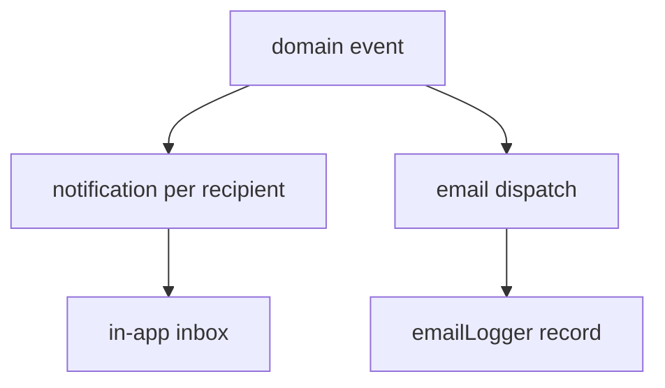

# 20 — Notifications & Email Logs

The notifications domain delivers **in-app notifications** to users and keeps a read-only **email delivery log** for auditing outbound mail. Notifications are generated by domain events across the platform (bookings, orders, invoices, purchases, low-stock alerts) and are always scoped to the recipient user within the current tenant.

- **Entities:** `notification`, `emailLogger`
- **Base path:** `/api/v1/notifications` and `/api/v1/email-logs`
- **Frontend module:** Notifications (bell/inbox) + Settings → Email Logs

See [Conventions](00-conventions.md:1) for the envelope, auth, tenancy scoping, pagination, error format, and soft-delete.

---

## Domain overview



Notification `type` (category) examples: `BOOKING`, `ORDER`, `INVOICE`, `PAYMENT`, `PURCHASE`, `INVENTORY`, `SYSTEM`.
Notification `channel`: `IN_APP` (persisted here). Email delivery is tracked separately in `emailLogger`.
Email `status`: `QUEUED`, `SENT`, `FAILED`, `BOUNCED`.

---

## Endpoint Summary

### Notifications

| # | Action | Method | Path | Auth | Permission |
|---|--------|--------|------|------|------------|
| 1 | List my notifications | GET | `/api/v1/notifications` | Bearer | — (own) |
| 2 | Unread count | GET | `/api/v1/notifications/unread-count` | Bearer | — (own) |
| 3 | Get notification | GET | `/api/v1/notifications/:id` | Bearer | — (own) |
| 4 | Mark as read | POST | `/api/v1/notifications/:id/read` | Bearer | — (own) |
| 5 | Mark all as read | POST | `/api/v1/notifications/read-all` | Bearer | — (own) |
| 6 | Delete notification | DELETE | `/api/v1/notifications/:id` | Bearer | — (own) |

### Email logs

| # | Action | Method | Path | Auth | Permission |
|---|--------|--------|------|------|------------|
| 7 | List email logs | GET | `/api/v1/email-logs` | Bearer | `notification.email.read` |
| 8 | Get email log | GET | `/api/v1/email-logs/:id` | Bearer | `notification.email.read` |

> Notification endpoints 1–6 operate strictly on the authenticated user's own records (recipient = token user); no extra permission is required, but a user can never read or mutate another user's notifications.

---

## Notifications

### 1. List my notifications

`GET /api/v1/notifications`

#### Query parameters

| Param | Type | Default | Description |
|-------|------|---------|-------------|
| `page` | number | `1` | Page number |
| `limit` | number | `20` | Items per page (max 100) |
| `type` | string | — | Category filter (`BOOKING`, `ORDER`, …) |
| `isRead` | boolean | — | `true` \| `false` |
| `from` | string | — | Created on/after (ISO) |
| `to` | string | — | Created on/before (ISO) |
| `sortBy` | string | `createdAt` | `createdAt` \| `isRead` |
| `sortOrder` | string | `desc` | `asc` \| `desc` |

#### Response — `200 OK`

```json
{
  "success": true,
  "message": "Notifications retrieved successfully",
  "data": [
    {
      "id": "ntf-701",
      "type": "INVOICE",
      "title": "Invoice INV-2026-0900 paid",
      "body": "Payment of ₹1,400.00 recorded for Aarav Mehta.",
      "isRead": false,
      "link": "/billing/invoices/inv-900",
      "meta": { "invoiceId": "inv-900", "amount": 140000 },
      "createdAt": "2026-07-15T11:05:00.000Z"
    }
  ],
  "meta": { "page": 1, "limit": 20, "total": 1, "totalPages": 1, "hasNext": false, "hasPrev": false, "unreadCount": 1 }
}
```

The list `meta` includes an extra `unreadCount` for badge rendering.

### 2. Unread count

`GET /api/v1/notifications/unread-count`

Lightweight endpoint for polling the bell badge.

```json
{ "success": true, "message": "Unread count retrieved successfully", "data": { "unreadCount": 3 }, "meta": {} }
```

### 3. Get notification

`GET /api/v1/notifications/:id`

```json
{
  "success": true,
  "message": "Notification retrieved successfully",
  "data": {
    "id": "ntf-701",
    "type": "INVOICE",
    "title": "Invoice INV-2026-0900 paid",
    "body": "Payment of ₹1,400.00 recorded for Aarav Mehta.",
    "isRead": false,
    "link": "/billing/invoices/inv-900",
    "meta": { "invoiceId": "inv-900", "amount": 140000 },
    "createdAt": "2026-07-15T11:05:00.000Z",
    "readAt": null
  },
  "meta": {}
}
```

Errors: `404 NOTIFICATION_NOT_FOUND` (also returned when the notification belongs to another user, to avoid leaking existence).

### 4. Mark as read

`POST /api/v1/notifications/:id/read`

Idempotent — marking an already-read notification returns `200` unchanged.

```json
{ "success": true, "message": "Notification marked as read", "data": { "id": "ntf-701", "isRead": true, "readAt": "2026-08-05T07:10:00.000Z" }, "meta": {} }
```

Errors: `404 NOTIFICATION_NOT_FOUND`.

### 5. Mark all as read

`POST /api/v1/notifications/read-all`

Optional body to scope by type.

```json
{ "type": "INVOICE" }
```

```json
{ "success": true, "message": "All notifications marked as read", "data": { "updated": 3 }, "meta": {} }
```

### 6. Delete notification

`DELETE /api/v1/notifications/:id`

Soft-deletes the recipient's own notification.

```json
{ "success": true, "message": "Notification deleted successfully", "data": null, "meta": {} }
```

Errors: `404 NOTIFICATION_NOT_FOUND`.

---

## Email logs

Read-only audit of outbound email dispatched by the platform (welcome mails, invoice PDFs, password resets, alerts). Requires the `notification.email.read` permission — typically granted to admins.

### 7. List email logs

`GET /api/v1/email-logs`

#### Query parameters

| Param | Type | Default | Description |
|-------|------|---------|-------------|
| `page` | number | `1` | Page number |
| `limit` | number | `20` | Items per page |
| `search` | string | — | Matches recipient, subject |
| `status` | string | — | `QUEUED` \| `SENT` \| `FAILED` \| `BOUNCED` |
| `template` | string | — | Template key filter |
| `from` | string | — | Created on/after |
| `to` | string | — | Created on/before |
| `sortBy` | string | `createdAt` | `createdAt` \| `status` |
| `sortOrder` | string | `desc` | `asc` \| `desc` |

#### Response — `200 OK`

```json
{
  "success": true,
  "message": "Email logs retrieved successfully",
  "data": [
    {
      "id": "mail-330",
      "to": "aarav.mehta@example.com",
      "subject": "Your invoice INV-2026-0900",
      "template": "invoice-issued",
      "status": "SENT",
      "provider": "ses",
      "providerMessageId": "0100018f-abc123",
      "attempts": 1,
      "sentAt": "2026-07-15T11:05:12.000Z",
      "createdAt": "2026-07-15T11:05:10.000Z"
    }
  ],
  "meta": { "page": 1, "limit": 20, "total": 1, "totalPages": 1, "hasNext": false, "hasPrev": false }
}
```

### 8. Get email log

`GET /api/v1/email-logs/:id`

Returns the full record including the last error for failed/bounced mail. The rendered HTML body is omitted from the list and returned here only when `?includeBody=true`.

```json
{
  "success": true,
  "message": "Email log retrieved successfully",
  "data": {
    "id": "mail-331",
    "to": "guest@example.com",
    "cc": [],
    "subject": "Booking confirmation BKG-2026-0044",
    "template": "booking-confirmed",
    "status": "FAILED",
    "provider": "ses",
    "providerMessageId": null,
    "attempts": 3,
    "error": "550 Mailbox does not exist",
    "sentAt": null,
    "createdAt": "2026-07-16T09:00:00.000Z",
    "updatedAt": "2026-07-16T09:02:30.000Z"
  },
  "meta": {}
}
```

Errors: `404 EMAIL_LOG_NOT_FOUND`, `403 FORBIDDEN` (missing `notification.email.read`).

---

## Related

- [Bookings & Folio](11-bookings-folio.md:1) — booking confirmation notifications & emails
- [Orders & Kitchen](14-orders-kitchen.md:1) — order status notifications
- [Billing](19-billing.md:1) — invoice issued / payment / refund notifications & emails
- [Purchase](18-purchase.md:1) — goods receipt & supplier payment notifications
- [Inventory](16-inventory.md:1) — low-stock alert notifications
- [Users](06-users.md:1) — recipient identity & email address
- [Audit Logs](21-audit-logs.md:1) — system-level event history
- [Conventions](00-conventions.md:1) — envelope, auth, tenancy, pagination