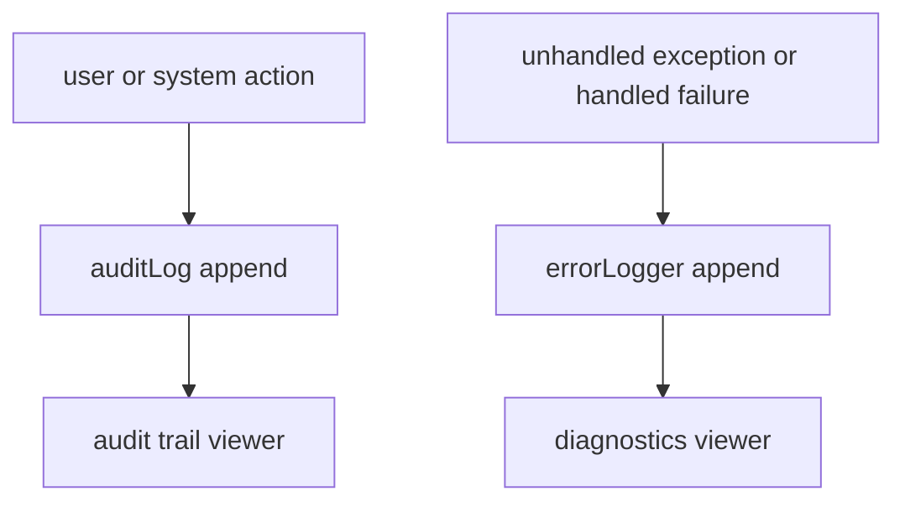

# 21 — Audit Logs & Error Logs

The audit domain provides a **read-only, tamper-evident record** of who did what across the platform, plus a technical **error log** for diagnostics. Both are append-only from the application's perspective and are exposed only through query endpoints — there are no create/update/delete APIs. All records are tenant-scoped.

- **Entities:** `auditLog`, `errorLogger`
- **Base path:** `/api/v1/audit-logs` and `/api/v1/error-logs`
- **Frontend module:** Settings → Audit Trail + Settings → System / Error Logs

See [Conventions](00-conventions.md:1) for the envelope, auth, tenancy scoping, pagination, and error format.

---

## Domain overview



An `auditLog` row captures: the actor (`userId`), the `action` (verb), the target `entity` + `entityId`, an optional `before`/`after` diff, request context (`ip`, `userAgent`), and a timestamp.
An `errorLogger` row captures: `level`, `message`, `stack`, `context` (route, method, payload snapshot), correlation `requestId`, and a timestamp.

---

## Endpoint Summary

### Audit logs

| # | Action | Method | Path | Auth | Permission |
|---|--------|--------|------|------|------------|
| 1 | List audit logs | GET | `/api/v1/audit-logs` | Bearer | `audit.log.read` |
| 2 | Get audit log | GET | `/api/v1/audit-logs/:id` | Bearer | `audit.log.read` |
| 3 | List entity history | GET | `/api/v1/audit-logs/entity/:entity/:entityId` | Bearer | `audit.log.read` |
| 4 | Export audit logs | GET | `/api/v1/audit-logs/export` | Bearer | `audit.log.export` |

### Error logs

| # | Action | Method | Path | Auth | Permission |
|---|--------|--------|------|------|------------|
| 5 | List error logs | GET | `/api/v1/error-logs` | Bearer | `audit.error.read` |
| 6 | Get error log | GET | `/api/v1/error-logs/:id` | Bearer | `audit.error.read` |

> These endpoints are high-privilege. `audit.*` and `audit.error.*` permissions are normally restricted to organization owners and admin roles.

---

## Audit logs

### 1. List audit logs

`GET /api/v1/audit-logs`

#### Query parameters

| Param | Type | Default | Description |
|-------|------|---------|-------------|
| `page` | number | `1` | Page number |
| `limit` | number | `20` | Items per page (max 100) |
| `search` | string | — | Matches action, entity, actor name |
| `userId` | string | — | Filter by actor |
| `action` | string | — | `CREATE` \| `UPDATE` \| `DELETE` \| `LOGIN` \| `PAYMENT` … |
| `entity` | string | — | Target entity name (e.g. `invoice`, `booking`) |
| `entityId` | string | — | Specific target id |
| `from` | string | — | On/after (ISO) |
| `to` | string | — | On/before (ISO) |
| `sortBy` | string | `createdAt` | `createdAt` \| `action` \| `entity` |
| `sortOrder` | string | `desc` | `asc` \| `desc` |

#### Response — `200 OK`

```json
{
  "success": true,
  "message": "Audit logs retrieved successfully",
  "data": [
    {
      "id": "aud-9001",
      "action": "UPDATE",
      "entity": "invoice",
      "entityId": "inv-900",
      "summary": "Invoice status changed DRAFT → ISSUED",
      "actor": { "id": "usr-12", "name": "Priya Nair", "email": "priya@hotel.example.com" },
      "ip": "203.0.113.24",
      "userAgent": "Mozilla/5.0",
      "createdAt": "2026-07-15T11:04:00.000Z"
    }
  ],
  "meta": { "page": 1, "limit": 20, "total": 1, "totalPages": 1, "hasNext": false, "hasPrev": false }
}
```

The list view omits the full `before`/`after` diff for payload size; retrieve a single record to see it.

### 2. Get audit log

`GET /api/v1/audit-logs/:id`

Returns the full record including the field-level diff.

```json
{
  "success": true,
  "message": "Audit log retrieved successfully",
  "data": {
    "id": "aud-9001",
    "action": "UPDATE",
    "entity": "invoice",
    "entityId": "inv-900",
    "summary": "Invoice status changed DRAFT → ISSUED",
    "actor": { "id": "usr-12", "name": "Priya Nair", "email": "priya@hotel.example.com" },
    "before": { "status": "DRAFT" },
    "after": { "status": "ISSUED", "issuedAt": "2026-07-15T11:04:00.000Z" },
    "ip": "203.0.113.24",
    "userAgent": "Mozilla/5.0",
    "requestId": "req-6f2a",
    "createdAt": "2026-07-15T11:04:00.000Z"
  },
  "meta": {}
}
```

Errors: `404 AUDIT_LOG_NOT_FOUND`, `403 FORBIDDEN`.

### 3. List entity history

`GET /api/v1/audit-logs/entity/:entity/:entityId`

Convenience endpoint returning the chronological change history for one record (e.g. every mutation on `booking/bkg-44`). Supports the same pagination and date filters as endpoint 1.

```json
{
  "success": true,
  "message": "Entity history retrieved successfully",
  "data": [
    { "id": "aud-8800", "action": "CREATE", "summary": "Booking created", "actor": { "id": "usr-12", "name": "Priya Nair" }, "createdAt": "2026-07-10T08:00:00.000Z" },
    { "id": "aud-8805", "action": "UPDATE", "summary": "Room assigned 204", "actor": { "id": "usr-12", "name": "Priya Nair" }, "createdAt": "2026-07-10T08:02:00.000Z" }
  ],
  "meta": { "page": 1, "limit": 20, "total": 2, "totalPages": 1, "hasNext": false, "hasPrev": false, "entity": "booking", "entityId": "bkg-44" }
}
```

Errors: `403 FORBIDDEN`.

### 4. Export audit logs

`GET /api/v1/audit-logs/export`

Streams a CSV of audit logs matching the same filters as endpoint 1. Requires the `audit.log.export` permission. Response is `text/csv` (not the JSON envelope).

| Query | Type | Description |
|-------|------|-------------|
| `format` | string | `csv` (default) \| `json` |
| _(all filters from endpoint 1)_ | | Reused for the export selection |

Response headers:

```
Content-Type: text/csv
Content-Disposition: attachment; filename="audit-logs-2026-07.csv"
```

Errors: `403 FORBIDDEN`, `422 EXPORT_RANGE_TOO_LARGE` (when the selected range exceeds the export cap — narrow the `from`/`to` window).

---

## Error logs

Technical diagnostics for operators. Not for end-user consumption. Requires `audit.error.read`.

### 5. List error logs

`GET /api/v1/error-logs`

#### Query parameters

| Param | Type | Default | Description |
|-------|------|---------|-------------|
| `page` | number | `1` | Page number |
| `limit` | number | `20` | Items per page |
| `search` | string | — | Matches message, route |
| `level` | string | — | `ERROR` \| `WARN` \| `FATAL` |
| `route` | string | — | Request path filter |
| `requestId` | string | — | Correlation id |
| `from` | string | — | On/after |
| `to` | string | — | On/before |
| `sortBy` | string | `createdAt` | `createdAt` \| `level` |
| `sortOrder` | string | `desc` | `asc` \| `desc` |

#### Response — `200 OK`

```json
{
  "success": true,
  "message": "Error logs retrieved successfully",
  "data": [
    {
      "id": "err-2201",
      "level": "ERROR",
      "message": "Payment gateway timeout",
      "route": "POST /api/v1/payments",
      "statusCode": 502,
      "requestId": "req-91cd",
      "userId": "usr-31",
      "createdAt": "2026-07-15T12:30:05.000Z"
    }
  ],
  "meta": { "page": 1, "limit": 20, "total": 1, "totalPages": 1, "hasNext": false, "hasPrev": false }
}
```

### 6. Get error log

`GET /api/v1/error-logs/:id`

Returns the full record including stack trace and captured context. Sensitive fields in the captured payload (passwords, tokens, card data) are redacted at write time.

```json
{
  "success": true,
  "message": "Error log retrieved successfully",
  "data": {
    "id": "err-2201",
    "level": "ERROR",
    "message": "Payment gateway timeout",
    "route": "POST /api/v1/payments",
    "method": "POST",
    "statusCode": 502,
    "requestId": "req-91cd",
    "userId": "usr-31",
    "context": { "invoiceId": "inv-900", "amount": 140000, "gateway": "razorpay" },
    "stack": "Error: gateway timeout\n    at PaymentService.charge (payment.service.js:88:13)\n    ...",
    "createdAt": "2026-07-15T12:30:05.000Z"
  },
  "meta": {}
}
```

Errors: `404 ERROR_LOG_NOT_FOUND`, `403 FORBIDDEN`.

---

## Related

- [Billing](19-billing.md:1) — invoice/payment mutations are audited
- [Bookings & Folio](11-bookings-folio.md:1) — booking lifecycle audit history
- [Orders & Kitchen](14-orders-kitchen.md:1) — order & KOT audit history
- [Purchase](18-purchase.md:1) — goods receipt & payment audit history
- [RBAC](05-rbac.md:1) — role/permission changes are audited; controls `audit.*` access
- [Users](06-users.md:1) — resolves the actor identity
- [Notifications](20-notifications.md:1) — complementary user-facing event feed
- [Conventions](00-conventions.md:1) — envelope, auth, tenancy, pagination