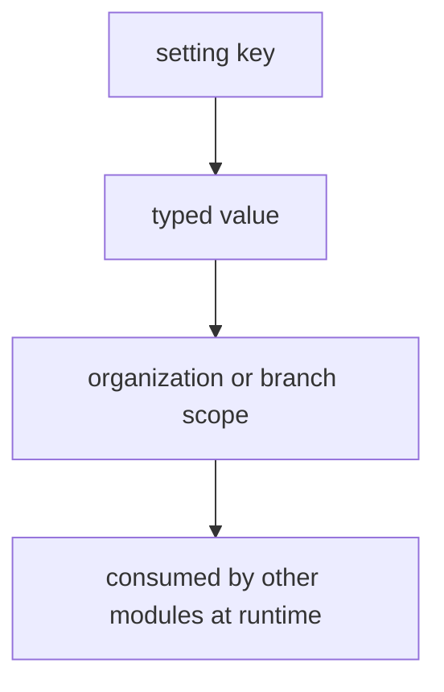

# 22 — Application Settings

The application settings domain stores **tenant-configurable key/value settings** that govern platform behavior — invoice number prefixes, tax defaults, business hours, feature toggles, branding, and notification preferences. Settings are addressed by a stable `key` and are always scoped to the current tenant (and optionally a specific branch).

- **Entities:** `appSettings`
- **Base path:** `/api/v1/app-settings`
- **Frontend module:** Settings → General / Preferences

See [Conventions](00-conventions.md:1) for the envelope, auth, tenancy scoping, pagination, error format, and soft-delete.

---

## Domain overview



Each setting has: a namespaced `key` (e.g. `billing.invoicePrefix`), a `value` (typed via `valueType`), a `valueType` (`STRING`, `NUMBER`, `BOOLEAN`, `JSON`), an optional `branchId` for branch-level overrides, a `group` for UI grouping, and `isSystem` (system-managed keys cannot be deleted).

**Resolution rule:** when a branch-scoped value exists it overrides the organization-level value for that branch; otherwise the organization-level value applies.

---

## Endpoint Summary

| # | Action | Method | Path | Auth | Permission |
|---|--------|--------|------|------|------------|
| 1 | List settings | GET | `/api/v1/app-settings` | Bearer | `settings.read` |
| 2 | Get setting by key | GET | `/api/v1/app-settings/:key` | Bearer | `settings.read` |
| 3 | Get effective settings | GET | `/api/v1/app-settings/effective` | Bearer | `settings.read` |
| 4 | Create setting | POST | `/api/v1/app-settings` | Bearer | `settings.manage` |
| 5 | Update setting by key | PATCH | `/api/v1/app-settings/:key` | Bearer | `settings.manage` |
| 6 | Bulk upsert settings | PUT | `/api/v1/app-settings/bulk` | Bearer | `settings.manage` |
| 7 | Delete setting | DELETE | `/api/v1/app-settings/:key` | Bearer | `settings.manage` |

---

## Endpoints

### 1. List settings

`GET /api/v1/app-settings`

#### Query parameters

| Param | Type | Default | Description |
|-------|------|---------|-------------|
| `page` | number | `1` | Page number |
| `limit` | number | `50` | Items per page (max 200) |
| `search` | string | — | Matches key |
| `group` | string | — | Filter by UI group (e.g. `billing`, `branding`) |
| `branchId` | string | — | Filter to branch-scoped overrides only |
| `includeSystem` | boolean | `true` | Include system-managed keys |
| `sortBy` | string | `key` | `key` \| `group` \| `updatedAt` |
| `sortOrder` | string | `asc` | `asc` \| `desc` |

#### Response — `200 OK`

```json
{
  "success": true,
  "message": "Settings retrieved successfully",
  "data": [
    {
      "id": "set-01",
      "key": "billing.invoicePrefix",
      "value": "INV",
      "valueType": "STRING",
      "group": "billing",
      "branchId": null,
      "isSystem": true,
      "updatedAt": "2026-06-01T09:00:00.000Z"
    },
    {
      "id": "set-02",
      "key": "billing.defaultTaxRate",
      "value": 18,
      "valueType": "NUMBER",
      "group": "billing",
      "branchId": null,
      "isSystem": false,
      "updatedAt": "2026-06-01T09:00:00.000Z"
    }
  ],
  "meta": { "page": 1, "limit": 50, "total": 2, "totalPages": 1, "hasNext": false, "hasPrev": false }
}
```

### 2. Get setting by key

`GET /api/v1/app-settings/:key`

Resolves the value honoring the branch override rule. Pass `?branchId=...` to inspect a specific branch's effective value; omit for organization-level.

```json
{
  "success": true,
  "message": "Setting retrieved successfully",
  "data": {
    "id": "set-02",
    "key": "billing.defaultTaxRate",
    "value": 18,
    "valueType": "NUMBER",
    "group": "billing",
    "branchId": null,
    "isSystem": false,
    "description": "Default GST rate applied to new invoices",
    "createdAt": "2026-06-01T09:00:00.000Z",
    "updatedAt": "2026-06-01T09:00:00.000Z"
  },
  "meta": {}
}
```

Errors: `404 SETTING_NOT_FOUND`.

### 3. Get effective settings

`GET /api/v1/app-settings/effective`

Returns a **flattened key→value map** of all settings resolved for the current tenant/branch — ideal for the frontend to bootstrap on load. Pass `?group=` to limit, and `?branchId=` to resolve for a specific branch.

```json
{
  "success": true,
  "message": "Effective settings retrieved successfully",
  "data": {
    "billing.invoicePrefix": "INV",
    "billing.defaultTaxRate": 18,
    "billing.currency": "INR",
    "branding.primaryColor": "#1d4ed8",
    "features.kitchenDisplay": true,
    "notifications.emailEnabled": true
  },
  "meta": { "branchId": null, "resolvedAt": "2026-08-05T07:11:30.000Z" }
}
```

### 4. Create setting

`POST /api/v1/app-settings`

#### Request

```json
{
  "key": "branding.primaryColor",
  "value": "#1d4ed8",
  "valueType": "STRING",
  "group": "branding",
  "branchId": null,
  "description": "Primary brand color for the customer portal"
}
```

| Field | Type | Required | Description |
|-------|------|----------|-------------|
| `key` | string | Yes | Unique per tenant+branch; dot-namespaced |
| `value` | any | Yes | Must match `valueType` |
| `valueType` | string | Yes | `STRING` \| `NUMBER` \| `BOOLEAN` \| `JSON` |
| `group` | string | No | UI grouping key |
| `branchId` | string | No | Branch override; null = organization-level |
| `description` | string | No | Human-readable help text |

#### Response — `201 Created`

```json
{
  "success": true,
  "message": "Setting created successfully",
  "data": { "id": "set-10", "key": "branding.primaryColor", "value": "#1d4ed8", "valueType": "STRING", "group": "branding", "branchId": null, "isSystem": false, "createdAt": "2026-08-05T07:11:40.000Z" },
  "meta": {}
}
```

Errors: `409 SETTING_KEY_EXISTS`, `422 VALIDATION_ERROR` (value does not match `valueType`).

### 5. Update setting by key

`PATCH /api/v1/app-settings/:key`

Updates the value (and optionally description/group) of an existing key. To set a branch override, include `branchId`; the server upserts the branch-scoped row.

#### Request

```json
{ "value": 12, "branchId": "brh-2" }
```

#### Response — `200 OK`

```json
{
  "success": true,
  "message": "Setting updated successfully",
  "data": { "id": "set-21", "key": "billing.defaultTaxRate", "value": 12, "valueType": "NUMBER", "group": "billing", "branchId": "brh-2", "isSystem": false, "updatedAt": "2026-08-05T07:12:00.000Z" },
  "meta": {}
}
```

Errors: `404 SETTING_NOT_FOUND`, `422 VALIDATION_ERROR` (type mismatch).

### 6. Bulk upsert settings

`PUT /api/v1/app-settings/bulk`

Creates or updates many settings in one atomic call — used by the Settings screen "Save all" action. Each item follows the create shape; existing keys are updated, new keys created.

#### Request

```json
{
  "settings": [
    { "key": "billing.defaultTaxRate", "value": 18, "valueType": "NUMBER", "group": "billing" },
    { "key": "features.kitchenDisplay", "value": true, "valueType": "BOOLEAN", "group": "features" },
    { "key": "notifications.emailEnabled", "value": true, "valueType": "BOOLEAN", "group": "notifications" }
  ],
  "branchId": null
}
```

#### Response — `200 OK`

```json
{
  "success": true,
  "message": "Settings saved successfully",
  "data": { "created": 1, "updated": 2, "keys": ["billing.defaultTaxRate", "features.kitchenDisplay", "notifications.emailEnabled"] },
  "meta": {}
}
```

Errors: `422 VALIDATION_ERROR` (returns `meta.errors[]` per offending key). The operation is transactional — if any item fails validation, none are applied.

### 7. Delete setting

`DELETE /api/v1/app-settings/:key`

Soft-deletes a setting. Pass `?branchId=...` to remove only a branch override (reverting that branch to the organization-level value). System-managed keys (`isSystem: true`) cannot be deleted.

```json
{ "success": true, "message": "Setting deleted successfully", "data": null, "meta": {} }
```

Errors: `404 SETTING_NOT_FOUND`, `409 SYSTEM_SETTING_PROTECTED` (attempt to delete an `isSystem` key).

---

## Common setting keys

| Key | Type | Group | Consumed by |
|-----|------|-------|-------------|
| `billing.invoicePrefix` | STRING | billing | [Billing](19-billing.md:1) |
| `billing.defaultTaxRate` | NUMBER | billing | [Billing](19-billing.md:1) |
| `billing.currency` | STRING | billing | [Currency](08-currency.md:1) |
| `booking.checkoutTime` | STRING | hotel | [Bookings & Folio](11-bookings-folio.md:1) |
| `order.autoAcceptKot` | BOOLEAN | restaurant | [Orders & Kitchen](14-orders-kitchen.md:1) |
| `inventory.lowStockThreshold` | NUMBER | inventory | [Inventory](16-inventory.md:1) |
| `notifications.emailEnabled` | BOOLEAN | notifications | [Notifications](20-notifications.md:1) |
| `branding.primaryColor` | STRING | branding | Frontend theming |
| `features.kitchenDisplay` | BOOLEAN | features | Feature toggle |

---

## Related

- [Organization & Tenancy](02-organization-tenancy.md:1) — organization/branch scope for overrides
- [Billing](19-billing.md:1) — invoice prefix, tax, currency defaults
- [Currency](08-currency.md:1) — default currency setting
- [Bookings & Folio](11-bookings-folio.md:1) — checkout time and hotel defaults
- [Orders & Kitchen](14-orders-kitchen.md:1) — KOT/order behavior toggles
- [Inventory](16-inventory.md:1) — low-stock threshold
- [Notifications](20-notifications.md:1) — email/notification preferences
- [RBAC](05-rbac.md:1) — `settings.read` / `settings.manage` permissions
- [Audit Logs](21-audit-logs.md:1) — setting changes are audited
- [Conventions](00-conventions.md:1) — envelope, auth, tenancy, pagination